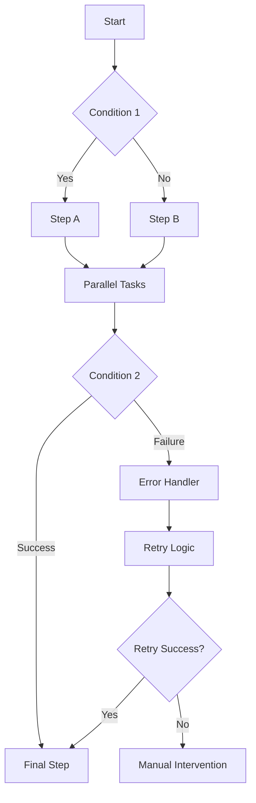

## Conditional Logic and Branching

Create sophisticated workflows with decision-making capabilities.

<Callout kind="info">
  Conditional logic allows workflows to adapt based on data, time, or external conditions.
</Callout>

## Advanced Triggers

Beyond simple event triggers, use complex conditions and schedules.

<Tabs>
  <Tab title="Multi-Condition Triggers" icon="git-branch">
    Combine multiple conditions with AND/OR logic:

    ```prompt
    Trigger when:
    - A new lead is created in Salesforce AND
    - The lead score is above 75 OR
    - The lead came from a paid advertising campaign
    ```
  </Tab>

  <Tab title="Time-Based Conditions" icon="clock">
    ```prompt
    During business hours (9 AM - 6 PM EST):
    - Send immediate notifications for high-priority tickets
    - Queue low-priority items for next business day
    - Escalate urgent issues to on-call team
    ```
  </Tab>

  <Tab title="Data-Driven Triggers" icon="database">
    ```prompt
    When sales pipeline value drops below threshold:
    - Analyze recent deal closures
    - Generate performance report
    - Schedule emergency sales meeting
    - Send alerts to sales leadership
    ```
  </Tab>
</Tabs>

## Dynamic Data Mapping

Transform and manipulate data between different integrations.

<Columns cols={2}>
  <Card title="Field Mapping" icon="arrow-right">
    Map fields between different data formats automatically.
  </Card>
  <Card title="Data Transformation" icon="shuffle">
    Convert data types, format dates, and clean text.
  </Card>
  <Card title="Lookup Tables" icon="table">
    Reference external data sources for enrichment.
  </Card>
  <Card title="Calculations" icon="calculator">
    Perform mathematical operations on numeric data.
  </Card>
</Columns>

<Expandable title="Advanced Mapping Example">
```javascript
// Complex data transformation
const transformedData = {
  customer_name: `${input.first_name} ${input.last_name}`,
  account_type: input.revenue > 100000 ? 'enterprise' : 'standard',
  region: lookupRegion(input.postal_code),
  formatted_date: formatDate(input.created_at, 'MM/DD/YYYY'),
  priority_score: calculatePriority(input.tags, input.engagement_score)
};
```
</Expandable>

## Workflow Templates and Reusability

Create reusable workflow components and templates.

<Steps>
  <Step title="Create Templates" icon="template">
    Build parameterized workflows that can be reused with different inputs.
  </Step>
  <Step title="Version Control" icon="git-branch">
    Maintain different versions of workflows for testing and production.
  </Step>
  <Step title="Import/Export" icon="download">
    Share workflows between teams or backup configurations.
  </Step>
</Steps>

## Custom Functions and Scripts

Extend AetherFlow with custom JavaScript functions.

<Callout kind="warning">
  Custom scripts run in a secure sandbox environment with limited execution time.
</Callout>

<Tabs>
  <Tab title="Data Validation" icon="check-circle">
    ```javascript
    function validateEmail(email) {
      const regex = /^[^\s@]+@[^\s@]+\.[^\s@]+$/;
      return regex.test(email);
    }

    function validatePhone(phone) {
      const regex = /^\+?1?[-.\s]?\(?([0-9]{3})\)?[-.\s]?([0-9]{3})[-.\s]?([0-9]{4})$/;
      return regex.test(phone);
    }
    ```
  </Tab>

  <Tab title="Data Processing" icon="cog">
    ```javascript
    function processCustomerData(customer) {
      return {
        fullName: `${customer.firstName} ${customer.lastName}`,
        displayName: customer.preferredName || customer.firstName,
        membershipTier: calculateTier(customer.lifetimeValue),
        lastActivityDays: daysSince(customer.lastActivity)
      };
    }

    function calculateTier(lifetimeValue) {
      if (lifetimeValue > 10000) return 'Platinum';
      if (lifetimeValue > 5000) return 'Gold';
      if (lifetimeValue > 1000) return 'Silver';
      return 'Bronze';
    }
    ```
  </Tab>
</Tabs>

## Advanced Integrations

Connect to APIs and services not natively supported.

<ExpandableGroup>
  <Expandable title="REST API Integration">
    Connect to any REST API using custom HTTP requests with authentication.
  </Expandable>
  <Expandable title="Webhook Endpoints">
    Create custom webhook URLs for real-time data integration.
  </Expandable>
  <Expandable title="Database Connections">
    Query external databases directly (Enterprise feature).
  </Expandable>
</ExpandableGroup>

## Workflow Orchestration

Coordinate complex multi-step processes with dependencies.

<Columns cols={3}>
  <Card title="Parallel Execution" icon="split">
    Run independent steps simultaneously for faster completion.
  </Card>
  <Card title="Sequential Dependencies" icon="arrow-down">
    Ensure steps execute in the correct order with prerequisites.
  </Card>
  <Card title="Error Recovery" icon="refresh-cw">
    Define fallback paths when steps fail.
  </Card>
</Columns>



## Performance Monitoring

Track and optimize workflow performance at scale.

<Expandable title="Performance Metrics">
| Metric | Description | Target |
|--------|-------------|--------|
| Execution Time | Total workflow duration | < 30 seconds |
| Step Success Rate | Percentage of successful steps | > 95% |
| API Response Time | Average integration response time | < 5 seconds |
| Error Recovery Rate | Successful error handling | > 90% |
</Expandable>

## Advanced Analytics

Gain insights into workflow patterns and optimization opportunities.

<Tabs>
  <Tab title="Usage Analytics" icon="bar-chart">
    Track workflow execution frequency, success rates, and resource usage.
  </Tab>
  <Tab title="Performance Trends" icon="trending-up">
    Identify bottlenecks and optimization opportunities over time.
  </Tab>
  <Tab title="Cost Analysis" icon="dollar-sign">
    Monitor and optimize workflow costs across different integrations.
  </Tab>
</Tabs>

## Enterprise Features

Advanced capabilities for large organizations.

<Callout kind="success">
  Enterprise features are available on our Enterprise plan. Contact sales for more information.
</Callout>

<ExpandableGroup>
  <Expandable title="Role-Based Access Control">
    Granular permissions for different user roles and departments.
  </Expandable>
  <Expandable title="Audit Logging">
    Comprehensive logging of all workflow activities for compliance.
  </Expandable>
  <Expandable title="SLA Management">
    Define and monitor service level agreements for critical workflows.
  </Expandable>
  <Expandable title="Multi-Region Deployment">
    Deploy workflows across multiple geographic regions for redundancy.
  </Expandable>
</ExpandableGroup>

## API Rate Limiting and Optimization

Handle high-volume API interactions efficiently.

<Columns cols={2}>
  <Card title="Smart Batching" icon="package">
    Group multiple API calls to reduce overhead and respect rate limits.
  </Card>
  <Card title="Exponential Backoff" icon="timer">
    Automatically retry failed requests with increasing delays.
  </Card>
  <Card title="Circuit Breakers" icon="zap">
    Temporarily disable failing integrations to prevent cascade failures.
  </Card>
  <Card title="Load Balancing" icon="scale">
    Distribute requests across multiple endpoints for high availability.
  </Card>
</Columns>

## Custom Webhook Handlers

Create sophisticated webhook processing logic.

```javascript
// Advanced webhook handler example
app.post('/webhook/order-update', async (req, res) => {
  const { orderId, status, customerId } = req.body;

  // Validate webhook data
  if (!isValidOrderUpdate(req.body)) {
    return res.status(400).json({ error: 'Invalid data' });
  }

  // Process based on order status
  switch (status) {
    case 'shipped':
      await updateCustomerRecord(customerId, { lastOrderShipped: new Date() });
      await sendShippingNotification(orderId);
      break;
    case 'delivered':
      await scheduleFollowUpEmail(customerId, orderId);
      await updateInventory(orderId);
      break;
    case 'returned':
      await processReturn(orderId);
      await notifyCustomerService(orderId);
      break;
  }

  res.json({ processed: true });
});
```

These advanced features enable complex automation scenarios that go beyond basic workflow creation.
