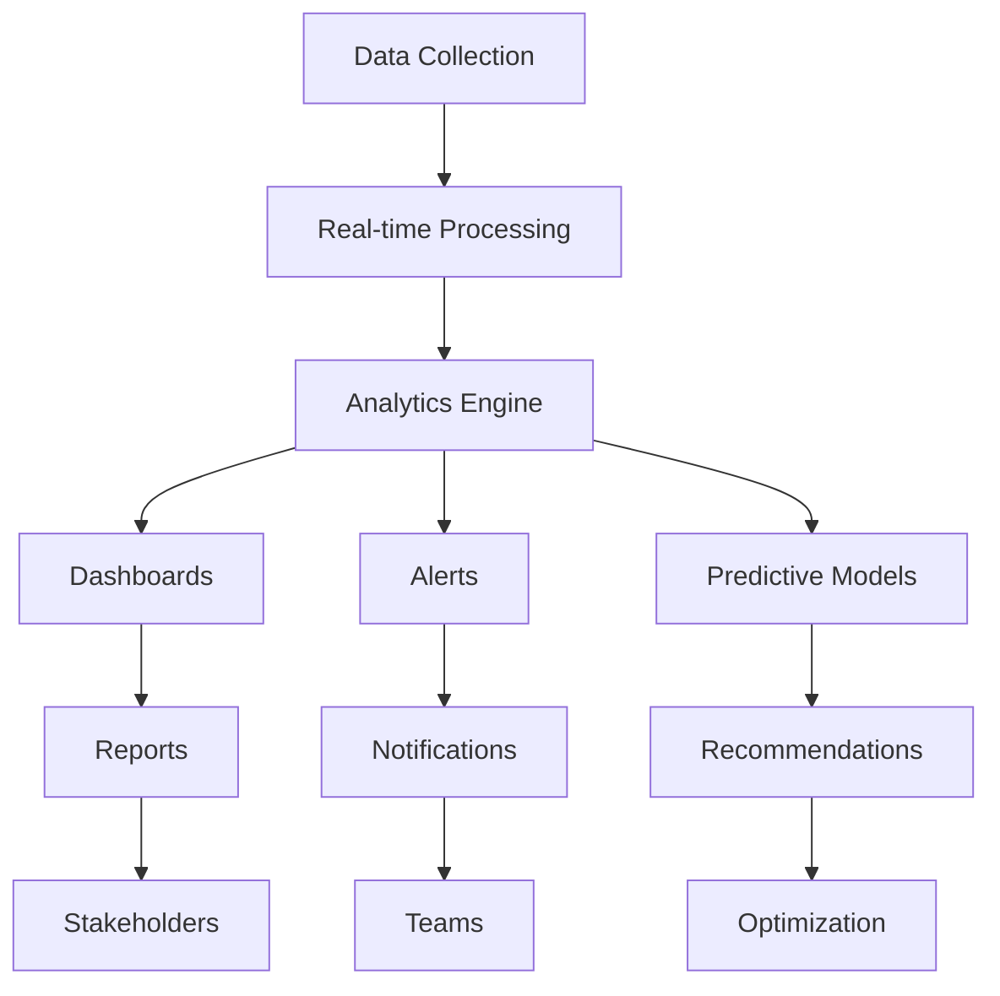

## Dashboard Overview

Monitor your AetherFlow ecosystem with comprehensive analytics and real-time insights.

<Callout kind="info">
  The Analytics Dashboard provides actionable insights to optimize workflow performance and reliability.
</Callout>

## Key Performance Metrics

Track essential metrics to ensure workflow health and efficiency.

<Columns cols={4}>
  <Card title="Success Rate" icon="check-circle">
    Percentage of workflows completing without errors (target: >95%)
  </Card>
  <Card title="Average Runtime" icon="clock">
    Mean execution time across all workflows (target: &lt;30 seconds)
  </Card>
  <Card title="Execution Volume" icon="activity">
    Total workflows run in a given period
  </Card>
  <Card title="Error Frequency" icon="alert-triangle">
    Rate of failed workflow executions
  </Card>
</Columns>

## Real-Time Monitoring

Get instant visibility into workflow execution and system health.

<Tabs>
  <Tab title="Live Dashboard" icon="monitor">
    View real-time workflow execution, active integrations, and system status.
  </Tab>
  <Tab title="Alert System" icon="bell">
    Configure notifications for failures, performance degradation, and unusual patterns.
  </Tab>
  <Tab title="Health Checks" icon="heart">
    Automated monitoring of integration connectivity and API responsiveness.
  </Tab>
</Tabs>

## Workflow Analytics

Deep dive into individual workflow performance and optimization opportunities.

<ExpandableGroup>
  <Expandable title="Execution Trends">
    Analyze workflow run patterns over time, identifying peak usage and seasonal variations.
  </Expandable>
  <Expandable title="Step-by-Step Analysis">
    Break down workflow execution by individual steps to identify bottlenecks.
  </Expandable>
  <Expandable title="Error Pattern Recognition">
    Detect recurring errors and their root causes for proactive fixes.
  </Expandable>
</ExpandableGroup>

## Integration Monitoring

Track the health and performance of connected applications.

<Steps>
  <Step title="Connection Status" icon="wifi">
    Monitor real-time connectivity to all integrated services.
  </Step>
  <Step title="API Response Times" icon="zap">
    Track response times for each integration endpoint.
  </Step>
  <Step title="Error Rates" icon="alert-circle">
    Identify integrations with high failure rates.
  </Step>
  <Step title="Rate Limit Tracking" icon="gauge">
    Monitor API usage against rate limits and quotas.
  </Step>
</Steps>

## Custom Reports and Dashboards

Create tailored analytics views for different stakeholders.

<Columns cols={2}>
  <Card title="Executive Summary" icon="briefcase">
    High-level overview of automation ROI and business impact.
  </Card>
  <Card title="Technical Deep Dive" icon="code">
    Detailed performance metrics for developers and IT teams.
  </Card>
  <Card title="Team Performance" icon="users">
    Workflow creation and maintenance metrics by team.
  </Card>
  <Card title="Cost Analysis" icon="dollar-sign">
    Usage costs and optimization opportunities.
  </Card>
</Columns>

## Alert Configuration

Set up intelligent notifications for critical events and thresholds.

<Tabs>
  <Tab title="Performance Alerts" icon="trending-down">
    ```json
    {
      "alert_name": "High Error Rate",
      "condition": "error_rate > 5%",
      "timeframe": "last_1_hour",
      "channels": ["email", "slack"],
      "recipients": ["devops@company.com", "#alerts"]
    }
    ```
  </Tab>

  <Tab title="Integration Alerts" icon="plug">
    ```json
    {
      "alert_name": "Integration Down",
      "condition": "connection_status == 'failed'",
      "duration": "5_minutes",
      "channels": ["email", "sms"],
      "recipients": ["support@company.com"]
    }
    ```
  </Tab>

  <Tab title="Usage Alerts" icon="activity">
    ```json
    {
      "alert_name": "Rate Limit Approaching",
      "condition": "api_usage > 80%",
      "channels": ["slack"],
      "recipients": ["#engineering"]
    }
    ```
  </Tab>
</Tabs>

## Log Analysis and Debugging

Comprehensive logging for troubleshooting and optimization.

<Expandable title="Log Types">
- **Execution Logs**: Step-by-step workflow execution details
- **Error Logs**: Detailed error messages and stack traces
- **Integration Logs**: API request/response data and timings
- **Audit Logs**: User actions and system changes
- **Performance Logs**: Resource usage and timing metrics
</Expandable>

## Historical Analytics

Analyze long-term trends and patterns in your automation usage.

<Steps>
  <Step title="Trend Analysis" icon="trending-up">
    Identify patterns in workflow usage, errors, and performance over months.
  </Step>
  <Step title="Seasonal Insights" icon="calendar">
    Understand how business cycles affect automation needs.
  </Step>
  <Step title="Growth Metrics" icon="bar-chart-3">
    Track automation adoption and efficiency improvements over time.
  </Step>
  <Step title="ROI Calculation" icon="calculator">
    Measure the financial impact of your automation initiatives.
  </Step>
</Steps>

## Cost Optimization

Monitor and optimize your AetherFlow usage costs.

<ExpandableGroup>
  <Expandable title="Usage Breakdown">
    Analyze costs by workflow, integration, and time period.
  </Expandable>
  <Expandable title="Efficiency Metrics">
    Identify workflows with high cost relative to business value.
  </Expandable>
  <Expandable title="Optimization Recommendations">
    AI-powered suggestions for reducing costs while maintaining performance.
  </Expandable>
</ExpandableGroup>

## Data Export and Integration

Export analytics data for external analysis and reporting.

<Tabs>
  <Tab title="CSV Export" icon="download">
    Export raw metrics data for spreadsheet analysis.
  </Tab>
  <Tab title="API Access" icon="code">
    Programmatically access analytics data via REST API.
  </Tab>
  <Tab title="Third-Party Integration" icon="link">
    Connect analytics to BI tools like Tableau, Power BI, or custom dashboards.
  </Tab>
</Tabs>

```javascript
// Analytics API example
const analytics = await fetch('/api/v2/analytics/workflows', {
  headers: {
    'Authorization': `Bearer ${token}`,
    'Content-Type': 'application/json'
  },
  body: JSON.stringify({
    timeframe: 'last_30_days',
    metrics: ['success_rate', 'avg_runtime', 'execution_count'],
    group_by: 'workflow_id'
  })
});
```

## Predictive Analytics

Use AI to forecast issues and optimize performance.

<Callout kind="success">
  Predictive analytics help prevent issues before they impact your business.
</Callout>

<Columns cols={3}>
  <Card title="Failure Prediction" icon="alert-triangle">
    Identify workflows likely to fail based on historical patterns.
  </Card>
  <Card title="Capacity Planning" icon="trending-up">
    Forecast resource needs based on usage trends.
  </Card>
  <Card title="Optimization Suggestions" icon="lightbulb">
    AI recommendations for improving workflow efficiency.
  </Card>
</Columns>

## Compliance and Audit Reporting

Maintain compliance with regulatory requirements through detailed audit trails.

<Expandable title="Compliance Features">
- **GDPR Compliance**: Data processing logs and user consent tracking
- **SOC 2 Reporting**: Comprehensive audit trails for security controls
- **Custom Retention**: Configurable log retention periods
- **Export Capabilities**: Generate compliance reports for auditors
</Expandable>

## Team Analytics

Monitor team productivity and collaboration metrics.

<ExpandableGroup>
  <Expandable title="Workflow Creation Metrics">
    Track how many workflows each team member creates and their success rates.
  </Expandable>
  <Expandable title="Collaboration Insights">
    Analyze workflow sharing, reviews, and team contributions.
  </Expandable>
  <Expandable title="Learning Opportunities">
    Identify areas where team training could improve automation quality.
  </Expandable>
</ExpandableGroup>



The Analytics & Monitoring system provides comprehensive visibility into your AetherFlow ecosystem, enabling data-driven optimization and proactive issue resolution.
