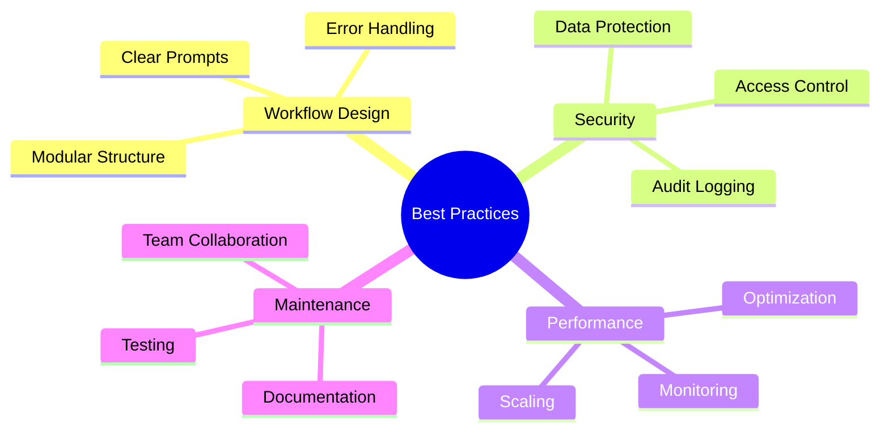

## Workflow Design Principles

Build reliable, maintainable workflows using these fundamental principles.

<Callout kind="info">
  Well-designed workflows are easier to debug, maintain, and scale over time.
</Callout>

## Prompt Engineering

Craft effective natural language prompts for optimal AI interpretation.

<Columns cols={3}>
  <Card title="Be Specific" icon="target">
    Clearly define triggers, conditions, and actions. Avoid ambiguous language.
  </Card>
  <Card title="Use Context" icon="file-text">
    Provide relevant background information and examples in your prompts.
  </Card>
  <Card title="Iterate Gradually" icon="refresh-cw">
    Start simple and add complexity incrementally through testing.
  </Card>
</Columns>

<Tabs>
  <Tab title="Good Examples" icon="check-circle">
    ```prompt
    When a new customer support ticket is created in Zendesk with priority "High",
    analyze the ticket content for keywords related to billing, technical issues, or account problems,
    then route to the appropriate agent based on their expertise and current workload,
    and send a Slack notification to the #support channel with ticket summary.
    ```

    ```prompt
    Every Monday at 9 AM, generate a weekly report from Google Analytics data,
    create a summary of key metrics including page views, conversion rates, and top content,
    format it as a professional report, and share it in the #marketing Slack channel.
    ```
  </Tab>

  <Tab title="Poor Examples" icon="x-circle">
    ```prompt
    Handle tickets and send notifications.
    ```
    *Too vague - lacks specific conditions and actions*

    ```prompt
    Do everything related to customer support automatically.
    ```
    *Overly broad - creates unpredictable behavior*
  </Tab>
</Tabs>

## Error Handling and Resilience

Build robust workflows that handle failures gracefully.

<Steps>
  <Step title="Implement Fallbacks" icon="shield">
    Define alternative actions when primary integrations fail.
  </Step>
  <Step title="Add Validation" icon="check-circle">
    Verify data integrity before processing or sending.
  </Step>
  <Step title="Monitor Success Rates" icon="bar-chart">
    Set up alerts for workflows with declining performance.
  </Step>
</Steps>

<Expandable title="Retry Strategies">
  - **Fixed Interval**: Retry failed steps after a set delay (e.g., 30 seconds)
  - **Exponential Backoff**: Increase delay between retries (30s, 1m, 2m, 4m...)
  - **Circuit Breaker**: Stop retrying after multiple failures, alert for manual intervention
</Expandable>

## Performance Optimization

Ensure workflows run efficiently and within resource limits.

<ExpandableGroup>
  <Expandable title="Batch Processing">
    Group similar operations to reduce API calls and improve throughput.
  </Expandable>
  <Expandable title="Caching Strategies">
    Store frequently accessed data to avoid redundant API requests.
  </Expandable>
  <Expandable title="Parallel Execution">
    Run independent steps simultaneously when possible.
  </Expandable>
</ExpandableGroup>

## Security Considerations

Protect sensitive data and maintain compliance.

<Columns cols={2}>
  <Card title="Data Encryption" icon="lock">
    Use encrypted connections and avoid logging sensitive information.
  </Card>
  <Card title="Access Control" icon="key">
    Limit workflow permissions to minimum required scopes.
  </Card>
  <Card title="Audit Logging" icon="file-text">
    Enable logging for compliance and debugging purposes.
  </Card>
  <Card title="Regular Reviews" icon="eye">
    Periodically audit workflows for security vulnerabilities.
  </Card>
</Columns>

## Testing and Validation

Thoroughly test workflows before deploying to production.

<Tabs>
  <Tab title="Test Environments" icon="flask">
    Create separate test workflows that mirror production setups.
  </Tab>
  <Tab title="Edge Cases" icon="alert-triangle">
    Test with unusual data inputs, network failures, and integration outages.
  </Tab>
  <Tab title="Load Testing" icon="zap">
    Verify performance under expected peak loads.
  </Tab>
</Tabs>

## Monitoring and Maintenance

Keep workflows running smoothly with proactive monitoring.

<Steps>
  <Step title="Set Up Alerts" icon="bell">
    Configure notifications for failures, performance degradation, and unusual patterns.
  </Step>
  <Step title="Regular Audits" icon="clipboard">
    Review workflow performance and update as needed quarterly.
  </Step>
  <Step title="Documentation" icon="book">
    Maintain clear documentation of workflow logic and dependencies.
  </Step>
</Steps>

## Team Collaboration

Best practices for multi-user workflow development.

<Expandable title="Version Control">
  - Use descriptive names for workflow versions
  - Document changes and reasoning
  - Test thoroughly before promoting to production
</Expandable>

<Expandable title="Code Reviews">
  - Peer review complex workflows before deployment
  - Check for security implications
  - Validate error handling and edge cases
</Expandable>

## Scaling Strategies

Prepare workflows for growing usage and complexity.

| Scale Level | Characteristics | Strategies |
|-------------|-----------------|------------|
| Small | 1-5 workflows, basic integrations | Focus on reliability and documentation |
| Medium | 10-50 workflows, multiple teams | Implement monitoring and testing frameworks |
| Large | 100+ workflows, enterprise integrations | Automate deployment, use advanced monitoring |

<Callout kind="tip">
  Plan for scale from the beginning by designing modular, reusable workflow components.
</Callout>

## Cost Optimization

Manage AetherFlow usage costs effectively.

<ExpandableGroup>
  <Expandable title="Usage Monitoring">
    Track workflow execution frequency and identify optimization opportunities.
  </Expandable>
  <Expandable title="Resource Efficiency">
    Choose appropriate plan tiers based on actual usage patterns.
  </Expandable>
  <Expandable title="Automation ROI">
    Regularly assess workflow benefits against operational costs.
  </Expandable>
</ExpandableGroup>



Following these best practices ensures your AetherFlow implementation is reliable, secure, and maintainable.
