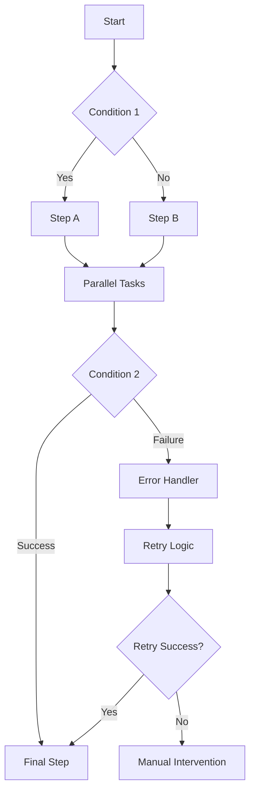

## Bedingte Logik und Verzweigungen

Erstellen Sie ausgefeilte Workflows mit Entscheidungsfunktionen.

<Callout kind="info">
  Bedingte Logik ermoeglicht es Workflows, sich basierend auf Daten, Zeit oder externen Bedingungen anzupassen.
</Callout>

## Erweiterte Trigger

Verwenden Sie neben einfachen Ereignis-Triggern auch komplexe Bedingungen und Zeitplaene.

<Tabs>
  <Tab title="Mehrfachbedingungen-Trigger" icon="git-branch">
    Mehrere Bedingungen mit UND/ODER-Logik kombinieren:

    ```prompt
    Ausloesen, wenn:
    - Ein neuer Lead in Salesforce erstellt wird UND
    - Der Lead-Score ueber 75 liegt ODER
    - Der Lead aus einer bezahlten Werbekampagne stammt
    ```
  </Tab>

  <Tab title="Zeitbasierte Bedingungen" icon="clock">
    ```prompt
    Waehrend der Geschaeftszeiten (9–18 Uhr MEZ):
    - Sofortige Benachrichtigungen fuer Tickets mit hoher Prioritaet senden
    - Niedrigprioritaere Elemente fuer den naechsten Werktag in die Warteschlange stellen
    - Dringende Probleme an das Bereitschaftsteam eskalieren
    ```
  </Tab>

  <Tab title="Datengesteuerte Trigger" icon="database">
    ```prompt
    Wenn der Wert der Vertriebspipeline unter den Schwellenwert faellt:
    - Aktuelle Abschluesse analysieren
    - Leistungsbericht erstellen
    - Notfall-Vertriebsmeeting planen
    - Alerts an die Vertriebsleitung senden
    ```
  </Tab>
</Tabs>

## Dynamische Datenzuordnung

Daten zwischen verschiedenen Integrationen transformieren und manipulieren.

<Columns cols={2}>
  <Card title="Feldzuordnung" icon="arrow-right">
    Felder zwischen verschiedenen Datenformaten automatisch zuordnen.
  </Card>
  <Card title="Datentransformation" icon="shuffle">
    Datentypen konvertieren, Datumsangaben formatieren und Text bereinigen.
  </Card>
  <Card title="Nachschlagetabellen" icon="table">
    Externe Datenquellen zur Anreicherung referenzieren.
  </Card>
  <Card title="Berechnungen" icon="calculator">
    Mathematische Operationen auf numerischen Daten durchfuehren.
  </Card>
</Columns>

<Expandable title="Erweitertes Zuordnungsbeispiel">
```javascript
// Complex data transformation
const transformedData = {
  customer_name: `${input.first_name} ${input.last_name}`,
  account_type: input.revenue > 100000 ? 'enterprise' : 'standard',
  region: lookupRegion(input.postal_code),
  formatted_date: formatDate(input.created_at, 'MM/DD/YYYY'),
  priority_score: calculatePriority(input.tags, input.engagement_score)
};
```
</Expandable>

## Workflow-Vorlagen und Wiederverwendbarkeit

Erstellen Sie wiederverwendbare Workflow-Komponenten und Vorlagen.

<Steps>
  <Step title="Vorlagen erstellen" icon="template">
    Parametrisierte Workflows erstellen, die mit verschiedenen Eingaben wiederverwendet werden koennen.
  </Step>
  <Step title="Versionsverwaltung" icon="git-branch">
    Verschiedene Versionen von Workflows fuer Tests und Produktion pflegen.
  </Step>
  <Step title="Import/Export" icon="download">
    Workflows zwischen Teams teilen oder Konfigurationen sichern.
  </Step>
</Steps>

## Benutzerdefinierte Funktionen und Skripte

AetherFlow mit benutzerdefinierten JavaScript-Funktionen erweitern.

<Callout kind="warning">
  Benutzerdefinierte Skripte werden in einer sicheren Sandbox-Umgebung mit begrenzter Ausfuehrungszeit ausgefuehrt.
</Callout>

<Tabs>
  <Tab title="Datenvalidierung" icon="check-circle">
    ```javascript
    function validateEmail(email) {
      const regex = /^[^\s@]+@[^\s@]+\.[^\s@]+$/;
      return regex.test(email);
    }

    function validatePhone(phone) {
      const regex = /^\+?1?[-.\s]?\(?([0-9]{3})\)?[-.\s]?([0-9]{3})[-.\s]?([0-9]{4})$/;
      return regex.test(phone);
    }
    ```
  </Tab>

  <Tab title="Datenverarbeitung" icon="cog">
    ```javascript
    function processCustomerData(customer) {
      return {
        fullName: `${customer.firstName} ${customer.lastName}`,
        displayName: customer.preferredName || customer.firstName,
        membershipTier: calculateTier(customer.lifetimeValue),
        lastActivityDays: daysSince(customer.lastActivity)
      };
    }

    function calculateTier(lifetimeValue) {
      if (lifetimeValue > 10000) return 'Platinum';
      if (lifetimeValue > 5000) return 'Gold';
      if (lifetimeValue > 1000) return 'Silver';
      return 'Bronze';
    }
    ```
  </Tab>
</Tabs>

## Erweiterte Integrationen

Verbindungen zu nicht nativ unterstuetzten APIs und Diensten herstellen.

<ExpandableGroup>
  <Expandable title="REST-API-Integration">
    Verbindung zu jeder REST-API ueber benutzerdefinierte HTTP-Anfragen mit Authentifizierung herstellen.
  </Expandable>
  <Expandable title="Webhook-Endpunkte">
    Benutzerdefinierte Webhook-URLs fuer Echtzeit-Datenintegration erstellen.
  </Expandable>
  <Expandable title="Datenbankverbindungen">
    Direkte Abfrage externer Datenbanken (Enterprise-Funktion).
  </Expandable>
</ExpandableGroup>

## Workflow-Orchestrierung

Komplexe mehrstufige Prozesse mit Abhaengigkeiten koordinieren.

<Columns cols={3}>
  <Card title="Parallele Ausfuehrung" icon="split">
    Unabhaengige Schritte gleichzeitig ausfuehren fuer schnelleren Abschluss.
  </Card>
  <Card title="Sequenzielle Abhaengigkeiten" icon="arrow-down">
    Sicherstellen, dass Schritte in der richtigen Reihenfolge mit Voraussetzungen ausgefuehrt werden.
  </Card>
  <Card title="Fehlerbehebung" icon="refresh-cw">
    Fallback-Pfade definieren, wenn Schritte fehlschlagen.
  </Card>
</Columns>



## Leistungsueberwachung

Workflow-Leistung in grossem Massstab verfolgen und optimieren.

<Expandable title="Leistungskennzahlen">
| Kennzahl | Beschreibung | Zielwert |
|----------|--------------|----------|
| Ausfuehrungszeit | Gesamte Workflow-Dauer | < 30 Sekunden |
| Schritt-Erfolgsrate | Prozentsatz erfolgreicher Schritte | > 95 % |
| API-Antwortzeit | Durchschnittliche Integrationsantwortzeit | < 5 Sekunden |
| Fehlerbehandlungsrate | Erfolgreiche Fehlerbehandlung | > 90 % |
</Expandable>

## Erweiterte Analysen

Erkenntnisse ueber Workflow-Muster und Optimierungsmoeglichkeiten gewinnen.

<Tabs>
  <Tab title="Nutzungsanalysen" icon="bar-chart">
    Workflow-Ausfuehrungshaeufigkeit, Erfolgsraten und Ressourcenverbrauch verfolgen.
  </Tab>
  <Tab title="Leistungstrends" icon="trending-up">
    Engpaesse und Optimierungsmoeglichkeiten im Zeitverlauf identifizieren.
  </Tab>
  <Tab title="Kostenanalyse" icon="dollar-sign">
    Workflow-Kosten ueber verschiedene Integrationen hinweg ueberwachen und optimieren.
  </Tab>
</Tabs>

## Enterprise-Funktionen

Erweiterte Funktionen fuer grosse Organisationen.

<Callout kind="success">
  Enterprise-Funktionen sind in unserem Enterprise-Tarif verfuegbar. Kontaktieren Sie den Vertrieb fuer weitere Informationen.
</Callout>

<ExpandableGroup>
  <Expandable title="Rollenbasierte Zugangskontrolle">
    Granulare Berechtigungen fuer verschiedene Benutzerrollen und Abteilungen.
  </Expandable>
  <Expandable title="Audit-Protokollierung">
    Umfassende Protokollierung aller Workflow-Aktivitaeten fuer Compliance.
  </Expandable>
  <Expandable title="SLA-Management">
    Service-Level-Agreements fuer kritische Workflows definieren und ueberwachen.
  </Expandable>
  <Expandable title="Multi-Region-Bereitstellung">
    Workflows in mehreren geografischen Regionen fuer Redundanz bereitstellen.
  </Expandable>
</ExpandableGroup>

## API-Rate-Limiting und -Optimierung

Hochvolumige API-Interaktionen effizient verwalten.

<Columns cols={2}>
  <Card title="Intelligentes Batching" icon="package">
    Mehrere API-Aufrufe buendeln, um Overhead zu reduzieren und Rate-Limits einzuhalten.
  </Card>
  <Card title="Exponentielles Backoff" icon="timer">
    Fehlgeschlagene Anfragen automatisch mit zunehmenden Verzoegerungen wiederholen.
  </Card>
  <Card title="Circuit Breaker" icon="zap">
    Fehlerhaften Integrationen temporaer deaktivieren, um Kaskadenfehler zu verhindern.
  </Card>
  <Card title="Load Balancing" icon="scale">
    Anfragen auf mehrere Endpunkte verteilen fuer hohe Verfuegbarkeit.
  </Card>
</Columns>

## Benutzerdefinierte Webhook-Handler

Ausgefeilte Webhook-Verarbeitungslogik erstellen.

```javascript
// Advanced webhook handler example
app.post('/webhook/order-update', async (req, res) => {
  const { orderId, status, customerId } = req.body;

  // Validate webhook data
  if (!isValidOrderUpdate(req.body)) {
    return res.status(400).json({ error: 'Invalid data' });
  }

  // Process based on order status
  switch (status) {
    case 'shipped':
      await updateCustomerRecord(customerId, { lastOrderShipped: new Date() });
      await sendShippingNotification(orderId);
      break;
    case 'delivered':
      await scheduleFollowUpEmail(customerId, orderId);
      await updateInventory(orderId);
      break;
    case 'returned':
      await processReturn(orderId);
      await notifyCustomerService(orderId);
      break;
  }

  res.json({ processed: true });
});
```

Diese erweiterten Funktionen ermoeoelchen komplexe Automatisierungsszenarien, die ueber die grundlegende Workflow-Erstellung hinausgehen.
