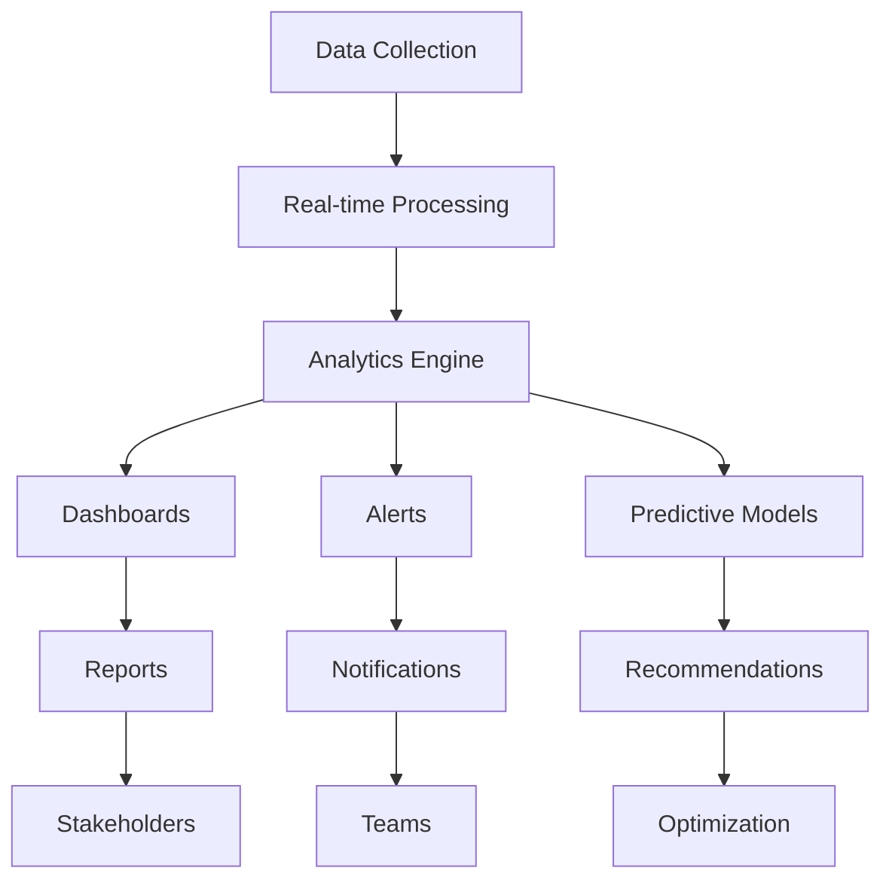

## Dashboard-Ueberblick

Ueberwachen Sie Ihr AetherFlow-Oekosystem mit umfassenden Analysen und Echtzeit-Einblicken.

<Callout kind="info">
  Das Analyse-Dashboard bietet umsetzbare Erkenntnisse zur Optimierung von Workflow-Leistung und Zuverlaessigkeit.
</Callout>

## Wichtige Leistungskennzahlen

Verfolgen Sie wesentliche Kennzahlen, um Workflow-Gesundheit und Effizienz sicherzustellen.

<Columns cols={4}>
  <Card title="Erfolgsrate" icon="check-circle">
    Prozentsatz der Workflows, die ohne Fehler abgeschlossen werden (Zielwert: >95 %)
  </Card>
  <Card title="Durchschnittliche Laufzeit" icon="clock">
    Mittlere Ausfuehrungszeit ueber alle Workflows (Zielwert: &lt;30 Sekunden)
  </Card>
  <Card title="Ausfuehrungsvolumen" icon="activity">
    Gesamtanzahl der in einem bestimmten Zeitraum ausgefuehrten Workflows
  </Card>
  <Card title="Fehlerhaeufigkeit" icon="alert-triangle">
    Rate fehlgeschlagener Workflow-Ausfuehrungen
  </Card>
</Columns>

## Echtzeit-Ueberwachung

Sofortige Sichtbarkeit in die Workflow-Ausfuehrung und den Systemzustand erhalten.

<Tabs>
  <Tab title="Live-Dashboard" icon="monitor">
    Echtzeit-Workflow-Ausfuehrung, aktive Integrationen und Systemstatus anzeigen.
  </Tab>
  <Tab title="Alarmsystem" icon="bell">
    Benachrichtigungen fuer Fehler, Leistungsabfall und ungewoehnliche Muster konfigurieren.
  </Tab>
  <Tab title="Systemzustandspruefungen" icon="heart">
    Automatisierte Ueberwachung der Integrationskonnektivitaet und API-Reaktionsfaehigkeit.
  </Tab>
</Tabs>

## Workflow-Analysen

Detaillierte Untersuchung einzelner Workflow-Leistung und Optimierungsmoeglichkeiten.

<ExpandableGroup>
  <Expandable title="Ausfuehrungstrends">
    Workflow-Ausfuehrungsmuster im Zeitverlauf analysieren und Nutzungsspitzen sowie saisonale Schwankungen identifizieren.
  </Expandable>
  <Expandable title="Schrittweise Analyse">
    Workflow-Ausfuehrung nach einzelnen Schritten aufschluesseln, um Engpaesse zu identifizieren.
  </Expandable>
  <Expandable title="Fehlermustererkennung">
    Wiederkehrende Fehler und deren Grundursachen fuer proaktive Behebung erkennen.
  </Expandable>
</ExpandableGroup>

## Integrationsüberwachung

Zustand und Leistung verbundener Anwendungen verfolgen.

<Steps>
  <Step title="Verbindungsstatus" icon="wifi">
    Echtzeit-Konnektivitaet zu allen integrierten Diensten ueberwachen.
  </Step>
  <Step title="API-Antwortzeiten" icon="zap">
    Antwortzeiten fuer jeden Integrationsendpunkt verfolgen.
  </Step>
  <Step title="Fehlerraten" icon="alert-circle">
    Integrationen mit hohen Fehlerraten identifizieren.
  </Step>
  <Step title="Rate-Limit-Verfolgung" icon="gauge">
    API-Nutzung gegenueber Rate-Limits und Kontingenten ueberwachen.
  </Step>
</Steps>

## Benutzerdefinierte Berichte und Dashboards

Individuelle Analyseansichten fuer verschiedene Interessengruppen erstellen.

<Columns cols={2}>
  <Card title="Fuehrungszusammenfassung" icon="briefcase">
    Ueberblick ueber Automatisierungs-ROI und Geschaeftsauswirkungen auf hoher Ebene.
  </Card>
  <Card title="Technische Tiefenanalyse" icon="code">
    Detaillierte Leistungskennzahlen fuer Entwickler und IT-Teams.
  </Card>
  <Card title="Team-Leistung" icon="users">
    Workflow-Erstellungs- und Wartungskennzahlen nach Team.
  </Card>
  <Card title="Kostenanalyse" icon="dollar-sign">
    Nutzungskosten und Optimierungsmoeglichkeiten.
  </Card>
</Columns>

## Alarmkonfiguration

Intelligente Benachrichtigungen fuer kritische Ereignisse und Schwellenwerte einrichten.

<Tabs>
  <Tab title="Leistungsalerts" icon="trending-down">
    ```json
    {
      "alert_name": "High Error Rate",
      "condition": "error_rate > 5%",
      "timeframe": "last_1_hour",
      "channels": ["email", "slack"],
      "recipients": ["devops@company.com", "#alerts"]
    }
    ```
  </Tab>

  <Tab title="Integrationsalerts" icon="plug">
    ```json
    {
      "alert_name": "Integration Down",
      "condition": "connection_status == 'failed'",
      "duration": "5_minutes",
      "channels": ["email", "sms"],
      "recipients": ["support@company.com"]
    }
    ```
  </Tab>

  <Tab title="Nutzungsalerts" icon="activity">
    ```json
    {
      "alert_name": "Rate Limit Approaching",
      "condition": "api_usage > 80%",
      "channels": ["slack"],
      "recipients": ["#engineering"]
    }
    ```
  </Tab>
</Tabs>

## Protokollanalyse und Debugging

Umfassende Protokollierung fuer Fehlerbehebung und Optimierung.

<Expandable title="Protokolltypen">
- **Ausfuehrungsprotokolle**: Schrittweise Workflow-Ausfuehrungsdetails
- **Fehlerprotokolle**: Detaillierte Fehlermeldungen und Stack-Traces
- **Integrationsprotokolle**: API-Anfrage/-Antwortdaten und Zeitangaben
- **Audit-Protokolle**: Benutzeraktionen und Systemänderungen
- **Leistungsprotokolle**: Ressourcenverbrauch und Zeitkennzahlen
</Expandable>

## Historische Analysen

Langfristige Trends und Muster in Ihrer Automatisierungsnutzung analysieren.

<Steps>
  <Step title="Trendanalyse" icon="trending-up">
    Muster bei Workflow-Nutzung, Fehlern und Leistung ueber Monate hinweg identifizieren.
  </Step>
  <Step title="Saisonale Erkenntnisse" icon="calendar">
    Verstehen, wie Geschaeftszyklen den Automatisierungsbedarf beeinflussen.
  </Step>
  <Step title="Wachstumskennzahlen" icon="bar-chart-3">
    Automatisierungsakzeptanz und Effizienzverbesserungen im Zeitverlauf verfolgen.
  </Step>
  <Step title="ROI-Berechnung" icon="calculator">
    Den finanziellen Einfluss Ihrer Automatisierungsinitiativen messen.
  </Step>
</Steps>

## Kostenoptimierung

AetherFlow-Nutzungskosten ueberwachen und optimieren.

<ExpandableGroup>
  <Expandable title="Nutzungsaufschluesselung">
    Kosten nach Workflow, Integration und Zeitraum analysieren.
  </Expandable>
  <Expandable title="Effizienz-Kennzahlen">
    Workflows mit hohen Kosten im Verhaeltnis zum Geschaeftswert identifizieren.
  </Expandable>
  <Expandable title="Optimierungsempfehlungen">
    KI-gestuetzte Vorschlaege zur Kostensenkung bei gleichbleibender Leistung.
  </Expandable>
</ExpandableGroup>

## Datenexport und -integration

Analysedaten fuer externe Analysen und Berichte exportieren.

<Tabs>
  <Tab title="CSV-Export" icon="download">
    Rohe Kennzahlendaten fuer Tabellenkalkulationsanalysen exportieren.
  </Tab>
  <Tab title="API-Zugriff" icon="code">
    Programmatischen Zugriff auf Analysedaten ueber die REST-API.
  </Tab>
  <Tab title="Drittanbieter-Integration" icon="link">
    Analysen mit BI-Tools wie Tableau, Power BI oder benutzerdefinierten Dashboards verbinden.
  </Tab>
</Tabs>

```javascript
// Analytics API example
const analytics = await fetch('/api/v2/analytics/workflows', {
  headers: {
    'Authorization': `Bearer ${token}`,
    'Content-Type': 'application/json'
  },
  body: JSON.stringify({
    timeframe: 'last_30_days',
    metrics: ['success_rate', 'avg_runtime', 'execution_count'],
    group_by: 'workflow_id'
  })
});
```

## Praediktive Analysen

KI nutzen, um Probleme vorherzusagen und Leistung zu optimieren.

<Callout kind="success">
  Praediktive Analysen helfen, Probleme zu verhindern, bevor sie Ihr Unternehmen beeintraechtigen.
</Callout>

<Columns cols={3}>
  <Card title="Fehlervorhersage" icon="alert-triangle">
    Workflows identifizieren, die basierend auf historischen Mustern wahrscheinlich fehlschlagen werden.
  </Card>
  <Card title="Kapazitaetsplanung" icon="trending-up">
    Ressourcenbedarf basierend auf Nutzungstrends vorhersagen.
  </Card>
  <Card title="Optimierungsvorschlaege" icon="lightbulb">
    KI-Empfehlungen zur Verbesserung der Workflow-Effizienz.
  </Card>
</Columns>

## Compliance- und Audit-Berichte

Compliance mit regulatorischen Anforderungen durch detaillierte Audit-Trails aufrechterhalten.

<Expandable title="Compliance-Funktionen">
- **DSGVO-Compliance**: Datenverarbeitungsprotokolle und Benutzereinwilligungsverfolgung
- **SOC-2-Berichterstattung**: Umfassende Audit-Trails fuer Sicherheitskontrollen
- **Benutzerdefinierte Aufbewahrung**: Konfigurierbare Protokollaufbewahrungszeitraeume
- **Exportfunktionen**: Compliance-Berichte fuer Pruefer erstellen
</Expandable>

## Team-Analysen

Team-Produktivitaet und Zusammenarbeitskennzahlen ueberwachen.

<ExpandableGroup>
  <Expandable title="Workflow-Erstellungskennzahlen">
    Verfolgen, wie viele Workflows jedes Teammitglied erstellt und welche Erfolgsraten sie erzielen.
  </Expandable>
  <Expandable title="Kollaborationserkenntnisse">
    Workflow-Sharing, Reviews und Team-Beitraege analysieren.
  </Expandable>
  <Expandable title="Lernmoeglichkeiten">
    Bereiche identifizieren, in denen Team-Schulungen die Automatisierungsqualitaet verbessern koennen.
  </Expandable>
</ExpandableGroup>



Das Analysen- und Ueberwachungssystem bietet umfassende Transparenz in Ihrem AetherFlow-Oekosystem und ermoeoelicht datengesteuertes Optimieren sowie proaktive Problemloesung.
