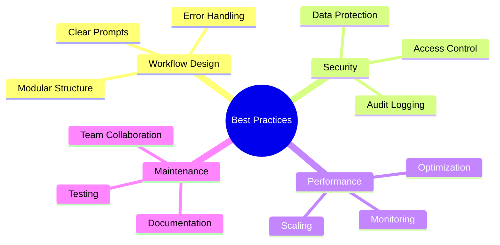

## Workflow-Designprinzipien

Erstellen Sie zuverlaessige, wartbare Workflows mit diesen grundlegenden Prinzipien.

<Callout kind="info" collapsed="false">
  Gut gestaltete Workflows sind einfacher zu debuggen, zu warten und im Laufe der Zeit zu skalieren.
</Callout>

## Prompt-Engineering

Verfassen Sie effektive natuerlichsprachliche Prompts fuer eine optimale KI-Interpretation.

<Columns cols="3">
  <Card title="Praezise sein" icon="target" horizontal="false">
    Trigger, Bedingungen und Aktionen klar definieren. Mehrdeutige Sprache vermeiden.
  </Card>

  <Card title="Kontext verwenden" icon="file-text" horizontal="false">
    Relevante Hintergrundinformationen und Beispiele in Ihren Prompts bereitstellen.
  </Card>

  <Card title="Schrittweise iterieren" icon="refresh-cw" horizontal="false">
    Einfach beginnen und Komplexitaet durch schrittweises Testen erhoehen.
  </Card>
</Columns>

<Tabs>
  <Tab title="Gute Beispiele" icon="check-circle">
    ```prompt wrap
    When a new customer support ticket is created in Zendesk with priority "High",
    analyze the ticket content for keywords related to billing, technical issues, or account problems,
    then route to the appropriate agent based on their expertise and current workload,
    and send a Slack notification to the #support channel with ticket summary.
    ```

    ```prompt
    Every Monday at 9 AM, generate a weekly report from Google Analytics data,
    create a summary of key metrics including page views, conversion rates, and top content,
    format it as a professional report, and share it in the #marketing Slack channel.
    ```
  </Tab>

  <Tab title="Schlechte Beispiele" icon="x-circle">
    ```prompt
    Handle tickets and send notifications.
    ```

    *Zu vage – fehlende spezifische Bedingungen und Aktionen*

    ```prompt
    Do everything related to customer support automatically.
    ```

    *Zu allgemein – fuehrt zu unvorhersehbarem Verhalten*
  </Tab>
</Tabs>

## Fehlerbehandlung und Robustheit

Erstellen Sie robuste Workflows, die Fehler elegant verarbeiten.

<Steps>
  <Step title="Fallbacks implementieren" icon="shield" title-type="p">
    Alternative Aktionen definieren, wenn primaere Integrationen fehlschlagen.
  </Step>

  <Step title="Validierung hinzufuegen" icon="check-circle" title-type="p">
    Datenintegritaet vor der Verarbeitung oder dem Senden pruefen.
  </Step>

  <Step title="Erfolgsraten ueberwachen" icon="bar-chart" title-type="p">
    Alerts fuer Workflows mit sinkender Leistung einrichten.
  </Step>
</Steps>

<Expandable title="Wiederholungsstrategien" default-open="false">
  - **Festes Intervall**: Fehlgeschlagene Schritte nach einer festgelegten Verzoegerung wiederholen (z. B. 30 Sekunden)

  - **Exponentielles Backoff**: Verzoegerung zwischen Wiederholungen erhoehen (30 Sek., 1 Min., 2 Min., 4 Min. ...)

  - **Circuit Breaker**: Wiederholungen nach mehreren Fehlern stoppen und auf manuelle Intervention hinweisen
</Expandable>

## Leistungsoptimierung

Sicherstellen, dass Workflows effizient und innerhalb der Ressourcenlimits laufen.

<ExpandableGroup>
  <Expandable title="Batch-Verarbeitung" default-open="false">
    Aehnliche Operationen buendeln, um API-Aufrufe zu reduzieren und den Durchsatz zu verbessern.
  </Expandable>

  <Expandable title="Caching-Strategien" default-open="false">
    Haeufig aufgerufene Daten speichern, um redundante API-Anfragen zu vermeiden.
  </Expandable>

  <Expandable title="Parallele Ausfuehrung" default-open="false">
    Unabhaengige Schritte nach Moeglichkeit gleichzeitig ausfuehren.
  </Expandable>
</ExpandableGroup>

## Sicherheitsueberlegungen

Sensible Daten schuetzen und Compliance gewaehrleisten.

<Columns cols="2">
  <Card title="Datenverschluesselung" icon="lock" horizontal="false">
    Verschluesselte Verbindungen verwenden und keine sensiblen Informationen protokollieren.
  </Card>

  <Card title="Zugriffskontrolle" icon="key" horizontal="false">
    Workflow-Berechtigungen auf minimal erforderliche Berechtigungen beschraenken.
  </Card>

  <Card title="Audit-Protokollierung" icon="file-text" horizontal="false">
    Protokollierung fuer Compliance- und Debugging-Zwecke aktivieren.
  </Card>

  <Card title="Regelmaessige Ueberpruefungen" icon="eye" horizontal="false">
    Workflows regelmaessig auf Sicherheitsschwachstellen ueberpruefen.
  </Card>
</Columns>

## Tests und Validierung

Workflows gruendlich testen, bevor sie in der Produktionsumgebung eingesetzt werden.

<Tabs>
  <Tab title="Testumgebungen" icon="flask">
    Separate Test-Workflows erstellen, die Produktionssetups widerspiegeln.
  </Tab>

  <Tab title="Grenzfaelle" icon="alert-triangle">
    Mit ungewoehnlichen Dateneingaben, Netzwerkfehlern und Integrationsausfaellen testen.
  </Tab>

  <Tab title="Lasttests" icon="zap">
    Leistung unter erwarteten Spitzenlastbedingungen verifizieren.
  </Tab>
</Tabs>

## Ueberwachung und Wartung

Workflows mit proaktiver Ueberwachung reibungslos am Laufen halten.

<Steps>
  <Step title="Alerts einrichten" icon="bell" title-type="p">
    Benachrichtigungen fuer Fehler, Leistungsabfall und ungewoehnliche Muster konfigurieren.
  </Step>

  <Step title="Regelmaessige Auditierung" icon="clipboard" title-type="p">
    Workflow-Leistung vierteljaehrlich pruefen und bei Bedarf aktualisieren.
  </Step>

  <Step title="Dokumentation" icon="book" title-type="p">
    Klare Dokumentation der Workflow-Logik und Abhaengigkeiten pflegen.
  </Step>
</Steps>

## Team-Zusammenarbeit

Best Practices fuer die gemeinsame Workflow-Entwicklung im Team.

<Expandable title="Versionsverwaltung" default-open="false">
  - Beschreibende Namen fuer Workflow-Versionen verwenden

  - Aenderungen und Begruendungen dokumentieren

  - Gruendlich testen, bevor die Produktionsumgebung aktualisiert wird
</Expandable>

<Expandable title="Code-Reviews" default-open="false">
  - Komplexe Workflows vor der Bereitstellung durch Kollegen pruefen lassen

  - Auf Sicherheitsimplikationen achten

  - Fehlerbehandlung und Grenzfaelle validieren
</Expandable>

## Skalierungsstrategien

Workflows fuer wachsende Nutzung und Komplexitaet vorbereiten.

| Skalierungsstufe | Merkmale                                  | Strategien                                              |
| ---------------- | ----------------------------------------- | ------------------------------------------------------- |
| Klein            | 1–5 Workflows, einfache Integrationen     | Auf Zuverlaessigkeit und Dokumentation fokussieren      |
| Mittel           | 10–50 Workflows, mehrere Teams            | Ueberwachungs- und Testframeworks implementieren        |
| Gross            | 100+ Workflows, Enterprise-Integrationen  | Bereitstellung automatisieren, erweiterte Ueberwachung nutzen |

<Callout kind="tip" collapsed="false">
  Planen Sie von Anfang an fuer Skalierung, indem Sie modulare, wiederverwendbare Workflow-Komponenten entwerfen.
</Callout>

## Kostenoptimierung

AetherFlow-Nutzungskosten effektiv verwalten.

<ExpandableGroup>
  <Expandable title="Nutzungsueberwachung" default-open="false">
    Workflow-Ausfuehrungshaeufigkeit verfolgen und Optimierungsmoeglichkeiten identifizieren.
  </Expandable>

  <Expandable title="Ressourceneffizienz" default-open="false">
    Geeignete Tarifstufen basierend auf tatsaechlichen Nutzungsmustern waehlen.
  </Expandable>

  <Expandable title="Automatisierungs-ROI" default-open="false">
    Workflow-Vorteile regelmaessig gegenueber den Betriebskosten abwaegen.
  </Expandable>
</ExpandableGroup>



Die Einhaltung dieser Best Practices stellt sicher, dass Ihre AetherFlow-Implementierung zuverlaessig, sicher und wartbar ist.
