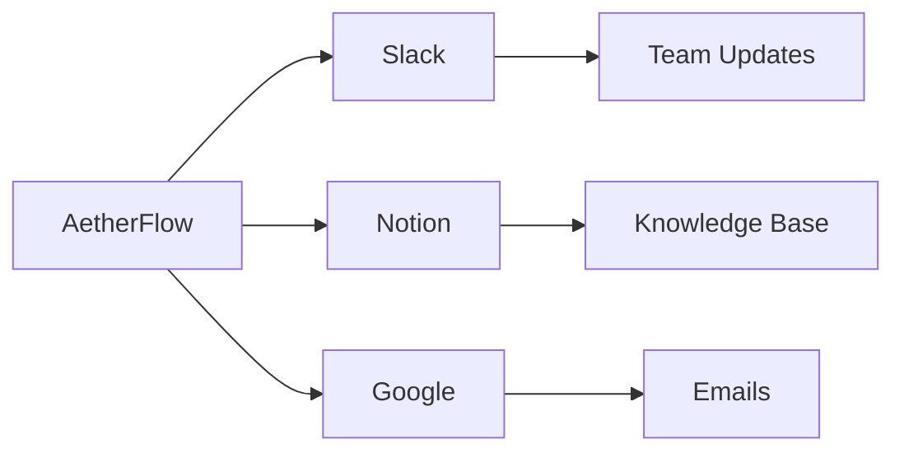

## Ueberblick ueber Integrationen

AetherFlow unterstuetzt ueber 50 beliebte Tools und ermoeglicht die Automatisierung in Ihrem gesamten Tech-Stack. Sie verbinden Apps ueber sicheres OAuth oder API-Schluessel, sodass die KI Daten lesen, Aktionen ausloesen und Informationen synchronisieren kann. Diese Vernetzung verwandelt isolierte Tools in ein einheitliches Workflow-Oekosystem.

<Columns cols={3}>
  <Card title="Kommunikation" icon="message-square">
    Slack, Microsoft Teams, E-Mail (Gmail/Outlook).
  </Card>
  <Card title="Produktivitaet" icon="calendar">
    Notion, Google Workspace, Trello.
  </Card>
  <Card title="CRM" icon="users">
    Salesforce, HubSpot, Zendesk.
  </Card>
</Columns>

## Integrationen einrichten

Navigieren Sie zum Integrations-Dashboard, um Verbindungen hinzuzufuegen. Suchen Sie nach Ihrer App und folgen Sie dem Autorisierungsablauf.

<Steps>
  <Step title="App autorisieren" icon="key">
    Die App auswaehlen und Berechtigungen erteilen. AetherFlow verwaltet die Token-Speicherung sicher.
    ```bash
    # Example CLI for advanced setup
    aetherflow integrate slack --token YOUR_SLACK_TOKEN
    ```
  </Step>
  <Step title="Verbindung testen" icon="check-circle">
    Ein Testereignis senden, um zu bestaetigen, dass die Daten korrekt fliessen.
  </Step>
  <Step title="Im Workflow verwenden" icon="link">
    Die Integration in Ihrem Prompt referenzieren, z. B. "Im Slack-Kanal posten."
  </Step>
</Steps>

## Plattformspezifische Leitfaeden

<Tabs>
  <Tab title="Slack" icon="message-circle">
    Slack verbinden, um Benachrichtigungen aus Workflows zu senden.
    <CodeGroup tabs="Node.js,Python">
      ```javascript
      // Verify integration
      const integrations = await client.getIntegrations();
      console.log(integrations.slack); // { connected: true }
      ```
      ```python
      integrations = client.get_integrations()
      print(integrations['slack'])  # {'connected': True}
      ```
    </CodeGroup>
    <Callout kind="alert">
      Sicherstellen, dass die Bot-Berechtigungen das Posten von Nachrichten umfassen.
    </Callout>
  </Tab>
  <Tab title="Notion" icon="file-text">
    Seiten und Datenbanken automatisch synchronisieren.
    ```javascript
    // Create Notion page from workflow
    await fetch('https://api.notion.com/v1/pages', {
      headers: { 'Authorization': `Bearer ${notionToken}` },
      body: JSON.stringify({ parent: { database_id: 'db_id' } })
    });
    ```
  </Tab>
  <Tab title="Google Workspace" icon="mail">
    Gmail- und Drive-Aufgaben automatisieren.
    <Expandable title="Erweiterte Konfiguration">
      Felder wie Labels und Ordner zuordnen.
    </Expandable>
  </Tab>
</Tabs>

## Benutzerdefinierte Integrationen

Fuer nicht unterstuetzte Apps Webhooks oder benutzerdefinierte API-Aufrufe verwenden. Endpunkte im Workflow-Prompt definieren.



| App | Kategorie | Einrichtungszeit |
|-----|-----------|-----------------|
| Slack | Kommunikation | `<5` Min. |
| Notion | Produktivitaet | `10` Min. |
| Salesforce | CRM | `15` Min. |

<ExpandableGroup>
  <Expandable title="Webhook-Einrichtung">
    Endpunkte fuer eingehende Daten bereitstellen. `{webhook_url}` in Prompts verwenden.
  </Expandable>
  <Expandable title="Best Practices fuer Sicherheit">
    Schluessel regelmaessig rotieren und Berechtigungen einschraenken.
  </Expandable>
</ExpandableGroup>

<Callout kind="success">
  Integrationen schalten AetherFlows volles Potenzial frei – starten Sie mit Ihren am haeufigsten genutzten Tools.
</Callout>

Diese Seite bietet umfassende Integrationsanleitung mit praktischen Beispielen.
