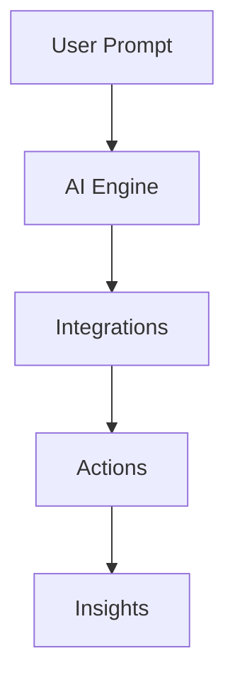

AetherFlow ermoeglicht es Teams, Workflows mithilfe natuerlicher Sprache zu automatisieren, ohne Code zu schreiben. Sie entwerfen intelligente Automatisierungen, indem Sie Aufgaben in einfachem Deutsch beschreiben, und die KI-Engine uebernimmt die Ausfuehrung, Integration und Entscheidungsfindung.

<Columns uid="5a380a1d-6a4b-40a5-bf80-b0291f146451" cols="2">
  <Card title="Intelligente Integrationen" image="https://blob-cdn.documentation.ai/org-a78a7fa2-dcee-40a8-b887-d5d5b2ded474/doc-d7fcf659-1ace-458b-b090-28a59ad7fe5d/1768978595758-awywnsxz3z8-pasted-image-1768978593525.png?q=85&fm=auto&auto=compress%2Cformat" horizontal="false" target="_self">
    Verbinden Sie ueber 50 Apps, darunter Google Workspace und Notion.&#x20;
  </Card>

  <Card title="Analytics-Dashboard" image="https://blob-cdn.documentation.ai/org-a78a7fa2-dcee-40a8-b887-d5d5b2ded474/doc-d7fcf659-1ace-458b-b090-28a59ad7fe5d/1768978626072-a1ey0mdgav-pasted-image-1768978624214.png?q=85&fm=auto&auto=compress%2Cformat" horizontal="false" target="_self">
    Verfolgen Sie Workflow-Ausfuehrungen, Erfolgsraten und Engpaesse. Optimieren Sie Automatisierungen basierend auf echten Daten und KI-Vorschlaegen.
  </Card>

  <Card title="KI-Workflow-Builder" image="https://blob-cdn.documentation.ai/org-a78a7fa2-dcee-40a8-b887-d5d5b2ded474/doc-d7fcf659-1ace-458b-b090-28a59ad7fe5d/1768978539955-o21iy9vwfr-pasted-image-1768978537826.png?q=85&fm=auto&auto=compress%2Cformat" horizontal="false" target="_self">
    Beschreiben Sie Ihre Automatisierungsanforderungen, und AetherFlow generiert den Workflow.&#x20;
  </Card>

  <Card title="Datenbank verbinden" image="https://blob-cdn.documentation.ai/org-a78a7fa2-dcee-40a8-b887-d5d5b2ded474/doc-d7fcf659-1ace-458b-b090-28a59ad7fe5d/1768978648942-0a5f1le6sgw-pasted-image-1768978646772.png?q=85&fm=auto&auto=compress%2Cformat" horizontal="false" target="_self">
    Die Einrichtung dauert nur wenige Minuten mit sicherer OAuth-Authentifizierung.
  </Card>
</Columns>

Text

<Columns cols="3">
  <Card title="Teamzusammenarbeit" icon="users" horizontal="false">
    Teilen Sie Workflows in Ihrem Team mit rollenbasierter Zugriffskontrolle. Ueberpruefen, genehmigen und iterieren Sie gemeinsam in Echtzeit.
  </Card>

  <Card title="Bedingte Logik" icon="git-branch" horizontal="false">
    Erstellen Sie verzweigte Workflows mit Wenn-Dann-Regeln. Leiten Sie Aufgaben dynamisch basierend auf Inhalt, Prioritaet oder benutzerdefinierten Bedingungen weiter.
  </Card>

  <Card title="Geplante Ausloeser" icon="clock" horizontal="false">
    Fuehren Sie Workflows nach Zeitplan aus — stuendlich, taeglich oder woechentlich. Kombinieren Sie zeitbasierte Ausloeser mit ereignisgesteuerter Automatisierung fuer vollstaendige Abdeckung.
  </Card>
</Columns>

## Wichtige Vorteile

Steigern Sie die Effizienz durch Automatisierung von Routineaufgaben und konzentrieren Sie sich auf wertschoepfende Arbeit. Die kontextbewusste KI von AetherFlow passt sich an Veraenderungen an und gewaehrleistet zuverlaessige Ergebnisse. Teams arbeiten nahtlos zusammen, da Workflows Benachrichtigungen und Updates ueber verschiedene Tools hinweg ausloesen.

## Schnelle Einrichtung

<Steps uid="58418e48-f2a9-46a7-b02f-71258fd99550">
  <Step title="Registrieren" icon="user-plus" title-type="p">
    Erstellen Sie Ihr Konto auf aetherflow\.com. Bestaetigen Sie Ihre E-Mail, um auf das Dashboard zuzugreifen.
  </Step>

  <Step title="Tools verbinden" icon="link" title-type="p">
    Navigieren Sie zu Integrationen und autorisieren Sie Ihre erste App, z.B. Slack.

    <Callout kind="tip" collapsed="false">
      Beginnen Sie mit Ihrem meistgenutzten Tool. Sie koennen jederzeit weitere Integrationen ueber das Dashboard hinzufuegen.
    </Callout>
  </Step>

  <Step title="Ersten Workflow erstellen" icon="play" title-type="p">
    Oeffnen Sie den Workflow-Builder und beschreiben Sie Ihre Automatisierung in natuerlicher Sprache. Geben Sie z.B. ein: "Wenn ein neues Support-Ticket eingeht, fasse es zusammen und benachrichtige den Bereitschaftsingenieur in Slack."
  </Step>

  <Step title="Testen und verfeinern" icon="check-circle" title-type="p">
    Fuehren Sie Ihren Workflow im Testmodus aus, um zu ueberpruefen, ob jeder Schritt das erwartete Ergebnis liefert. AetherFlow hebt Probleme hervor und schlaegt Korrekturen vor, bevor Sie live gehen.
  </Step>

  <Step title="Aktivieren und ueberwachen" icon="activity" title-type="p">
    Schalten Sie Ihren Workflow auf aktiv und lassen Sie ihn automatisch laufen. Besuchen Sie das Analytics-Dashboard, um den Ausfuehrungsverlauf, Erfolgsraten und Leistungskennzahlen zu verfolgen.

    <Callout kind="success" collapsed="false">
      Sie haben jetzt eine aktive Automatisierung. Gehen Sie zur Seite [Analytik und Ueberwachung](/analytics-monitoring), um detaillierte Ausfuehrungsprotokolle zu erkunden.
    </Callout>
  </Step>
</Steps>

Fuer die Einrichtung auf mehreren Plattformen lesen Sie die folgenden Tabs.

<Tabs uid="7d824a72-4bad-4d2f-af58-e6fa8a450b94">
  <Tab title="Web" icon="globe">
    Greifen Sie ueber den Browser auf das Dashboard zu. Kein Download erforderlich.

    ```javascript
    // Example API call to create workflow
    const response = await fetch('https://api.aetherflow.com/workflows', {
      method: 'POST',
      headers: { 'Authorization': `Bearer ${token}` },
      body: JSON.stringify({ prompt: 'Automate ticket assignment' })
    });
    ```
  </Tab>

  <Tab title="Mobil" icon="phone">
    Nutzen Sie die App fuer die Ueberwachung unterwegs. Push-Benachrichtigungen informieren Sie ueber Workflow-Ereignisse.
  </Tab>
</Tabs>

## Haeufige Anwendungsfaelle

<ExpandableGroup uid="60c3b2aa-7569-44da-8c71-fa22c61e8692">
  <Expandable title="Automatisierung des Kundensupports" default-open="true">
    Leiten Sie Tickets basierend auf Schluesselwoertern weiter und benachrichtigen Sie Teams ueber Slack. AetherFlow analysiert den Inhalt, um dringende Probleme zu priorisieren.
  </Expandable>

  <Expandable title="Inhaltssynchronisierung" default-open="false">
    Rufen Sie Updates aus Notion ab und synchronisieren Sie sie mit Google Docs. Halten Sie die Konsistenz ueber Plattformen hinweg muehelos aufrecht.
  </Expandable>
</ExpandableGroup>

Diese Einrichtung stellt sicher, dass Sie das volle Potenzial von AetherFlow vom ersten Tag an nutzen. Erkunden Sie weitere Seiten fuer detaillierte Anleitungen.



Mit diesem grundlegenden Wissen verstehen Sie nun die Rolle von AetherFlow bei der Optimierung von Ablaeufen.
