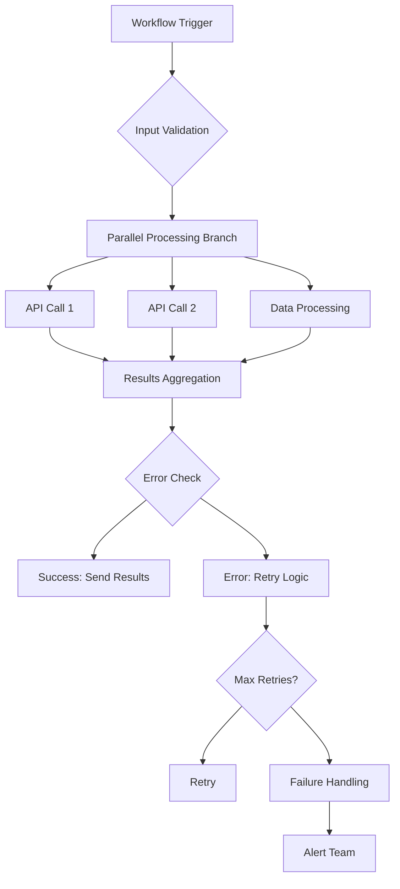

## Leistungsgrundlagen

Verstehen Sie die wichtigsten Faktoren, die die AetherFlow-Leistung beeinflussen, und wie Sie diese optimieren koennen.

<Callout kind="info">
  Gut optimierte Workflows laufen schneller, kosten weniger und bieten zuverlaessigere Automatisierung.
</Callout>

## Workflow-Ausfuehrungszeit

Faktoren, die beeinflussen, wie schnell Ihre Workflows abgeschlossen werden.

<Columns cols={3}>
  <Card title="Integrationslatenz" icon="wifi">
    Zeit fuer die Kommunikation mit externen APIs und Diensten.
  </Card>
  <Card title="Datenverarbeitung" icon="database">
    Zeit fuer die Transformation und Verarbeitung von Daten innerhalb von Workflows.
  </Card>
  <Card title="KI-Verarbeitung" icon="brain">
    Zeit fuer AetherFlows KI zur Interpretation von Prompts und Generierung von Aktionen.
  </Card>
</Columns>

## Optimierungsstrategien

Techniken zur Verbesserung der Workflow-Leistung in verschiedenen Dimensionen.

### Prompt-Optimierung

<ExpandableGroup>
  <Expandable title="Klarheit und Praezision">
    Klare, spezifische Prompts schreiben, die wenig Spielraum fuer KI-Interpretation lassen:

    **Schlecht:** "Kunden-E-Mails verarbeiten"
    **Besser:** "Beim Empfang von Kunden-E-Mails diese als Abrechnung, Support oder Vertrieb kategorisieren und dann an den entsprechenden Team-Kanal in Slack weiterleiten"
  </Expandable>

  <Expandable title="Kontextbereitstellung">
    Notwendigen Kontext im Voraus bereitstellen, anstatt die KI darauf schliessen zu lassen:

    **Schlecht:** "Bestellungen verarbeiten"
    **Besser:** "Wenn eine neue Bestellung aus Shopify eingeht, Lagerbestaende in unserem Lagersystem pruefen, den Bestellstatus aktualisieren und eine Bestaetigungs-E-Mail an customer@example.com senden"
  </Expandable>

  <Expandable title="Aktionsreihenfolge">
    Prompts strukturieren, um Hin- und Herkommunikation zu minimieren:

    **Schlecht:** "E-Mail-Zusammenfassung, dann Slack-Post"
    **Besser:** "Eine woechentliche Vertriebszusammenfassung aus Salesforce-Daten generieren und sie jeden Montag um 9 Uhr im Slack-Kanal #sales posten"
  </Expandable>
</ExpandableGroup>

### Integrationsoptimierung

<Steps>
  <Step title="Batch-Operationen" icon="package">
    Mehrere API-Aufrufe nach Moeglichkeit in einzelne Anfragen buendeln.
  </Step>
  <Step title="Caching-Strategie" icon="database">
    Haeufig aufgerufene Daten cachen, um API-Aufrufe zu reduzieren.
  </Step>
  <Step title="Verbindungs-Pooling" icon="server">
    Verbindungen wiederverwenden, anstatt fuer jede Anfrage neue zu erstellen.
  </Step>
  <Step title="Rate-Limit-Bewusstsein" icon="gauge">
    API-Limits einhalten und intelligente Wiederholungslogik implementieren.
  </Step>
</Steps>

### Datenverarbeitungsoptimierung

<Expandable title="Effiziente Datenverwaltung">
- **Fruehzeitig filtern**: Datenvolumen so frueh wie moeglich im Workflow reduzieren
- **Stream-Verarbeitung**: Grosse Datensaetze in Stuecken statt komplett laden verarbeiten
- **Index-Optimierung**: Geeignete Datenstrukturen fuer Nachschlageoperationen verwenden
- **Speicherverwaltung**: Auf Speicherverbrauch bei grossen Datensaetzen achten
</Expandable>

## Leistung ueberwachen

Workflow-Leistungskennzahlen verfolgen und analysieren.

<Tabs>
  <Tab title="Ausfuehrungskennzahlen" icon="bar-chart">
    Durchschnittliche Ausfuehrungszeit, Erfolgsraten und Fehlermuster ueberwachen.
  </Tab>
  <Tab title="Ressourcenverbrauch" icon="cpu">
    CPU-, Speicher- und API-Aufrufverbrauch verfolgen.
  </Tab>
  <Tab title="Engpassanalyse" icon="search">
    Identifizieren, welche Schritte oder Integrationen Workflows verlangsamen.
  </Tab>
</Tabs>

<Expandable title="Leistungs-Dashboard">
```javascript
// Example: Custom performance monitoring
const performanceData = await client.analytics.getWorkflowMetrics(workflowId, {
  metrics: ['avg_execution_time', 'success_rate', 'step_timings'],
  timeframe: 'last_7_days'
});

// Identify bottlenecks
const slowSteps = performanceData.step_timings
  .filter(step => step.duration > 5000) // Steps taking >5 seconds
  .sort((a, b) => b.duration - a.duration);

console.log('Performance bottlenecks:', slowSteps);
```
</Expandable>

## Kostenoptimierung

Betriebskosten reduzieren und gleichzeitig Leistung erhalten.

<Columns cols={2}>
  <Card title="Ausfuehrungseffizienz" icon="zap">
    Unnoetige Workflow-Ausfuehrungen durch bessere Trigger minimieren.
  </Card>
  <Card title="Ressourcenauslastung" icon="cpu">
    Fuer kostenguenstigen Ressourceneinsatz innerhalb der Leistungsgrenzen optimieren.
  </Card>
  <Card title="Tarifauswahl" icon="credit-card">
    Geeignete Tarife basierend auf tatsaechlichen Nutzungsmustern waehlen.
  </Card>
  <Card title="Caching-Vorteile" icon="database">
    API-Aufrufe durch intelligente Caching-Strategien reduzieren.
  </Card>
</Columns>

## Erweiterte Optimierungstechniken

Ausgefeilte Methoden fuer hochleistungsfaehige Workflows.

### Parallele Verarbeitung

<Expandable title="Workflow-Parallelisierung">
Unabhaengige Schritte gleichzeitig ausfuehren:

```prompt
When processing monthly reports:
1. [Parallel] Generate sales report from Salesforce
2. [Parallel] Generate marketing report from Google Analytics
3. [Parallel] Generate financial report from QuickBooks
4. Combine all reports and send consolidated email
```

**Leistungsauswirkung:** Reduziert die Gesamtausfuehrungszeit von der sequenziellen Summe auf den laengsten einzelnen Schritt.
</Expandable>

### Bedingte Ausfuehrung

<Expandable title="Intelligente Verzweigung">
Unnoetige Verarbeitung durch intelligente Bedingungen vermeiden:

```prompt
When receiving a customer ticket:
- If priority is "urgent", immediately notify on-call engineer via SMS
- If priority is "high", create task in Jira and notify team via Slack
- If priority is "normal", add to support queue and send automated response
- Only for billing-related tickets, also update accounting system
```

**Leistungsauswirkung:** Reduziert die durchschnittliche Ausfuehrungszeit, indem irrelevante Schritte uebersprungen werden.
</Expandable>

### Caching und Memoization

<Expandable title="Intelligentes Caching">
Teure Operationen cachen und Ergebnisse wiederverwenden:

```javascript
// Example caching strategy
const CACHE_TTL = 3600000; // 1 hour

async function getCachedUserData(userId) {
  const cacheKey = `user_${userId}`;
  let userData = await cache.get(cacheKey);

  if (!userData) {
    userData = await fetchUserFromAPI(userId);
    await cache.set(cacheKey, userData, CACHE_TTL);
  }

  return userData;
}
```
</Expandable>

## Skalierbarkeitsueberlegungen

Workflows entwerfen, die mit Ihrem Unternehmenswachstum skalieren.

<ExpandableGroup>
  <Expandable title="Horizontale Skalierung">
    Workflows entwerfen, die erhoehte Last durch parallele Verarbeitung bewaeltigen koennen.
  </Expandable>
  <Expandable title="Ressourcenverwaltung">
    Ordnungsgemaesse Ressourcenzuteilung und -bereinigung in lang laufenden Workflows implementieren.
  </Expandable>
  <Expandable title="Load Balancing">
    Arbeit auf mehrere Instanzen verteilen, wenn das Volumen Schwellenwerte ueberschreitet.
  </Expandable>
</ExpandableGroup>

## Fehlerbehandlungsoptimierung

Effiziente Fehlerbehandlung, die die Leistung nicht beeintraechtigt.

<Expandable title="Sanfter Abbau">
Workflows so gestalten, dass sie bei Ausfall nicht-kritischer Komponenten weiter funktionieren:

```prompt
When generating weekly reports:
- Try to fetch data from primary database
- If primary fails, use backup data source
- Always generate report, even with partial data
- Send report with data quality indicators
```
</Expandable>

<Expandable title="Circuit Breaker">
Kaskadenfehler verhindern, indem problematische Integrationen temporaer deaktiviert werden:

```javascript
class CircuitBreaker {
  constructor(failureThreshold = 5, recoveryTimeout = 60000) {
    this.failureCount = 0;
    this.failureThreshold = failureThreshold;
    this.recoveryTimeout = recoveryTimeout;
    this.state = 'CLOSED'; // CLOSED, OPEN, HALF_OPEN
  }

  async execute(operation) {
    if (this.state === 'OPEN') {
      if (Date.now() - this.lastFailureTime > this.recoveryTimeout) {
        this.state = 'HALF_OPEN';
      } else {
        throw new Error('Circuit breaker is OPEN');
      }
    }

    try {
      const result = await operation();
      this.onSuccess();
      return result;
    } catch (error) {
      this.onFailure();
      throw error;
    }
  }

  onSuccess() {
    this.failureCount = 0;
    this.state = 'CLOSED';
  }

  onFailure() {
    this.failureCount++;
    if (this.failureCount >= this.failureThreshold) {
      this.state = 'OPEN';
      this.lastFailureTime = Date.now();
    }
  }
}
```
</Expandable>

## Leistungstests

Workflow-Leistung systematisch testen und validieren.

<Steps>
  <Step title="Lasttests" icon="activity">
    Workflows unter verschiedenen Lastbedingungen testen, um Limits zu identifizieren.
  </Step>
  <Step title="Stresstests" icon="zap">
    Workflows ueber normale Grenzen hinaus belasten, um Bruchpunkte zu finden.
  </Step>
  <Step title="Dauertests" icon="clock">
    Lang laufende Workflows auf Speicherlecks und Leistungsabfall testen.
  </Step>
  <Step title="Spitzenlasttests" icon="trending-up">
    Ploetzliche Lastspitzen testen, um Skalierbarkeit zu validieren.
  </Step>
</Steps>

## Ueberwachung und Alarmierung

Umfassende Ueberwachung auf Leistungsprobleme einrichten.

<Expandable title="Leistungsalerts">
- **Ausfuehrungszeit**: Alert, wenn Workflows Zeitschwellenwerte ueberschreiten
- **Fehlerraten**: Benachrichtigung, wenn Fehlerraten ueber akzeptable Niveaus steigen
- **Ressourcenverbrauch**: Auf ungewoehnliche Spitzen bei CPU- oder Speicherverbrauch ueberwachen
- **Integrationslatenz**: Alert bei langsamen API-Antworten von Integrationen
</Expandable>

## Zusammenfassung der Best Practices

Wichtige Prinzipien fuer optimale AetherFlow-Leistung.

<Columns cols={4}>
  <Card title="Fuer Parallelitaet entwerfen" icon="split">
    Workflows strukturieren, um gleichzeitige Ausfuehrung zu maximieren.
  </Card>
  <Card title="API-Aufrufe minimieren" icon="minus">
    Operationen buendeln und Caching verwenden, um externe Anfragen zu reduzieren.
  </Card>
  <Card title="Fruehzeitig scheitern" icon="x">
    Fehler fruehzeitig erkennen und behandeln, um verschwendete Verarbeitung zu verhindern.
  </Card>
  <Card title="Kontinuierlich ueberwachen" icon="eye">
    Leistungskennzahlen verfolgen und automatisierte Alerts einrichten.
  </Card>
</Columns>

<Expandable title="Leistungs-Checkliste">
- [ ] Prompts sind klar und spezifisch
- [ ] Unabhaengige Schritte werden parallel ausgefuehrt
- [ ] Teure Operationen werden gecacht
- [ ] Fehlerbehandlung beeintraechtigt die Leistung nicht
- [ ] Ueberwachung und Alarmierung sind konfiguriert
- [ ] Regelmaessige Leistungsueberpruefungen werden durchgefuehrt
- [ ] Skalierbarkeitsueberlegungen sind einbezogen
- [ ] Kostenoptimierung ist mit Leistung abgewogen
</Expandable>



Die Umsetzung dieser Optimierungsstrategien wird Ihre Workflow-Leistung, Zuverlaessigkeit und Kosteneffizienz erheblich verbessern.
