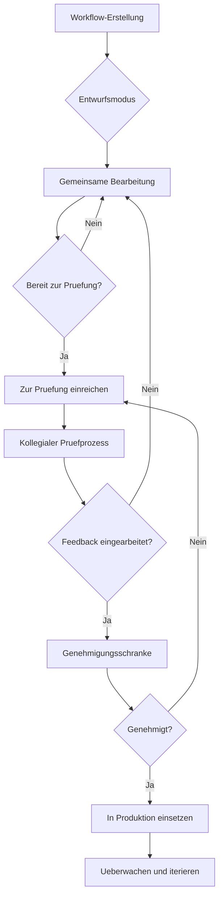

## Mehrbenutzerbereiche

Erstellen Sie gemeinsame Arbeitsbereiche, in denen Teammitglieder an Automatisierungsprojekten zusammenarbeiten koennen.

<Callout kind="info">
  Funktionen fuer die Teamzusammenarbeit sind in den Pro- und Enterprise-Plaenen verfuegbar.
</Callout>

## Arbeitsbereichsverwaltung

Richten Sie kollaborative Umgebungen fuer Ihr Team ein und verwalten Sie diese.

<Steps>
  <Step title="Arbeitsbereich erstellen" icon="folder-plus">
    Richten Sie einen neuen Arbeitsbereich mit benutzerdefinierten Einstellungen und Berechtigungen ein.
  </Step>
  <Step title="Teammitglieder einladen" icon="user-plus">
    Fuegen Sie Kollegen mit geeigneten Rollen und Zugriffsebenen hinzu.
  </Step>
  <Step title="Berechtigungen konfigurieren" icon="shield">
    Legen Sie fest, was jedes Teammitglied anzeigen, bearbeiten und verwalten kann.
  </Step>
  <Step title="Benachrichtigungen einrichten" icon="bell">
    Konfigurieren Sie teamweite Benachrichtigungen und Update-Meldungen.
  </Step>
</Steps>

## Rollenbasierte Zugriffskontrolle

Praezise Berechtigungen gewaehrleisten sicheren und angemessenen Zugriff auf Workflows und Daten.

<Tabs>
  <Tab title="Benutzerrollen" icon="users">
    | Rolle | Berechtigungen | Beschreibung |
    |-------|---------------|--------------|
    | **Eigentümer** | Vollzugriff auf alle Funktionen | Kann Abrechnung, Benutzer und Einstellungen verwalten |
    | **Administrator** | Benutzer und Workflows verwalten | Kann Benutzer hinzufuegen/entfernen und alle Workflows aendern |
    | **Editor** | Workflows erstellen und bearbeiten | Kann Workflows erstellen und aendern, aber keine Benutzer verwalten |
    | **Betrachter** | Nur-Lese-Zugriff | Kann Workflows und Analysen anzeigen, aber nicht aendern |
    | **Ausfuehrer** | Nur Workflows ausfuehren | Beschraenkt auf das Ausfuehren bestehender Workflows |
  </Tab>

  <Tab title="Workflow-Berechtigungen" icon="git-branch">
    Steuern Sie den Zugriff auf Ebene einzelner Workflows:
    - **Oeffentlich**: Fuer alle Teammitglieder sichtbar
    - **Team**: Auf bestimmte Teams beschraenkt
    - **Privat**: Nur Ersteller und benannte Mitarbeiter
    - **Eingeschraenkt**: Nur Lesezugriff, explizite Genehmigung fuer Bearbeitungen erforderlich
  </Tab>
</Tabs>

## Gemeinsame Workflow-Erstellung

Erstellen Sie Workflows gemeinsam mit Echtzeit-Kollaborationsfunktionen.

<Columns cols={3}>
  <Card title="Live-Bearbeitung" icon="edit">
    Mehrere Benutzer koennen Workflows gleichzeitig bearbeiten, mit Konfliktloesung.
  </Card>
  <Card title="Kommentare und Feedback" icon="message-circle">
    Fuegen Sie Kommentare und Vorschlaege direkt zu Workflow-Schritten hinzu.
  </Card>
  <Card title="Versionsverlauf" icon="history">
    Verfolgen Sie Aenderungen und kehren Sie bei Bedarf zu frueheren Versionen zurueck.
  </Card>
</Columns>

<Expandable title="Kollaborations-Workflow">
1. **Entwurfserstellung**: Teammitglied erstellt ersten Workflow-Entwurf
2. **Kollegiale Pruefung**: Kollegen pruefen und geben Feedback
3. **Iterative Verfeinerung**: Vorschlaege und Verbesserungen einarbeiten
4. **Testphase**: Team validiert die Workflow-Funktionalitaet
5. **Genehmigungsprozess**: Benannte Pruefer genehmigen fuer den Produktiveinsatz
6. **Bereitstellung**: Einfuehrung in den Produktivbetrieb mit Ueberwachung
</Expandable>

## Wissensaustausch

Teilen Sie Best Practices, Vorlagen und Dokumentation innerhalb Ihres Teams.

<ExpandableGroup>
  <Expandable title="Workflow-Vorlagen">
    Erstellen Sie wiederverwendbare Workflow-Vorlagen, die Teammitglieder anpassen koennen.
  </Expandable>
  <Expandable title="Dokumentationszentrale">
    Pflegen Sie Team-Dokumentation fuer komplexe Workflows und Integrationen.
  </Expandable>
  <Expandable title="Schulungsressourcen">
    Teilen Sie Tutorials und Best Practices fuer effektive Automatisierung.
  </Expandable>
</ExpandableGroup>

## Team-Analysen und Erkenntnisse

Ueberwachen Sie die Teamleistung und Kollaborationsmetriken.

<Tabs>
  <Tab title="Individuelle Leistung" icon="user">
    Verfolgen Sie die Workflow-Erstellung, Erfolgsraten und Beitraege jedes Teammitglieds.
  </Tab>
  <Tab title="Teamproduktivitaet" icon="users">
    Ueberwachen Sie den allgemeinen Automatisierungseinfluss des Teams und Effizienzverbesserungen.
  </Tab>
  <Tab title="Kollaborationsmetriken" icon="handshake">
    Analysieren Sie Workflow-Sharing, Pruefungen und teamuebergreifende Zusammenarbeit.
  </Tab>
</Tabs>

## Kommunikationsintegration

Verbinden Sie AetherFlow mit Team-Kommunikationstools fuer nahtlose Updates.

<Columns cols={2}>
  <Card title="Slack-Integration" icon="message-circle">
    Empfangen Sie Workflow-Benachrichtigungen und Updates in dedizierten Kanaelen.
  </Card>
  <Card title="Microsoft Teams" icon="users">
    Team-Benachrichtigungen und interaktives Workflow-Management.
  </Card>
  <Card title="E-Mail-Benachrichtigungen" icon="mail">
    Anpassbare E-Mail-Benachrichtigungen fuer wichtige Workflow-Ereignisse.
  </Card>
  <Card title="Webhooks" icon="webhook">
    Senden Sie Workflow-Daten an beliebige Webhook-Endpunkte fuer benutzerdefinierte Integrationen.
  </Card>
</Columns>

## Workflow-Pruefprozess

Implementieren Sie strukturierte Pruefprozesse zur Qualitaetssicherung.

<Steps>
  <Step title="Zur Pruefung einreichen" icon="send">
    Markieren Sie den Workflow als bereit zur Pruefung und weisen Sie Pruefer zu.
  </Step>
  <Step title="Feedback pruefen" icon="message-square">
    Pruefer geben detailliertes Feedback und Vorschlaege.
  </Step>
  <Step title="Kommentare bearbeiten" icon="check-circle">
    Nehmen Sie gewuenschte Aenderungen vor und reichen Sie erneut zur Genehmigung ein.
  </Step>
  <Step title="Endgenehmigung" icon="thumbs-up">
    Genehmigte Workflows koennen in den Produktivbetrieb uebergefuehrt werden.
  </Step>
</Steps>

<Expandable title="Pruefcheckliste">
- [ ] Sicherheitsimplikationen geprueft
- [ ] Fehlerbehandlung implementiert
- [ ] Leistung optimiert
- [ ] Dokumentation aktualisiert
- [ ] Tests abgeschlossen
- [ ] Genehmigung der Stakeholder eingeholt
</Expandable>

## Gemeinsame Ressourcen und Vorlagen

Erstellen und pflegen Sie eine Bibliothek wiederverwendbarer Komponenten.

<ExpandableGroup>
  <Expandable title="Workflow-Komponenten">
    Speichern Sie haeufig verwendete Workflow-Segmente als wiederverwendbare Komponenten.
  </Expandable>
  <Expandable title="Integrationsvorlagen">
    Vorkonfigurierte Integrationseinrichtungen fuer gaengige Dienste.
  </Expandable>
  <Expandable title="Best-Practice-Leitfaeden">
    Dokumentierte Muster und Standards fuer eine konsistente Workflow-Erstellung.
  </Expandable>
</ExpandableGroup>

## Teamuebergreifende Zusammenarbeit

Ermoeglichen Sie die Zusammenarbeit zwischen verschiedenen Abteilungen und Teams.

<Callout kind="tip">
  Teamuebergreifende Zusammenarbeit ueberwindet Silos und ermoeglichst unternehmensweite Automatisierung.
</Callout>

<Columns cols={2}>
  <Card title="Gemeinsame Arbeitsbereiche" icon="building">
    Erstellen Sie Arbeitsbereiche, die mehrere Teams oder Abteilungen umfassen.
  </Card>
  <Card title="Workflow-Sharing" icon="share">
    Teilen Sie Workflows zwischen Teams mit angemessenen Berechtigungen.
  </Card>
  <Card title="Abhaengigkeitsverwaltung" icon="link">
    Verfolgen Sie, wie Teams voneinander abhaengen.
  </Card>
  <Card title="Governance-Richtlinien" icon="gavel">
    Implementieren Sie unternehmensweite Standards und Compliance-Regeln.
  </Card>
</Columns>

## Schulung und Einfuehrung

Helfen Sie neuen Teammitgliedern, sich schnell mit AetherFlow vertraut zu machen.

<Expandable title="Einfuehrungsprogramm">
- **Willkommenspaket**: Uebersichtsdokumentation und Schnellstartanleitungen
- **Praxisschulung**: Interaktive Workshops und Tutorials
- **Mentoring-Programm**: Neue Benutzer mit erfahrenen Teammitgliedern zusammenbringen
- **Zertifizierung**: Kompetenzen durch strukturierte Bewertungen nachweisen
</Expandable>

## Enterprise-Funktionen

Erweiterte Kollaborationsmoeglichkeiten fuer grosse Organisationen.

<ExpandableGroup>
  <Expandable title="Single Sign-On (SSO)">
    Integration mit Enterprise-Identitaetsanbietern wie Okta, Azure AD und SAML.
  </Expandable>
  <Expandable title="Audit-Protokollierung">
    Umfassende Protokollierung aller Benutzeraktionen fuer Compliance und Sicherheit.
  </Expandable>
  <Expandable title="Erweiterte Berechtigungen">
    Detaillierte Berechtigungen bis zu einzelnen Workflow-Aktionen und Datenfeldern.
  </Expandable>
  <Expandable title="Unterstuetzung mehrerer Arbeitsbereiche">
    Verwaltung mehrerer isolierter Arbeitsbereiche innerhalb eines einzigen Enterprise-Kontos.
  </Expandable>
</ExpandableGroup>

## Konfliktloesung

Behandeln Sie Konflikte bei der gemeinsamen Bearbeitung auf elegante Weise.

<Tabs>
  <Tab title="Zusammenfuehrkonflikte" icon="git-merge">
    Wenn mehrere Benutzer gleichzeitig bearbeiten, fuehrt AetherFlow Aenderungen intelligent zusammen.
  </Tab>
  <Tab title="Versionskontrolle" icon="git-branch">
    Pflegen Sie den Versionsverlauf mit der Moeglichkeit, Aenderungen rueckgaengig zu machen und Versionen zu vergleichen.
  </Tab>
  <Tab title="Sperrmechanismus" icon="lock">
    Vermeiden Sie Konflikte, indem Benutzer Workflows waehrend kritischer Bearbeitungen sperren koennen.
  </Tab>
</Tabs>

## Kommunikations-Best-Practices

Etablieren Sie effektive Kommunikationsmuster fuer kollaborative Teams.

<Expandable title="Team-Kommunikationsrichtlinien">
- **Klare Namenskonventionen**: Verwenden Sie beschreibende Namen fuer Workflows und Komponenten
- **Dokumentationsstandards**: Pflegen Sie aktuelle Dokumentation fuer alle Workflows
- **Regelmaessige Synchronisierungsbesprechungen**: Woechentliche Ueberpruefungen der Workflow-Leistung und Verbesserungen
- **Wissensaustausch**: Regelmaessige Sitzungen zum Austausch neuer Techniken und Best Practices
- **Feedbackkultur**: Foerdern Sie konstruktives Feedback und kontinuierliche Verbesserung
</Expandable>

Teamzusammenarbeit verwandelt individuelle Automatisierungsbemühungen in skalierbare Enterprise-Loesungen.
