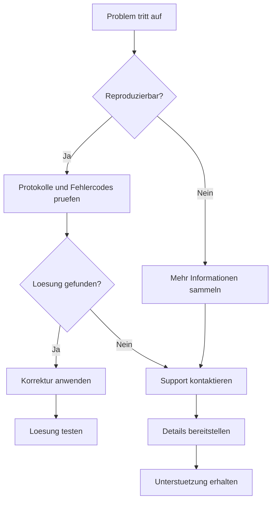

## Haeufige Workflow-Probleme

Loesen Sie die am haeufigsten auftretenden Probleme beim Erstellen und Ausfuehren von Workflows.

<Callout kind="tip">
  Pruefen Sie zuerst Ihre Workflow-Protokolle im Dashboard auf detaillierte Fehlermeldungen.
</Callout>

## Verbindungsprobleme bei Integrationen

Wenn Integrationen keine Verbindung herstellen oder nicht mehr funktionieren, fuehren Sie diese Diagnoseschritte durch.

<Steps>
  <Step title="Anmeldedaten pruefen" icon="key">
    Pruefen Sie, ob API-Schluessel oder OAuth-Token abgelaufen sind. Generieren Sie diese bei Bedarf neu.
  </Step>
  <Step title="Verbindung testen" icon="wifi">
    Verwenden Sie die Integrationstestfunktion im Dashboard, um die Konnektivitaet zu ueberpruefen.
  </Step>
  <Step title="Berechtigungen pruefen" icon="shield">
    Stellen Sie sicher, dass Ihre verbundenen Konten die erforderlichen Berechtigungen fuer die Vorgaenge besitzen.
  </Step>
</Steps>

<Tabs>
  <Tab title="Slack-Probleme" icon="message-circle">
    <Expandable title="Bot-Token-Probleme">
      - Vergewissern Sie sich, dass der Bot-Bereich die erforderlichen Berechtigungen umfasst
      - Pruefen Sie, ob der Bot aus dem Kanal entfernt wurde
      - Generieren Sie das Token neu, falls es kompromittiert wurde
    </Expandable>
    <Expandable title="Ratenbegrenzung">
      Slack-API-Limits: 1 Nachricht pro Sekunde, 100 pro Minute
    </Expandable>
  </Tab>

  <Tab title="Google Workspace" icon="mail">
    <Expandable title="OAuth-Bereiche">
      Stellen Sie sicher, dass alle erforderlichen Bereiche waehrend der Autorisierung gewaehrt werden.
    </Expandable>
    <Expandable title="Domaenenbeschraenkungen">
      Pruefen Sie, ob Ihre Google Workspace-Domaene den Zugriff durch Drittanbieter-Apps erlaubt.
    </Expandable>
  </Tab>

  <Tab title="Notion" icon="file-text">
    <Expandable title="Integrationszugriff">
      Vergewissern Sie sich, dass die Integration Zugriff auf die spezifischen Seiten/Datenbanken hat.
    </Expandable>
  </Tab>
</Tabs>

## Fehler bei der Workflow-Ausfuehrung

Debuggen Sie Workflow-Laeufe, die fehlschlagen oder unerwartete Ergebnisse liefern.

<Columns cols={2}>
  <Card title="Eingabeklarheit" icon="edit-3">
    Formulieren Sie unklare Eingaben neu. Seien Sie spezifisch bezueglich Ausloesern und Aktionen.
  </Card>
  <Card title="Schrittabhaengigkeiten" icon="git-branch">
    Stellen Sie sicher, dass vorausgehende Schritte abgeschlossen sind, bevor abhaengige Aktionen ausgefuehrt werden.
  </Card>
  <Card title="Datenformatprobleme" icon="database">
    Vergewissern Sie sich, dass Datenformate den Integrationsanforderungen entsprechen (JSON, XML usw.).
  </Card>
  <Card title="Zeitlimit-Behandlung" icon="clock">
    Lang laufende Workflows koennen ein Zeitlimit erreichen. Teilen Sie diese in kleinere Schritte auf.
  </Card>
</Columns>

## Fehlercodes und Loesungen

| Fehlercode | Beschreibung | Loesung |
|------------|--------------|---------|
| `AUTH_001` | Ungueltige Anmeldedaten | API-Schluessel pruefen und bei Bedarf neu generieren |
| `INT_002` | Integration offline | Servicestatus pruefen und spaeter erneut versuchen |
| `WF_003` | Ungueltiger Prompt | Workflow-Beschreibung klarer formulieren |
| `RATE_004` | Ratenlimit ueberschritten | Exponentielles Backoff implementieren, Plan upgraden |
| `DATA_005` | Fehlerhafte Daten | Eingabedatenformat und -struktur validieren |

## Leistungsprobleme

Optimieren Sie langsame oder nicht reagierende Workflows.

<ExpandableGroup>
  <Expandable title="Workflow-Optimierung">
    - Unnoetige Schritte reduzieren
    - Parallele Verarbeitung wo moeglich einsetzen
    - Haeufig abgerufene Daten zwischenspeichern
  </Expandable>
  <Expandable title="Integrationsleistung">
    - API-Aufrufe buendeln, um den Overhead zu reduzieren
    - Webhooks anstelle von Polling verwenden
    - Datenuebertragungsgroessen optimieren
  </Expandable>
</ExpandableGroup>

## Konto- und Abrechnungsprobleme

Loesen Sie Anmelde-, Zugriffs- und Zahlungsprobleme.

<Steps>
  <Step title="Kontozugriff" icon="user">
    Setzen Sie das Passwort zurueck, wenn die Anmeldung fehlschlaegt. Pruefen Sie Ihre E-Mail auf Verifizierungslinks.
  </Step>
  <Step title="Abrechnungsbenachrichtigungen" icon="credit-card">
    Aktualisieren Sie Zahlungsmethoden vor Ablauf. Ueberwachen Sie die Nutzung im Verhaeltnis zu den Limits.
  </Step>
  <Step title="Teamberechtigungen" icon="users">
    Ueberpruefen Sie Benutzerrollen und Berechtigungen fuer eingeschraenkte Funktionen.
  </Step>
</Steps>

## Debug-Tools und Protokollierung

Nutzen Sie die Debug-Moeglichkeiten von AetherFlow fuer komplexe Probleme.

<Tabs>
  <Tab title="Workflow-Protokolle" icon="file-text">
    ```json
    {
      "workflow_id": "wf_123",
      "step": "slack_notification",
      "status": "error",
      "message": "Channel not found",
      "timestamp": "2024-01-15T10:30:00Z"
    }
    ```
  </Tab>

  <Tab title="API-Debugging" icon="code">
    Verwenden Sie Tools wie Postman oder curl mit ausfuehrlicher Ausgabe:

    ```bash
    curl -v -X GET "https://api.aetherflow.com/v2/workflows" \
      -H "Authorization: Bearer YOUR_TOKEN"
    ```
  </Tab>
</Tabs>

## Hilfe erhalten

Wenn Sie Probleme nicht eigenstaendig loesen koennen, wenden Sie sich an den Support.

<Callout kind="success">
  Geben Sie beim Kontakt mit dem Support die Workflow-ID, Fehlermeldungen und Schritte zur Reproduktion an.
</Callout>

| Support-Kanal | Reaktionszeit | Am besten geeignet fuer |
|---------------|--------------|------------------------|
| Dokumentation | Sofort | Self-Service-Loesungen |
| Community-Forum | 24 Stunden | Unterstuetzung durch Gleichgesinnte |
| E-Mail-Support | 48 Stunden | Komplexe technische Probleme |
| Live-Chat | 30 Minuten | Dringende Produktionsprobleme |



Diese Fehlerbehebungsanleitung hilft Ihnen, haeufige AetherFlow-Probleme schnell zu identifizieren und zu loesen.
