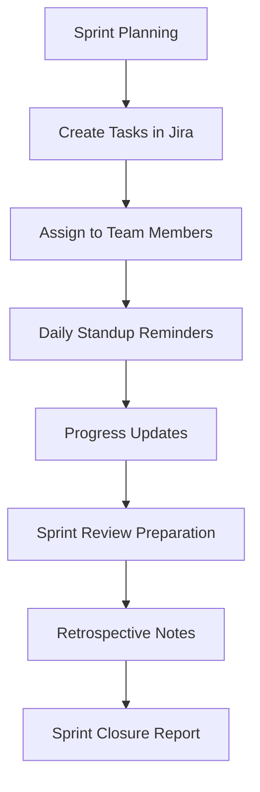

## Kundensupport-Automatisierung

Optimieren Sie den Supportbetrieb mit intelligenter Ticket-Weiterleitung und automatisierten Antworten.

<Callout kind="success">
  Support-Teams, die AetherFlow nutzen, berichten von 40 % schnelleren Reaktionszeiten und verbesserter Kundenzufriedenheit.
</Callout>

### Intelligente Ticket-Weiterleitung

Kategorisieren und weisen Sie Support-Tickets automatisch basierend auf der Inhaltsanalyse zu.

<Expandable title="Beispiel-Workflow-Prompt">
```
Wenn ein neues Ticket in Zendesk erstellt wird:
- Betreff und Beschreibung des Tickets auf Schluesselwoerter analysieren
- Als "Abrechnung", "Technik", "Konto" oder "Allgemein" kategorisieren
- Verfuegbarkeit und Fachkenntnisse der Mitarbeiter pruefen
- Dem am besten geeigneten verfuegbaren Mitarbeiter zuweisen
- Slack-Benachrichtigung an den zugewiesenen Mitarbeiter mit Prioritaetsstufe senden
- Bei hoher Prioritaet auch den Support-Manager benachrichtigen
```
</Expandable>

### Automatisierte Antworten

Generieren Sie kontextbezogene Antworten fuer haeufige Support-Szenarien.

<Tabs>
  <Tab title="Passwort zuruecksetzen" icon="key">
    ```prompt
    Wenn ein Kunde eine Passwortzuruecksetzung anfordert:
    - Sicheres tempoeraeres Passwort generieren
    - Zuruecksetz-E-Mail mit klaren Anweisungen senden
    - Kundendatensatz mit Zeitstempel der Zuruecksetzung aktualisieren
    - Aktion im Sicherheits-Auditprotokoll erfassen
    ```
  </Tab>

  <Tab title="Bestellstatusanfrage" icon="package">
    ```prompt
    Wenn ein Kunde nach dem Bestellstatus fragt:
    - Bestellung im System anhand der angegebenen Bestellnummer suchen
    - Aktuellen Versandstatus und voraussichtliche Lieferung pruefen
    - Personalisierte Antwort mit Trackinginformationen senden
    - Bei Verspaetung Rabatt auf den naechsten Einkauf anbieten
    ```
  </Tab>
</Tabs>

## Content-Management

Automatisieren Sie Workflows fuer Inhaltserstellung, Veroeffentlichung und Verteilung.

<Columns cols={2}>
  <Card title="Blog-Veroeffentlichung" icon="file-text">
    Blogbeitraege aus Gliederungen generieren, Veroeffentlichung planen und auf mehreren Plattformen verteilen.
  </Card>
  <Card title="Social-Media-Management" icon="share">
    Inhaltskalender erstellen, Beitraege generieren und plattformuebergreifende Veroeffentlichungen planen.
  </Card>
</Columns>

### Beispiel fuer einen Content-Workflow

```prompt
Woeochentliche Automatisierung der Inhaltsveroeffentlichung:
- 5 Blog-Ideen basierend auf aktuellen Trends in unserer Branche generieren
- Detaillierte Gliederungen fuer jede Idee erstellen
- Verfuegbaren Autoren basierend auf deren Fachkenntnissen zuweisen
- Ueberarbeitungsworkflow mit Redakteurgenehmigung einrichten
- Veroeffentlichung fuer optimale Engagement-Zeiten planen
- Cross-Posting auf LinkedIn, Twitter und Unternehmens-Newsletter
- Engagement-Kennzahlen verfolgen und Leistungsbericht erstellen
```

## Vertriebs- und Marketing-Automatisierung

Verbessern Sie Lead-Generierung, -Pflege und Konversionsprozesse.

<ExpandableGroup>
  <Expandable title="Lead-Qualifizierung">
    Leads automatisch bewerten und weiterleiten basierend auf Verhalten und demografischen Daten.
  </Expandable>
  <Expandable title="E-Mail-Kampagnen">
    E-Mail-Sequenzen basierend auf Lead-Merkmalen und Engagement personalisieren.
  </Expandable>
  <Expandable title="Meeting-Planung">
    Vertriebsmeetings und Nachverfolgungen ueber mehrere Zeitzonen hinweg koordinieren.
  </Expandable>
</ExpandableGroup>

### Automatisierung der Vertriebspipeline

<Steps>
  <Step title="Lead-Erfassung" icon="user-plus">
    Leads aus Website-Formularen, sozialen Medien und Visitenkarten erfassen.
  </Step>
  <Step title="Qualifizierung" icon="filter">
    Leads basierend auf Unternehmensgroesse, Budget, Zeitplan und Engagement bewerten.
  </Step>
  <Step title="Pflege" icon="mail">
    Personalisierte E-Mail-Sequenzen und Inhaltsempfehlungen senden.
  </Step>
  <Step title="Konversion" icon="target">
    Benachrichtigungen fuer das Vertriebsteam ausloesen, wenn Leads den Zielwert erreichen.
  </Step>
</Steps>

## Personalautomatisierung

Optimieren Sie HR-Prozesse vom Onboarding bis zum Offboarding.

<Callout kind="info">
  HR-Automatisierung reduziert den Verwaltungsaufwand um bis zu 60 % und verbessert das Mitarbeitererlebnis.
</Callout>

### Mitarbeiter-Onboarding

```prompt
Onboarding-Workflow fuer neue Mitarbeiter:
- Konten im HR-System, fuer E-Mail und Slack erstellen
- Willkommens-E-Mail mit Informationen fuer den ersten Arbeitstag senden
- Onboarding-Meetings mit Vorgesetztem und Team planen
- Lohnabrechnung und Leistungsanmeldung einrichten
- Schulungsmodule zuweisen und Abschluss verfolgen
- Feedback-Umfrage nach der ersten Woche senden
```

### Leistungsbeurteilungsprozess

<Tabs>
  <Tab title="Selbstbeurteilung erfassen" icon="user">
    ```prompt
    Vierteljährliche Leistungsbeurteilungen:
    - Selbstbeurteilungsformular 2 Wochen vor dem Beurteilungszeitraum an alle Mitarbeiter senden
    - Mitarbeiter erinnern, falls nicht ausgefuellt, 3 Tage vor Ablauf
    - Feedbackformulare der Vorgesetzten einsammeln
    - Konsolidiertes Beurteilungsdokument erstellen
    - Beurteilungsmeetings automatisch planen
    ```
  </Tab>

  <Tab title="Zielsetzung" icon="target">
    ```prompt
    Jaehrlicher Zielsetzungsprozess:
    - Zielsetzungsvorlagen an alle Mitarbeiter verteilen
    - Einzelgespraeche mit Vorgesetzten planen
    - Zielfortschritt ueber das Jahr hinweg verfolgen
    - Vierteljährliche Check-in-Erinnerungen senden
    - Jahresendbericht zur Zielerreichung erstellen
    ```
  </Tab>
</Tabs>

## Projektmanagement

Automatisieren Sie Projektworkflows und Teamkoordination.

<Columns cols={3}>
  <Card title="Aufgabenzuweisung" icon="check-square">
    Aufgaben basierend auf Verfuegbarkeit und Faehigkeiten der Teammitglieder verteilen.
  </Card>
  <Card title="Fortschrittsverfolgung" icon="bar-chart">
    Projektmeilensteine ueberwachen und Statusupdates senden.
  </Card>
  <Card title="Ressourcenzuweisung" icon="users">
    Teamauslastung und Arbeitsverteilung optimieren.
  </Card>
</Columns>

### Agiles Sprint-Management



## Finanzoperationen

Automatisieren Sie Rechnungsstellung, Berichterstattung und Compliance-Prozesse.

<Expandable title="Rechnungsverarbeitung">
```
Workflow zur Rechnungsautomatisierung:
- Daten aus eingegangenen Rechnungen per OCR extrahieren
- Gegen Bestellungen und Vertraege pruefen
- Basierend auf Betragsschwellen zur Genehmigung weiterleiten
- Zahlung ueber das Buchhaltungssystem verarbeiten
- Bestaetigung an den Lieferanten senden
- Fuer Pruefprotokoll ablegen
```
</Expandable>

## IT-Betrieb

Optimieren Sie das IT-Service-Management und die Infrastrukturueberwachung.

<ExpandableGroup>
  <Expandable title="Incident-Response">
    Alarme automatisch priorisieren, Tickets erstellen und Bereitschaftsingenieure benachrichtigen.
  </Expandable>
  <Expandable title="Backup-Verifizierung">
    Backup-Abschluss verifizieren, Wiederherstellungsverfahren testen und Berichte senden.
  </Expandable>
  <Expandable title="Lizenzverwaltung">
    Software-Lizenzen verfolgen, Erneuerungserinnerungen senden und Nutzung optimieren.
  </Expandable>
</ExpandableGroup>

## Branchenspezifische Vorlagen

Vorgefertigte Workflow-Vorlagen fuer haeufige Geschaeftsszenarien.

| Branche | Beliebte Anwendungsbeispiele |
|---------|------------------------------|
| **E-Commerce** | Auftragsabwicklung, Bestandsverwaltung, Kundendienst |
| **Gesundheitswesen** | Terminplanung, Patienten-Nachverfolgung, Compliance-Berichte |
| **Bildung** | Studentenanmeldung, Notenverarbeitung, Anwesenheitsverfolgung |
| **Rechtswesen** | Dokumentenpruefung, Fristenverfolgung, Kundenkommunikation |
| **Fertigung** | Qualitaetskontrolle, Lieferkettenüberwachung, Wartungsplanung |

<Callout kind="tip">
  Starten Sie mit diesen Vorlagen und passen Sie sie an Ihre spezifischen Geschaeftsprozesse an.
</Callout>

## Beispiele fuer benutzerdefinierte Integrationen

Erstellen Sie Workflows, die mehrere Tools kreativ kombinieren.

```javascript
// Advanced API integration example
const workflow = {
  name: "Customer Onboarding",
  trigger: "webhook",
  steps: [
    {
      action: "create_customer",
      service: "stripe",
      data: "${webhook.customer_data}"
    },
    {
      action: "send_welcome_email",
      service: "sendgrid",
      template: "customer_welcome",
      data: {
        name: "${steps.create_customer.name}",
        account_link: "${steps.create_customer.account_url}"
      }
    },
    {
      action: "create_task",
      service: "asana",
      project: "Customer Success",
      assignee: "account_manager",
      due_date: "in 3 days"
    }
  ]
};
```

Diese Beispiele veranschaulichen die Vielseitigkeit von AetherFlow in verschiedenen Geschaeftsbereichen und Branchen.
