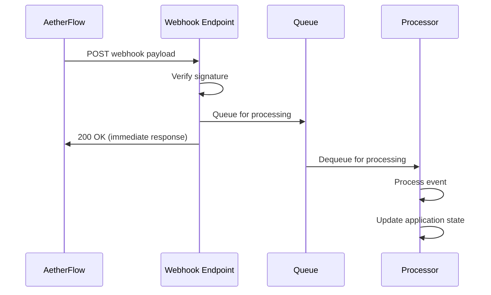

## Webhook-Uebersicht

Empfangen Sie Echtzeit-Benachrichtigungen ueber Workflow-Ereignisse und integrieren Sie AetherFlow mit externen Systemen.

<Callout kind="info">
  Webhooks liefern sofortige Benachrichtigungen, wenn Workflow-Ereignisse auftreten, und ermoeglichen Echtzeit-Integrationen.
</Callout>

## Webhooks erstellen

Richten Sie Webhook-Endpunkte ein, um AetherFlow-Ereignisbenachrichtigungen zu empfangen.

<Steps>
  <Step title="Endpunkt erstellen" icon="server">
    Richten Sie einen HTTPS-Endpunkt in Ihrer Anwendung ein, um Webhook-Payloads zu empfangen.
  </Step>
  <Step title="Webhook konfigurieren" icon="settings">
    Registrieren Sie Ihre Endpunkt-URL im AetherFlow-Dashboard.
  </Step>
  <Step title="Secret hinzufuegen" icon="key">
    Generieren und konfigurieren Sie ein Webhook-Secret fuer die Payload-Verifizierung.
  </Step>
  <Step title="Verbindung testen" icon="check-circle">
    Senden Sie Testereignisse, um zu ueberpruefen, ob Ihr Endpunkt Webhooks empfaengt und verarbeitet.
  </Step>
</Steps>

## Webhook-Ereignisse

Abonnieren Sie bestimmte Ereignisse, die Webhook-Benachrichtigungen ausloesen.

<ExpandableGroup>
  <Expandable title="Workflow-Ereignisse">
    - `workflow.created` - Wird ausgeloest, wenn ein neuer Workflow erstellt wird
    - `workflow.updated` - Wird ausgeloest, wenn die Workflow-Konfiguration geaendert wird
    - `workflow.deleted` - Wird ausgeloest, wenn ein Workflow geloescht wird
    - `workflow.executed` - Wird ausgeloest, wenn eine Workflow-Ausfuehrung beginnt
    - `workflow.completed` - Wird ausgeloest, wenn ein Workflow erfolgreich abgeschlossen wird
    - `workflow.failed` - Wird ausgeloest, wenn eine Workflow-Ausfuehrung fehlschlaegt
  </Expandable>

  <Expandable title="Integrationsereignisse">
    - `integration.connected` - Wird ausgeloest, wenn eine Integration erfolgreich verbunden wird
    - `integration.disconnected` - Wird ausgeloest, wenn eine Integrationsverbindung unterbrochen wird
    - `integration.error` - Wird ausgeloest, wenn eine Integration auf einen Fehler stoesst
  </Expandable>

  <Expandable title="Systemereignisse">
    - `user.invited` - Wird ausgeloest, wenn ein Teammitglied eingeladen wird
    - `user.joined` - Wird ausgeloest, wenn ein Benutzer dem Arbeitsbereich beitritt
    - `billing.updated` - Wird ausgeloest, wenn sich Abrechnungsinformationen aendern
  </Expandable>
</ExpandableGroup>

## Webhook-Payload-Struktur

Verstehen Sie das Format von Webhook-Payloads und wie diese verarbeitet werden.

<Expandable title="Payload bei erfolgreicher Workflow-Ausfuehrung">
```json
{
  "event": "workflow.completed",
  "id": "evt_1234567890",
  "timestamp": "2024-01-15T10:30:00Z",
  "data": {
    "workflow": {
      "id": "wf_abc123",
      "name": "Email Processor",
      "status": "completed",
      "execution_time": 2500,
      "executed_at": "2024-01-15T10:29:57Z"
    },
    "steps": [
      {
        "id": "step_1",
        "name": "Process Email",
        "status": "completed",
        "duration": 1200
      },
      {
        "id": "step_2",
        "name": "Send Slack Notification",
        "status": "completed",
        "duration": 1300
      }
    ],
    "custom_data": {
      "email_subject": "Important Update",
      "priority": "high"
    }
  }
}
```
</Expandable>

<Expandable title="Payload bei Workflow-Fehler">
```json
{
  "event": "workflow.failed",
  "id": "evt_1234567891",
  "timestamp": "2024-01-15T10:35:00Z",
  "data": {
    "workflow": {
      "id": "wf_def456",
      "name": "Data Sync",
      "status": "failed",
      "error_message": "Integration timeout",
      "failed_at": "2024-01-15T10:34:45Z"
    },
    "error_details": {
      "step": "step_3",
      "integration": "salesforce",
      "error_code": "TIMEOUT",
      "retry_count": 3
    }
  }
}
```
</Expandable>

## Sicherheit und Verifizierung

Sichern Sie Ihre Webhook-Endpunkte und verifizieren Sie die Authentiztaet von Payloads.

<Callout kind="warning">
  Verifizieren Sie immer Webhook-Signaturen, um sicherzustellen, dass Payloads echt sind und nicht manipuliert wurden.
</Callout>

### Signaturverifizierung

<CodeGroup tabs="Node.js,Python,Go">
```javascript
const crypto = require('crypto');

function verifySignature(payload, signature, secret) {
  const expectedSignature = crypto
    .createHmac('sha256', secret)
    .update(payload, 'utf8')
    .digest('hex');

  return crypto.timingSafeEqual(
    Buffer.from(signature, 'hex'),
    Buffer.from(expectedSignature, 'hex')
  );
}

// Verwendung in Express.js
app.post('/webhook', express.raw({ type: 'application/json' }), (req, res) => {
  const signature = req.headers['x-aetherflow-signature'];
  const secret = process.env.WEBHOOK_SECRET;

  if (!verifySignature(req.body, signature, secret)) {
    return res.status(401).send('Invalid signature');
  }

  // Webhook-Payload verarbeiten
  const payload = JSON.parse(req.body);
  // ... Ereignis verarbeiten
});
```

```python
import hmac
import hashlib
import json

def verify_signature(payload: bytes, signature: str, secret: str) -> bool:
    expected_signature = hmac.new(
        secret.encode('utf-8'),
        payload,
        hashlib.sha256
    ).hexdigest()

    return hmac.compare_digest(signature, expected_signature)

# Verwendung in Flask
@app.route('/webhook', methods=['POST'])
def webhook():
    signature = request.headers.get('X-AetherFlow-Signature')
    secret = os.environ.get('WEBHOOK_SECRET')

    if not verify_signature(request.data, signature, secret):
        return 'Invalid signature', 401

    payload = request.get_json()
    # ... Ereignis verarbeiten
    return 'OK', 200
```

```go
package main

import (
    "crypto/hmac"
    "crypto/sha256"
    "encoding/hex"
    "fmt"
    "io/ioutil"
    "net/http"
)

func verifySignature(payload []byte, signature string, secret string) bool {
    mac := hmac.New(sha256.New, []byte(secret))
    mac.Write(payload)
    expectedMAC := mac.Sum(nil)
    expectedSignature := hex.EncodeToString(expectedMAC)

    return hmac.Equal([]byte(signature), []byte(expectedSignature))
}

func webhookHandler(w http.ResponseWriter, r *http.Request) {
    signature := r.Header.Get("X-AetherFlow-Signature")
    secret := os.Getenv("WEBHOOK_SECRET")

    payload, err := ioutil.ReadAll(r.Body)
    if err != nil {
        http.Error(w, "Bad request", 400)
        return
    }

    if !verifySignature(payload, signature, secret) {
        http.Error(w, "Invalid signature", 401)
        return
    }

    // Webhook-Payload verarbeiten
    // ... Ereignis verarbeiten
    fmt.Fprint(w, "OK")
}
```
</CodeGroup>

## Webhook-Ereignisse verarbeiten

Verarbeiten Sie verschiedene Typen von Webhook-Ereignissen in Ihrer Anwendung.

<Expandable title="Beispiel zur Ereignisverarbeitung">
```javascript
function processWebhookEvent(eventType, data) {
  switch (eventType) {
    case 'workflow.completed':
      // Interne Datensaetze aktualisieren
      updateWorkflowStatus(data.workflow.id, 'completed');
      // Benachrichtigungen senden
      notifyTeam(data.workflow.name + ' completed successfully');
      break;

    case 'workflow.failed':
      // Fehlerdetails protokollieren
      logWorkflowError(data.workflow.id, data.error_details);
      // Wiederholung ausloesen oder Alarm senden
      if (data.error_details.retry_count < 3) {
        retryWorkflow(data.workflow.id);
      } else {
        alertDevopsTeam(data.workflow.name + ' failed permanently');
      }
      break;

    case 'integration.disconnected':
      // Integrationsprobleme behandeln
      disableWorkflowsUsingIntegration(data.integration.id);
      sendIntegrationAlert(data.integration.name);
      break;

    default:
      console.log('Unhandled event type:', eventType);
  }
}
```

```python
def process_webhook_event(event_type: str, data: dict):
    if event_type == 'workflow.completed':
        # Interne Datensaetze aktualisieren
        update_workflow_status(data['workflow']['id'], 'completed')
        # Benachrichtigungen senden
        notify_team(f"{data['workflow']['name']} completed successfully")

    elif event_type == 'workflow.failed':
        # Fehlerdetails protokollieren
        log_workflow_error(data['workflow']['id'], data['error_details'])
        # Wiederholung ausloesen oder Alarm senden
        if data['error_details']['retry_count'] < 3:
            retry_workflow(data['workflow']['id'])
        else:
            alert_devops_team(f"{data['workflow']['name']} failed permanently")

    elif event_type == 'integration.disconnected':
        # Integrationsprobleme behandeln
        disable_workflows_using_integration(data['integration']['id'])
        send_integration_alert(data['integration']['name'])

    else:
        print(f'Unhandled event type: {event_type}')
```
</Expandable>

## Wiederholungslogik und Zuverlaessigkeit

Behandeln Sie fehlgeschlagene Webhook-Zustellungen und implementieren Sie Wiederholungsmechanismen.

<Callout kind="tip">
  Implementieren Sie idempotente Webhook-Handler, um doppelte Zustellungen sicher zu verarbeiten.
</Callout>

<Columns cols={2}>
  <Card title="Idempotenz" icon="repeat">
    Verwenden Sie Ereignis-IDs, um die Verarbeitung doppelter Webhook-Zustellungen zu verhindern.
  </Card>
  <Card title="Wiederholungsbehandlung" icon="refresh-cw">
    AetherFlow versucht fehlgeschlagene Webhook-Zustellungen automatisch bis zu 3 Mal erneut.
  </Card>
  <Card title="Timeout-Behandlung" icon="clock">
    Antworten Sie innerhalb von 10 Sekunden, um Zustellungswiederholungen zu vermeiden.
  </Card>
  <Card title="Fehlerantworten" icon="alert-triangle">
    Geben Sie geeignete HTTP-Statuscodes fuer verschiedene Fehlerbedingungen zurueck.
  </Card>
</Columns>

<Expandable title="Beispiel eines idempotenten Handlers">
```javascript
const processedEvents = new Set();

function handleWebhook(req, res) {
  const eventId = req.body.id;

  // Pruefen, ob wir dieses Ereignis bereits verarbeitet haben
  if (processedEvents.has(eventId)) {
    return res.status(200).send('Already processed');
  }

  try {
    // Den Webhook verarbeiten
    processWebhookEvent(req.body.event, req.body.data);

    // Als verarbeitet markieren
    processedEvents.add(eventId);

    // Alte Ereignisse bereinigen (letzte 1000 behalten)
    if (processedEvents.size > 1000) {
      const oldestEvent = processedEvents.values().next().value;
      processedEvents.delete(oldestEvent);
    }

    res.status(200).send('Processed');
  } catch (error) {
    console.error('Webhook processing error:', error);
    res.status(500).send('Processing failed');
  }
}
```

```python
processed_events = set()

def handle_webhook():
    event_id = request.json['id']

    # Pruefen, ob wir dieses Ereignis bereits verarbeitet haben
    if event_id in processed_events:
        return 'Already processed', 200

    try:
        # Den Webhook verarbeiten
        process_webhook_event(request.json['event'], request.json['data'])

        # Als verarbeitet markieren
        processed_events.add(event_id)

        # Alte Ereignisse bereinigen (letzte 1000 behalten)
        if len(processed_events) > 1000:
            oldest_event = next(iter(processed_events))
            processed_events.remove(oldest_event)

        return 'Processed', 200
    except Exception as e:
        print(f'Webhook processing error: {e}')
        return 'Processing failed', 500
```
</Expandable>

## Webhooks testen

Testen Sie Ihre Webhook-Integrationen, bevor Sie diese live schalten.

<Tabs>
  <Tab title="Dashboard-Tests" icon="monitor">
    Verwenden Sie das AetherFlow-Dashboard, um Test-Webhook-Ereignisse an Ihren Endpunkt zu senden.
  </Tab>

  <Tab title="Lokale Entwicklung" icon="code">
    Verwenden Sie Tools wie ngrok oder localtunnel, um lokale Entwicklungsserver zugaenglich zu machen.
  </Tab>

  <Tab title="Automatisierte Tests" icon="robot">
    Erstellen Sie Unit-Tests fuer Webhook-Handler und Payload-Verarbeitung.
  </Tab>
</Tabs>

<Expandable title="Beispiel-Test-Payload">
```bash
curl -X POST http://your-endpoint.com/webhook \
  -H "Content-Type: application/json" \
  -H "X-AetherFlow-Signature: test_signature" \
  -d '{
    "event": "workflow.completed",
    "id": "test_event_123",
    "timestamp": "2024-01-15T10:30:00Z",
    "data": {
      "workflow": {
        "id": "test_workflow",
        "name": "Test Workflow",
        "status": "completed"
      }
    }
  }'
```
</Expandable>

## Webhook-Verwaltung

Verwalten und ueberwachen Sie Ihre Webhook-Konfigurationen.

<ExpandableGroup>
  <Expandable title="Webhook-Einstellungen">
    Konfigurieren Sie Wiederholungsrichtlinien, Timeout-Einstellungen und Ereignisfilter.
  </Expandable>

  <Expandable title="Zustellungsueberwachung">
    Verfolgen Sie Webhook-Zustellungserfolgsraten und Antwortzeiten.
  </Expandable>

  <Expandable title="Debug-Protokollierung">
    Aktivieren Sie detaillierte Protokollierung zur Fehlerbehebung bei Webhook-Problemen.
  </Expandable>
</ExpandableGroup>

## Best Practices

Optimieren Sie Ihre Webhook-Implementierung fuer Zuverlaessigkeit und Leistung.

<Columns cols={3}>
  <Card title="Schnelle Antworten" icon="zap">
    Verarbeiten Sie Webhooks asynchron und antworten Sie schnell.
  </Card>
  <Card title="Fehlerbehandlung" icon="shield">
    Implementieren Sie umfassende Fehlerbehandlung und Protokollierung.
  </Card>
  <Card title="Sicherheit" icon="lock">
    Verifizieren Sie immer Signaturen und verwenden Sie HTTPS-Endpunkte.
  </Card>
  <Card title="Ueberwachung" icon="eye">
    Ueberwachen Sie Webhook-Zustellungs- und Verarbeitungsmetriken.
  </Card>
  <Card title="Versionierung" icon="tag">
    Behandeln Sie Webhook-Payload-Versionierung reibungslos.
  </Card>
  <Card title="Ratenbegrenzung" icon="gauge">
    Implementieren Sie Ratenbegrenzung zur Verarbeitung von Ereignissen mit hohem Volumen.
  </Card>
</Columns>

<Expandable title="Webhook-Architekturmuster">

</Expandable>

Webhooks bieten Echtzeit-Integrationsmoeglichkeiten, sodass Ihre Anwendungen sofort auf AetherFlow-Ereignisse reagieren koennen.
