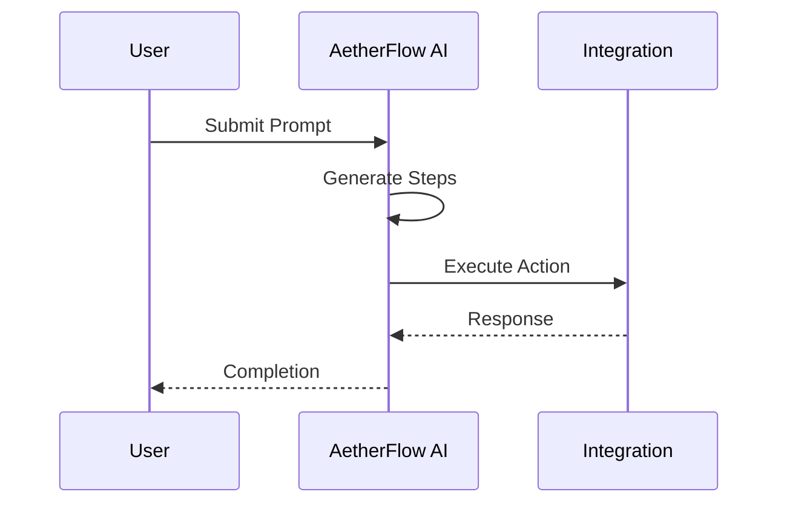

## Workflows erstellen

Sie erstellen Workflows, indem Sie gewuenschte Ergebnisse in natuerlicher Sprache beschreiben. Die KI analysiert Ihren Prompt, schlaegt Schritte vor und integriert verbundene Apps. Dieser No-Code-Ansatz macht die Automatisierung fuer alle Teammitglieder zugaenglich.

<Callout kind="info">
  Prompts sollten klar und praezise sein, um eine optimale KI-Interpretation zu gewaehrleisten.
</Callout>

## Workflow-Builder-Oberflaeche

Rufen Sie den Builder ueber das Dashboard auf. Geben Sie Ihren Prompt ein und verfeinern Sie den generierten Ablauf.

<Steps>
  <Step title="Prompt eingeben" icon="edit-3">
    Geben Sie eine Beschreibung ein, z. B. "Tickets basierend auf Faehigkeiten an verfuegbare Mitarbeiter zuweisen."
  </Step>
  <Step title="Schritte pruefen" icon="eye">
    Einzelne Aktionen bearbeiten, z. B. Bedingungen oder Schleifen hinzufuegen.
    ```javascript
    // API to update workflow
    await fetch(`/workflows/${id}`, {
      method: 'PATCH',
      body: JSON.stringify({
        steps: [{ action: 'assign', app: 'zendesk' }]
      })
    });
    ```
  </Step>
  <Step title="Bereitstellen" icon="rocket">
    Den Workflow aktivieren und Trigger festlegen.
  </Step>
</Steps>

## Aktive Workflows verwalten

Ueberwachen und bearbeiten Sie laufende Workflows im Tab "Workflows".

<Tabs>
  <Tab title="Trigger" icon="zap">
    Bedingungen wie zeitbasierte oder ereignisgesteuerte Trigger festlegen.
    <CodeGroup tabs="JSON, YAML">
      ```json
      {
        "trigger": {
          "type": "event",
          "source": "email"
        }
      }
      ```
      ```yaml
      trigger:
        type: event
        source: email
      ```
    </CodeGroup>
  </Tab>
  <Tab title="Aktionen" icon="play">
    Ausgaben wie Benachrichtigungen oder Datenaktualisierungen definieren.
    <Columns cols={2}>
      <Card title="Bedingte Logik" icon="git-branch">
        Wenn-dann-Regeln in Prompts verwenden.
      </Card>
      <Card title="Fehlerbehandlung" icon="alert-circle">
        Fallbacks fuer fehlgeschlagene Schritte festlegen.
      </Card>
    </Columns>
  </Tab>
</Tabs>

## Optimierung und Analysen

Leistungskennzahlen pruefen, um Workflows zu verbessern.

<ExpandableGroup>
  <Expandable title="Erklaerung der Kennzahlen">
    Erfolgsrate, durchschnittliche Laufzeit und Fehlerprotokolle helfen dabei, Probleme zu identifizieren.
  </Expandable>
  <Expandable title="KI-Vorschlaege">
    Prompt-Verbesserungen basierend auf Nutzungsdaten erhalten.
  </Expandable>
</ExpandableGroup>

| Kennzahl | Beschreibung | Zielwert |
|----------|--------------|----------|
| Erfolgsrate | Prozentsatz abgeschlossener Ausfuehrungen | `>95%` |
| Laufzeit | Durchschnittliche Ausfuehrungsdauer | `<30` Sek. |
| Fehler | Haeufige Fehlerquellen | Protokolle pruefen |



<Callout kind="tip">
  Iterieren Sie anhand von Analysen an Workflows, um die Effizienz zu steigern.
</Callout>

Fortgeschrittene Benutzer koennen Workflows als JSON fuer die Versionsverwaltung exportieren.

```javascript
// Export example
const workflowData = {
  id: 'wf_123',
  prompt: 'Automate reports',
  integrations: ['slack', 'google']
};
```

Dieser detaillierte Leitfaden vermittelt Ihnen alle notwendigen Kenntnisse, um Workflows zu erstellen und zu verwalten.
