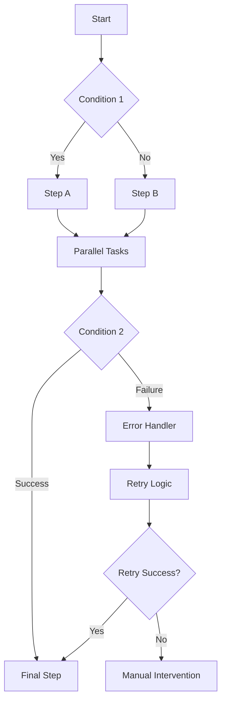

## Logique conditionnelle et branchement

Créez des flux de travail sophistiqués avec des capacités de prise de décision.

<Callout kind="info">
  La logique conditionnelle permet aux flux de travail de s'adapter en fonction des données, de l'heure ou de conditions externes.
</Callout>

## Déclencheurs avancés

Au-delà des déclencheurs d'événements simples, utilisez des conditions complexes et des planifications.

<Tabs>
  <Tab title="Déclencheurs multi-conditions" icon="git-branch">
    Combinez plusieurs conditions avec une logique ET/OU :

    ```prompt
    Déclencher quand :
    - Un nouveau prospect est créé dans Salesforce ET
    - Le score du prospect est supérieur à 75 OU
    - Le prospect provient d'une campagne publicitaire payante
    ```
  </Tab>

  <Tab title="Conditions temporelles" icon="clock">
    ```prompt
    Pendant les heures de bureau (9h - 18h HNE) :
    - Envoyer des notifications immédiates pour les tickets haute priorité
    - Mettre en file d'attente les éléments de basse priorité pour le prochain jour ouvrable
    - Escalader les problèmes urgents vers l'équipe d'astreinte
    ```
  </Tab>

  <Tab title="Déclencheurs basés sur les données" icon="database">
    ```prompt
    Quand la valeur du pipeline de ventes descend en dessous du seuil :
    - Analyser les récentes clôtures de contrats
    - Générer un rapport de performance
    - Planifier une réunion commerciale d'urgence
    - Envoyer des alertes à la direction commerciale
    ```
  </Tab>
</Tabs>

## Mappage de données dynamique

Transformez et manipulez des données entre différentes intégrations.

<Columns cols={2}>
  <Card title="Mappage des champs" icon="arrow-right">
    Associez automatiquement les champs entre différents formats de données.
  </Card>
  <Card title="Transformation des données" icon="shuffle">
    Convertissez les types de données, formatez les dates et nettoyez le texte.
  </Card>
  <Card title="Tables de correspondance" icon="table">
    Référencez des sources de données externes pour l'enrichissement.
  </Card>
  <Card title="Calculs" icon="calculator">
    Effectuez des opérations mathématiques sur des données numériques.
  </Card>
</Columns>

<Expandable title="Exemple de mappage avancé">
```javascript
// Complex data transformation
const transformedData = {
  customer_name: `${input.first_name} ${input.last_name}`,
  account_type: input.revenue > 100000 ? 'enterprise' : 'standard',
  region: lookupRegion(input.postal_code),
  formatted_date: formatDate(input.created_at, 'MM/DD/YYYY'),
  priority_score: calculatePriority(input.tags, input.engagement_score)
};
```
</Expandable>

## Modèles de flux de travail et réutilisabilité

Créez des composants de flux de travail et des modèles réutilisables.

<Steps>
  <Step title="Créer des modèles" icon="template">
    Construisez des flux de travail paramétrés pouvant être réutilisés avec différentes entrées.
  </Step>
  <Step title="Gestion des versions" icon="git-branch">
    Maintenez différentes versions de flux de travail pour les tests et la production.
  </Step>
  <Step title="Import/Export" icon="download">
    Partagez des flux de travail entre équipes ou sauvegardez des configurations.
  </Step>
</Steps>

## Fonctions et scripts personnalisés

Étendez AetherFlow avec des fonctions JavaScript personnalisées.

<Callout kind="warning">
  Les scripts personnalisés s'exécutent dans un environnement sandbox sécurisé avec un temps d'exécution limité.
</Callout>

<Tabs>
  <Tab title="Validation des données" icon="check-circle">
    ```javascript
    function validateEmail(email) {
      const regex = /^[^\s@]+@[^\s@]+\.[^\s@]+$/;
      return regex.test(email);
    }

    function validatePhone(phone) {
      const regex = /^\+?1?[-.\s]?\(?([0-9]{3})\)?[-.\s]?([0-9]{3})[-.\s]?([0-9]{4})$/;
      return regex.test(phone);
    }
    ```
  </Tab>

  <Tab title="Traitement des données" icon="cog">
    ```javascript
    function processCustomerData(customer) {
      return {
        fullName: `${customer.firstName} ${customer.lastName}`,
        displayName: customer.preferredName || customer.firstName,
        membershipTier: calculateTier(customer.lifetimeValue),
        lastActivityDays: daysSince(customer.lastActivity)
      };
    }

    function calculateTier(lifetimeValue) {
      if (lifetimeValue > 10000) return 'Platinum';
      if (lifetimeValue > 5000) return 'Gold';
      if (lifetimeValue > 1000) return 'Silver';
      return 'Bronze';
    }
    ```
  </Tab>
</Tabs>

## Intégrations avancées

Connectez-vous aux API et services non pris en charge nativement.

<ExpandableGroup>
  <Expandable title="Intégration d'API REST">
    Connectez-vous à n'importe quelle API REST en utilisant des requêtes HTTP personnalisées avec authentification.
  </Expandable>
  <Expandable title="Points de terminaison webhook">
    Créez des URL de webhook personnalisées pour l'intégration de données en temps réel.
  </Expandable>
  <Expandable title="Connexions aux bases de données">
    Interrogez directement des bases de données externes (fonctionnalité Entreprise).
  </Expandable>
</ExpandableGroup>

## Orchestration des flux de travail

Coordonnez des processus complexes en plusieurs étapes avec des dépendances.

<Columns cols={3}>
  <Card title="Exécution parallèle" icon="split">
    Exécutez des étapes indépendantes simultanément pour une exécution plus rapide.
  </Card>
  <Card title="Dépendances séquentielles" icon="arrow-down">
    Assurez-vous que les étapes s'exécutent dans le bon ordre avec les prérequis.
  </Card>
  <Card title="Récupération des erreurs" icon="refresh-cw">
    Définissez des chemins alternatifs en cas d'échec d'une étape.
  </Card>
</Columns>



## Surveillance des performances

Suivez et optimisez les performances des flux de travail à grande échelle.

<Expandable title="Indicateurs de performance">
| Indicateur | Description | Cible |
|------------|-------------|-------|
| Temps d'exécution | Durée totale du flux de travail | < 30 secondes |
| Taux de réussite des étapes | Pourcentage d'étapes réussies | > 95 % |
| Temps de réponse API | Temps de réponse moyen des intégrations | < 5 secondes |
| Taux de récupération des erreurs | Gestion réussie des erreurs | > 90 % |
</Expandable>

## Analyse avancée

Obtenez des informations sur les modèles de flux de travail et les opportunités d'optimisation.

<Tabs>
  <Tab title="Analyse d'utilisation" icon="bar-chart">
    Suivez la fréquence d'exécution des flux de travail, les taux de réussite et l'utilisation des ressources.
  </Tab>
  <Tab title="Tendances de performance" icon="trending-up">
    Identifiez les goulots d'étranglement et les opportunités d'optimisation dans le temps.
  </Tab>
  <Tab title="Analyse des coûts" icon="dollar-sign">
    Surveillez et optimisez les coûts des flux de travail sur différentes intégrations.
  </Tab>
</Tabs>

## Fonctionnalités Entreprise

Capacités avancées pour les grandes organisations.

<Callout kind="success">
  Les fonctionnalités Entreprise sont disponibles dans notre forfait Entreprise. Contactez l'équipe commerciale pour plus d'informations.
</Callout>

<ExpandableGroup>
  <Expandable title="Contrôle d'accès basé sur les rôles">
    Permissions granulaires pour différents rôles d'utilisateur et départements.
  </Expandable>
  <Expandable title="Journalisation d'audit">
    Journalisation complète de toutes les activités de flux de travail à des fins de conformité.
  </Expandable>
  <Expandable title="Gestion des SLA">
    Définissez et surveillez les accords de niveau de service pour les flux de travail critiques.
  </Expandable>
  <Expandable title="Déploiement multi-région">
    Déployez des flux de travail dans plusieurs régions géographiques pour la redondance.
  </Expandable>
</ExpandableGroup>

## Limitation du débit API et optimisation

Gérez efficacement les interactions API à volume élevé.

<Columns cols={2}>
  <Card title="Traitement par lots intelligent" icon="package">
    Regroupez plusieurs appels API pour réduire la surcharge et respecter les limites de débit.
  </Card>
  <Card title="Backoff exponentiel" icon="timer">
    Réessayez automatiquement les requêtes échouées avec des délais croissants.
  </Card>
  <Card title="Disjoncteurs" icon="zap">
    Désactivez temporairement les intégrations défaillantes pour prévenir les pannes en cascade.
  </Card>
  <Card title="Équilibrage de charge" icon="scale">
    Distribuez les requêtes sur plusieurs points de terminaison pour une haute disponibilité.
  </Card>
</Columns>

## Gestionnaires de webhooks personnalisés

Créez une logique de traitement de webhooks sophistiquée.

```javascript
// Advanced webhook handler example
app.post('/webhook/order-update', async (req, res) => {
  const { orderId, status, customerId } = req.body;

  // Validate webhook data
  if (!isValidOrderUpdate(req.body)) {
    return res.status(400).json({ error: 'Invalid data' });
  }

  // Process based on order status
  switch (status) {
    case 'shipped':
      await updateCustomerRecord(customerId, { lastOrderShipped: new Date() });
      await sendShippingNotification(orderId);
      break;
    case 'delivered':
      await scheduleFollowUpEmail(customerId, orderId);
      await updateInventory(orderId);
      break;
    case 'returned':
      await processReturn(orderId);
      await notifyCustomerService(orderId);
      break;
  }

  res.json({ processed: true });
});
```

Ces fonctionnalités avancées permettent des scénarios d'automatisation complexes qui vont au-delà de la simple création de flux de travail.
