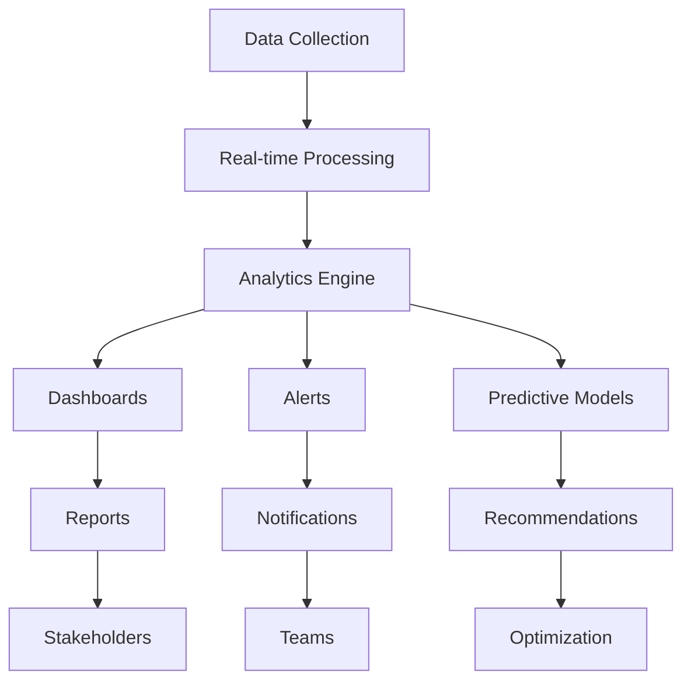

## Vue d'ensemble du tableau de bord

Surveillez votre écosystème AetherFlow avec des analyses complètes et des informations en temps réel.

<Callout kind="info">
  Le tableau de bord d'analyse fournit des informations exploitables pour optimiser les performances et la fiabilité des flux de travail.
</Callout>

## Indicateurs de performance clés

Suivez les indicateurs essentiels pour garantir la santé et l'efficacité des flux de travail.

<Columns cols={4}>
  <Card title="Taux de réussite" icon="check-circle">
    Pourcentage de flux de travail s'exécutant sans erreur (cible : >95 %)
  </Card>
  <Card title="Durée d'exécution moyenne" icon="clock">
    Temps d'exécution moyen sur l'ensemble des flux de travail (cible : &lt;30 secondes)
  </Card>
  <Card title="Volume d'exécution" icon="activity">
    Total des flux de travail exécutés sur une période donnée
  </Card>
  <Card title="Fréquence des erreurs" icon="alert-triangle">
    Taux d'échec des exécutions de flux de travail
  </Card>
</Columns>

## Surveillance en temps réel

Obtenez une visibilité instantanée sur l'exécution des flux de travail et l'état du système.

<Tabs>
  <Tab title="Tableau de bord en direct" icon="monitor">
    Visualisez l'exécution des flux de travail en temps réel, les intégrations actives et l'état du système.
  </Tab>
  <Tab title="Système d'alertes" icon="bell">
    Configurez des notifications pour les défaillances, la dégradation des performances et les modèles inhabituels.
  </Tab>
  <Tab title="Contrôles de santé" icon="heart">
    Surveillance automatisée de la connectivité des intégrations et de la réactivité des API.
  </Tab>
</Tabs>

## Analyse des flux de travail

Plongez dans les performances individuelles des flux de travail et les opportunités d'optimisation.

<ExpandableGroup>
  <Expandable title="Tendances d'exécution">
    Analysez les modèles d'exécution des flux de travail dans le temps, en identifiant les pics d'utilisation et les variations saisonnières.
  </Expandable>
  <Expandable title="Analyse étape par étape">
    Décomposez l'exécution des flux de travail par étapes individuelles pour identifier les goulots d'étranglement.
  </Expandable>
  <Expandable title="Reconnaissance des modèles d'erreur">
    Détectez les erreurs récurrentes et leurs causes profondes pour des corrections proactives.
  </Expandable>
</ExpandableGroup>

## Surveillance des intégrations

Suivez la santé et les performances des applications connectées.

<Steps>
  <Step title="État des connexions" icon="wifi">
    Surveillez la connectivité en temps réel à tous les services intégrés.
  </Step>
  <Step title="Temps de réponse des API" icon="zap">
    Suivez les temps de réponse pour chaque point de terminaison d'intégration.
  </Step>
  <Step title="Taux d'erreur" icon="alert-circle">
    Identifiez les intégrations présentant des taux d'échec élevés.
  </Step>
  <Step title="Suivi des limites de débit" icon="gauge">
    Surveillez l'utilisation des API par rapport aux limites de débit et aux quotas.
  </Step>
</Steps>

## Rapports et tableaux de bord personnalisés

Créez des vues d'analyse adaptées aux différentes parties prenantes.

<Columns cols={2}>
  <Card title="Synthèse pour la direction" icon="briefcase">
    Vue d'ensemble du retour sur investissement de l'automatisation et de l'impact métier.
  </Card>
  <Card title="Analyse technique approfondie" icon="code">
    Indicateurs de performance détaillés pour les développeurs et les équipes informatiques.
  </Card>
  <Card title="Performance des équipes" icon="users">
    Indicateurs de création et de maintenance des flux de travail par équipe.
  </Card>
  <Card title="Analyse des coûts" icon="dollar-sign">
    Coûts d'utilisation et opportunités d'optimisation.
  </Card>
</Columns>

## Configuration des alertes

Configurez des notifications intelligentes pour les événements critiques et les seuils.

<Tabs>
  <Tab title="Alertes de performance" icon="trending-down">
    ```json
    {
      "alert_name": "High Error Rate",
      "condition": "error_rate > 5%",
      "timeframe": "last_1_hour",
      "channels": ["email", "slack"],
      "recipients": ["devops@company.com", "#alerts"]
    }
    ```
  </Tab>

  <Tab title="Alertes d'intégration" icon="plug">
    ```json
    {
      "alert_name": "Integration Down",
      "condition": "connection_status == 'failed'",
      "duration": "5_minutes",
      "channels": ["email", "sms"],
      "recipients": ["support@company.com"]
    }
    ```
  </Tab>

  <Tab title="Alertes d'utilisation" icon="activity">
    ```json
    {
      "alert_name": "Rate Limit Approaching",
      "condition": "api_usage > 80%",
      "channels": ["slack"],
      "recipients": ["#engineering"]
    }
    ```
  </Tab>
</Tabs>

## Analyse des journaux et débogage

Journalisation complète pour le dépannage et l'optimisation.

<Expandable title="Types de journaux">
- **Journaux d'exécution** : détails d'exécution étape par étape des flux de travail
- **Journaux d'erreurs** : messages d'erreur détaillés et traces de pile
- **Journaux d'intégration** : données de requête/réponse API et délais
- **Journaux d'audit** : actions des utilisateurs et modifications du système
- **Journaux de performance** : utilisation des ressources et indicateurs de temps
</Expandable>

## Analyse historique

Analysez les tendances et modèles à long terme dans votre utilisation de l'automatisation.

<Steps>
  <Step title="Analyse des tendances" icon="trending-up">
    Identifiez les modèles d'utilisation des flux de travail, les erreurs et les performances sur plusieurs mois.
  </Step>
  <Step title="Informations saisonnières" icon="calendar">
    Comprenez comment les cycles métier affectent les besoins d'automatisation.
  </Step>
  <Step title="Indicateurs de croissance" icon="bar-chart-3">
    Suivez l'adoption de l'automatisation et les améliorations d'efficacité dans le temps.
  </Step>
  <Step title="Calcul du ROI" icon="calculator">
    Mesurez l'impact financier de vos initiatives d'automatisation.
  </Step>
</Steps>

## Optimisation des coûts

Surveillez et optimisez vos coûts d'utilisation d'AetherFlow.

<ExpandableGroup>
  <Expandable title="Répartition des coûts">
    Analysez les coûts par flux de travail, intégration et période.
  </Expandable>
  <Expandable title="Indicateurs d'efficacité">
    Identifiez les flux de travail dont le coût est élevé par rapport à la valeur métier.
  </Expandable>
  <Expandable title="Recommandations d'optimisation">
    Suggestions alimentées par l'IA pour réduire les coûts tout en maintenant les performances.
  </Expandable>
</ExpandableGroup>

## Export des données et intégration

Exportez les données d'analyse pour une analyse et un reporting externes.

<Tabs>
  <Tab title="Export CSV" icon="download">
    Exportez les données brutes des indicateurs pour une analyse dans des tableurs.
  </Tab>
  <Tab title="Accès par API" icon="code">
    Accédez aux données d'analyse par programmation via l'API REST.
  </Tab>
  <Tab title="Intégration tierce" icon="link">
    Connectez les analyses à des outils BI comme Tableau, Power BI ou des tableaux de bord personnalisés.
  </Tab>
</Tabs>

```javascript
// Analytics API example
const analytics = await fetch('/api/v2/analytics/workflows', {
  headers: {
    'Authorization': `Bearer ${token}`,
    'Content-Type': 'application/json'
  },
  body: JSON.stringify({
    timeframe: 'last_30_days',
    metrics: ['success_rate', 'avg_runtime', 'execution_count'],
    group_by: 'workflow_id'
  })
});
```

## Analyse prédictive

Utilisez l'IA pour anticiper les problèmes et optimiser les performances.

<Callout kind="success">
  L'analyse prédictive permet de prévenir les problèmes avant qu'ils n'impactent votre activité.
</Callout>

<Columns cols={3}>
  <Card title="Prédiction des défaillances" icon="alert-triangle">
    Identifiez les flux de travail susceptibles d'échouer en fonction des modèles historiques.
  </Card>
  <Card title="Planification de la capacité" icon="trending-up">
    Prévoyez les besoins en ressources en fonction des tendances d'utilisation.
  </Card>
  <Card title="Suggestions d'optimisation" icon="lightbulb">
    Recommandations de l'IA pour améliorer l'efficacité des flux de travail.
  </Card>
</Columns>

## Reporting de conformité et d'audit

Maintenez la conformité réglementaire grâce à des pistes d'audit détaillées.

<Expandable title="Fonctionnalités de conformité">
- **Conformité RGPD** : journaux de traitement des données et suivi du consentement des utilisateurs
- **Reporting SOC 2** : pistes d'audit complètes pour les contrôles de sécurité
- **Rétention personnalisée** : périodes de conservation des journaux configurables
- **Capacités d'export** : générez des rapports de conformité pour les auditeurs
</Expandable>

## Analyse des équipes

Surveillez la productivité et les indicateurs de collaboration des équipes.

<ExpandableGroup>
  <Expandable title="Indicateurs de création de flux de travail">
    Suivez le nombre de flux de travail créés par chaque membre de l'équipe et leurs taux de réussite.
  </Expandable>
  <Expandable title="Informations sur la collaboration">
    Analysez le partage des flux de travail, les révisions et les contributions de l'équipe.
  </Expandable>
  <Expandable title="Opportunités d'apprentissage">
    Identifiez les domaines où la formation des équipes pourrait améliorer la qualité de l'automatisation.
  </Expandable>
</ExpandableGroup>



Le système d'analyse et de surveillance offre une visibilité complète sur votre écosystème AetherFlow, permettant une optimisation basée sur les données et une résolution proactive des problèmes.
