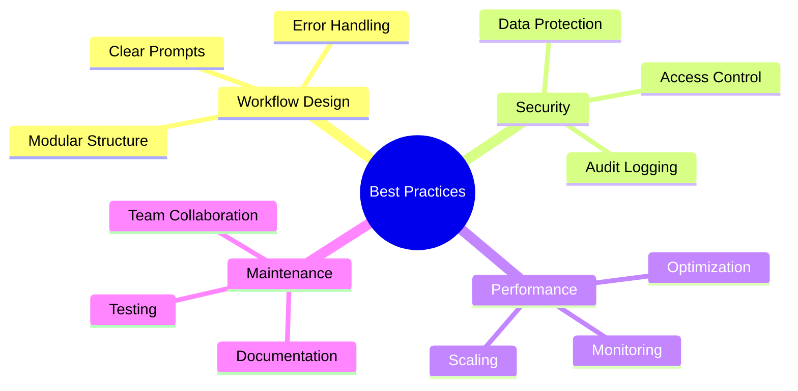

## Principes de conception des flux de travail

Créez des flux de travail fiables et maintenables en appliquant ces principes fondamentaux.

<Callout kind="info" collapsed="false">
  Les flux de travail bien conçus sont plus faciles à déboguer, à maintenir et à faire évoluer dans le temps.
</Callout>

## Ingénierie des invites

Rédigez des invites en langage naturel efficaces pour une interprétation optimale par l'IA.

<Columns cols="3">
  <Card title="Soyez précis" icon="target" horizontal="false">
    Définissez clairement les déclencheurs, les conditions et les actions. Évitez le langage ambigu.
  </Card>

  <Card title="Utilisez le contexte" icon="file-text" horizontal="false">
    Fournissez des informations de contexte pertinentes et des exemples dans vos invites.
  </Card>

  <Card title="Itérez progressivement" icon="refresh-cw" horizontal="false">
    Commencez simplement et ajoutez de la complexité de manière incrémentale à travers les tests.
  </Card>
</Columns>

<Tabs>
  <Tab title="Bons exemples" icon="check-circle">
    ```prompt wrap
    Lorsqu'un nouveau ticket de support client est créé dans Zendesk avec la priorité « Haute »,
    analysez le contenu du ticket pour les mots-clés liés à la facturation, aux problèmes techniques ou aux problèmes de compte,
    puis routez vers l'agent approprié en fonction de son expertise et de sa charge de travail actuelle,
    et envoyez une notification Slack au canal #support avec le résumé du ticket.
    ```

    ```prompt
    Tous les lundis à 9h, générez un rapport hebdomadaire à partir des données Google Analytics,
    créez un résumé des indicateurs clés incluant les pages vues, les taux de conversion et les meilleurs contenus,
    formatez-le sous forme de rapport professionnel et partagez-le dans le canal Slack #marketing.
    ```
  </Tab>

  <Tab title="Mauvais exemples" icon="x-circle">
    ```prompt
    Gérer les tickets et envoyer des notifications.
    ```

    *Trop vague — manque de conditions et d'actions spécifiques*

    ```prompt
    Faire tout ce qui est lié au support client automatiquement.
    ```

    *Trop large — crée un comportement imprévisible*
  </Tab>
</Tabs>

## Gestion des erreurs et résilience

Créez des flux de travail robustes qui gèrent les pannes de manière élégante.

<Steps>
  <Step title="Implémenter des solutions de repli" icon="shield" title-type="p">
    Définissez des actions alternatives quand les intégrations principales échouent.
  </Step>

  <Step title="Ajouter de la validation" icon="check-circle" title-type="p">
    Vérifiez l'intégrité des données avant le traitement ou l'envoi.
  </Step>

  <Step title="Surveiller les taux de réussite" icon="bar-chart" title-type="p">
    Configurez des alertes pour les flux de travail dont les performances se dégradent.
  </Step>
</Steps>

<Expandable title="Stratégies de nouvelle tentative" default-open="false">
  - **Intervalle fixe** : réessayez les étapes échouées après un délai défini (par exemple, 30 secondes)

  - **Backoff exponentiel** : augmentez le délai entre les tentatives (30s, 1m, 2m, 4m...)

  - **Disjoncteur** : arrêtez de réessayer après plusieurs échecs, alertez pour une intervention manuelle
</Expandable>

## Optimisation des performances

Assurez-vous que les flux de travail s'exécutent efficacement dans les limites des ressources.

<ExpandableGroup>
  <Expandable title="Traitement par lots" default-open="false">
    Regroupez les opérations similaires pour réduire les appels API et améliorer le débit.
  </Expandable>

  <Expandable title="Stratégies de mise en cache" default-open="false">
    Stockez les données fréquemment consultées pour éviter les requêtes API redondantes.
  </Expandable>

  <Expandable title="Exécution parallèle" default-open="false">
    Exécutez les étapes indépendantes simultanément lorsque c'est possible.
  </Expandable>
</ExpandableGroup>

## Considérations de sécurité

Protégez les données sensibles et maintenez la conformité.

<Columns cols="2">
  <Card title="Chiffrement des données" icon="lock" horizontal="false">
    Utilisez des connexions chiffrées et évitez de journaliser des informations sensibles.
  </Card>

  <Card title="Contrôle d'accès" icon="key" horizontal="false">
    Limitez les permissions des flux de travail aux portées minimales requises.
  </Card>

  <Card title="Journalisation d'audit" icon="file-text" horizontal="false">
    Activez la journalisation à des fins de conformité et de débogage.
  </Card>

  <Card title="Révisions régulières" icon="eye" horizontal="false">
    Auditez périodiquement les flux de travail pour détecter les vulnérabilités de sécurité.
  </Card>
</Columns>

## Tests et validation

Testez minutieusement les flux de travail avant de les déployer en production.

<Tabs>
  <Tab title="Environnements de test" icon="flask">
    Créez des flux de travail de test séparés qui reflètent les configurations de production.
  </Tab>

  <Tab title="Cas limites" icon="alert-triangle">
    Testez avec des entrées de données inhabituelles, des pannes réseau et des interruptions d'intégration.
  </Tab>

  <Tab title="Tests de charge" icon="zap">
    Vérifiez les performances sous les charges de pointe attendues.
  </Tab>
</Tabs>

## Surveillance et maintenance

Maintenez le bon fonctionnement des flux de travail avec une surveillance proactive.

<Steps>
  <Step title="Configurer les alertes" icon="bell" title-type="p">
    Configurez des notifications pour les défaillances, la dégradation des performances et les modèles inhabituels.
  </Step>

  <Step title="Audits réguliers" icon="clipboard" title-type="p">
    Examinez les performances des flux de travail et mettez-les à jour selon les besoins chaque trimestre.
  </Step>

  <Step title="Documentation" icon="book" title-type="p">
    Maintenez une documentation claire de la logique des flux de travail et des dépendances.
  </Step>
</Steps>

## Collaboration en équipe

Bonnes pratiques pour le développement de flux de travail multi-utilisateurs.

<Expandable title="Gestion des versions" default-open="false">
  - Utilisez des noms descriptifs pour les versions de flux de travail

  - Documentez les modifications et leur justification

  - Testez minutieusement avant de promouvoir en production
</Expandable>

<Expandable title="Revues de code" default-open="false">
  - Faites réviser les flux de travail complexes par des pairs avant le déploiement

  - Vérifiez les implications en matière de sécurité

  - Validez la gestion des erreurs et les cas limites
</Expandable>

## Stratégies de mise à l'échelle

Préparez les flux de travail à une utilisation et une complexité croissantes.

| Niveau d'échelle | Caractéristiques                                   | Stratégies                                              |
| ---------------- | -------------------------------------------------- | ------------------------------------------------------- |
| Petit            | 1 à 5 flux, intégrations de base                  | Se concentrer sur la fiabilité et la documentation       |
| Moyen            | 10 à 50 flux, équipes multiples                   | Mettre en place des frameworks de surveillance et de test |
| Grand            | 100+ flux, intégrations entreprise                | Automatiser le déploiement, utiliser la surveillance avancée |

<Callout kind="tip" collapsed="false">
  Planifiez la mise à l'échelle dès le départ en concevant des composants de flux de travail modulaires et réutilisables.
</Callout>

## Optimisation des coûts

Gérez efficacement les coûts d'utilisation d'AetherFlow.

<ExpandableGroup>
  <Expandable title="Surveillance de l'utilisation" default-open="false">
    Suivez la fréquence d'exécution des flux de travail et identifiez les opportunités d'optimisation.
  </Expandable>

  <Expandable title="Efficacité des ressources" default-open="false">
    Choisissez les niveaux de forfait appropriés en fonction des modèles d'utilisation réels.
  </Expandable>

  <Expandable title="Retour sur investissement de l'automatisation" default-open="false">
    Évaluez régulièrement les bénéfices des flux de travail par rapport aux coûts opérationnels.
  </Expandable>
</ExpandableGroup>



Suivre ces bonnes pratiques garantit que votre implémentation AetherFlow est fiable, sécurisée et maintenable.
