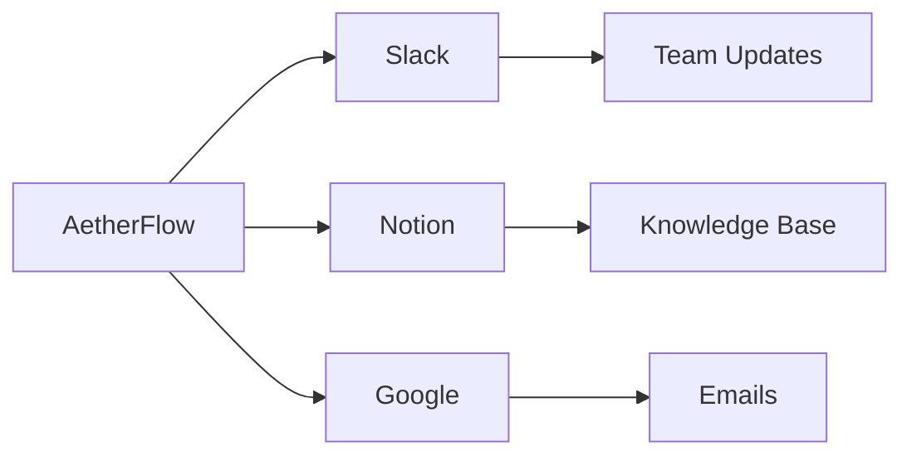

## Vue d'ensemble des intégrations

AetherFlow prend en charge plus de 50 outils populaires, vous permettant d'automatiser l'ensemble de votre pile technologique. Vous connectez les applications à l'aide d'OAuth sécurisé ou de clés API, ce qui permet à l'IA de lire des données, de déclencher des actions et de synchroniser des informations. Cette connectivité transforme des outils isolés en un écosystème de flux de travail unifié.

<Columns cols={3}>
  <Card title="Communication" icon="message-square">
    Slack, Microsoft Teams, E-mail (Gmail/Outlook).
  </Card>
  <Card title="Productivité" icon="calendar">
    Notion, Google Workspace, Trello.
  </Card>
  <Card title="CRM" icon="users">
    Salesforce, HubSpot, Zendesk.
  </Card>
</Columns>

## Configurer les intégrations

Accédez au tableau de bord des intégrations pour ajouter des connexions. Recherchez votre application et suivez le flux d'autorisation.

<Steps>
  <Step title="Autoriser l'application" icon="key">
    Sélectionnez l'application et accordez les permissions. AetherFlow gère le stockage des jetons de manière sécurisée.
    ```bash
    # Example CLI for advanced setup
    aetherflow integrate slack --token YOUR_SLACK_TOKEN
    ```
  </Step>
  <Step title="Tester la connexion" icon="check-circle">
    Envoyez un événement de test pour confirmer que les données circulent correctement.
  </Step>
  <Step title="Utiliser dans un flux de travail" icon="link">
    Référencez l'intégration dans votre invite, par exemple « Publier dans le canal Slack. »
  </Step>
</Steps>

## Guides spécifiques aux plateformes

<Tabs>
  <Tab title="Slack" icon="message-circle">
    Connectez Slack pour envoyer des notifications depuis les flux de travail.
    <CodeGroup tabs="Node.js,Python">
      ```javascript
      // Verify integration
      const integrations = await client.getIntegrations();
      console.log(integrations.slack); // { connected: true }
      ```
      ```python
      integrations = client.get_integrations()
      print(integrations['slack'])  # {'connected': True}
      ```
    </CodeGroup>
    <Callout kind="alert">
      Assurez-vous que les permissions du bot incluent la publication de messages.
    </Callout>
  </Tab>
  <Tab title="Notion" icon="file-text">
    Synchronisez automatiquement les pages et les bases de données.
    ```javascript
    // Create Notion page from workflow
    await fetch('https://api.notion.com/v1/pages', {
      headers: { 'Authorization': `Bearer ${notionToken}` },
      body: JSON.stringify({ parent: { database_id: 'db_id' } })
    });
    ```
  </Tab>
  <Tab title="Google Workspace" icon="mail">
    Automatisez les tâches Gmail et Drive.
    <Expandable title="Configuration avancée">
      Associez des champs tels que les libellés et les dossiers.
    </Expandable>
  </Tab>
</Tabs>

## Intégrations personnalisées

Pour les applications non prises en charge, utilisez des webhooks ou des appels API personnalisés. Définissez les points de terminaison dans l'invite de votre flux de travail.



| Application | Catégorie | Temps de configuration |
|-------------|-----------|------------------------|
| Slack | Communication | `<5` min |
| Notion | Productivité | `10` min |
| Salesforce | CRM | `15` min |

<ExpandableGroup>
  <Expandable title="Configuration des webhooks">
    Exposez des points de terminaison pour les données entrantes. Utilisez `{webhook_url}` dans les invites.
  </Expandable>
  <Expandable title="Bonnes pratiques de sécurité">
    Renouvelez régulièrement les clés et limitez les portées d'accès.
  </Expandable>
</ExpandableGroup>

<Callout kind="success">
  Les intégrations libèrent toute la puissance d'AetherFlow — commencez par vos outils les plus utilisés.
</Callout>

Cette page fournit des conseils d'intégration complets avec des exemples pratiques.
