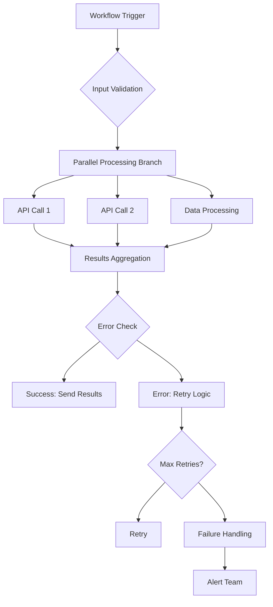

## Fondamentaux de la performance

Comprenez les facteurs clés qui affectent les performances d'AetherFlow et comment les optimiser.

<Callout kind="info">
  Les flux de travail bien optimisés s'exécutent plus rapidement, coûtent moins cher et offrent une automatisation plus fiable.
</Callout>

## Temps d'exécution des flux de travail

Facteurs influençant la rapidité d'exécution de vos flux de travail.

<Columns cols={3}>
  <Card title="Latence des intégrations" icon="wifi">
    Temps passé à communiquer avec les API et services externes.
  </Card>
  <Card title="Traitement des données" icon="database">
    Temps nécessaire pour transformer et traiter les données dans les flux de travail.
  </Card>
  <Card title="Traitement par l'IA" icon="brain">
    Temps nécessaire à l'IA d'AetherFlow pour interpréter les invites et générer des actions.
  </Card>
</Columns>

## Stratégies d'optimisation

Techniques pour améliorer les performances des flux de travail selon différentes dimensions.

### Optimisation des invites

<ExpandableGroup>
  <Expandable title="Clarté et précision">
    Rédigez des invites claires et précises qui laissent moins de place à l'interprétation par l'IA :

    **Médiocre :** « Gérer les e-mails des clients »
    **Meilleur :** « Lors de la réception d'e-mails clients, catégorisez-les comme facturation, support ou ventes, puis routez vers le canal d'équipe approprié dans Slack »
  </Expandable>

  <Expandable title="Fourniture du contexte">
    Fournissez le contexte nécessaire dès le départ plutôt que de laisser l'IA l'inférer :

    **Médiocre :** « Traiter les commandes »
    **Meilleur :** « Lorsqu'une nouvelle commande arrive de Shopify, vérifiez les niveaux de stock dans notre système d'entrepôt, mettez à jour le statut de la commande et envoyez un e-mail de confirmation à customer@example.com »
  </Expandable>

  <Expandable title="Séquençage des actions">
    Structurez les invites pour minimiser les allers-retours :

    **Médiocre :** « Résumé par e-mail, puis publication Slack »
    **Meilleur :** « Générez un résumé hebdomadaire des ventes à partir des données Salesforce et publiez-le dans le canal Slack #sales tous les lundis à 9h »
  </Expandable>
</ExpandableGroup>

### Optimisation des intégrations

<Steps>
  <Step title="Opérations par lots" icon="package">
    Regroupez plusieurs appels API en requêtes uniques lorsque c'est possible.
  </Step>
  <Step title="Stratégie de mise en cache" icon="database">
    Mettez en cache les données fréquemment consultées pour réduire les appels API.
  </Step>
  <Step title="Mise en commun des connexions" icon="server">
    Réutilisez les connexions plutôt que d'en créer de nouvelles pour chaque requête.
  </Step>
  <Step title="Conscience des limites de débit" icon="gauge">
    Respectez les limites API et implémentez une logique de nouvelle tentative intelligente.
  </Step>
</Steps>

### Optimisation du traitement des données

<Expandable title="Gestion efficace des données">
- **Filtrer tôt** : réduisez le volume de données le plus tôt possible dans le flux de travail
- **Traitement en flux** : traitez les grands ensembles de données par morceaux plutôt que de tout charger
- **Optimisation des index** : utilisez des structures de données appropriées pour les recherches
- **Gestion de la mémoire** : soyez attentif à l'utilisation de la mémoire avec les grands ensembles de données
</Expandable>

## Surveillance des performances

Suivez et analysez les indicateurs de performance des flux de travail.

<Tabs>
  <Tab title="Indicateurs d'exécution" icon="bar-chart">
    Surveillez le temps d'exécution moyen, les taux de réussite et les modèles d'échec.
  </Tab>
  <Tab title="Utilisation des ressources" icon="cpu">
    Suivez la consommation CPU, mémoire et les appels API.
  </Tab>
  <Tab title="Analyse des goulots d'étranglement" icon="search">
    Identifiez les étapes ou intégrations qui ralentissent les flux de travail.
  </Tab>
</Tabs>

<Expandable title="Tableau de bord des performances">
```javascript
// Example: Custom performance monitoring
const performanceData = await client.analytics.getWorkflowMetrics(workflowId, {
  metrics: ['avg_execution_time', 'success_rate', 'step_timings'],
  timeframe: 'last_7_days'
});

// Identify bottlenecks
const slowSteps = performanceData.step_timings
  .filter(step => step.duration > 5000) // Steps taking >5 seconds
  .sort((a, b) => b.duration - a.duration);

console.log('Performance bottlenecks:', slowSteps);
```
</Expandable>

## Optimisation des coûts

Réduisez les coûts opérationnels tout en maintenant les performances.

<Columns cols={2}>
  <Card title="Efficacité d'exécution" icon="zap">
    Minimisez les exécutions de flux de travail inutiles grâce à de meilleurs déclencheurs.
  </Card>
  <Card title="Utilisation des ressources" icon="cpu">
    Optimisez pour une utilisation des ressources rentable dans les limites de performance.
  </Card>
  <Card title="Sélection du forfait" icon="credit-card">
    Choisissez les forfaits appropriés en fonction des modèles d'utilisation réels.
  </Card>
  <Card title="Avantages de la mise en cache" icon="database">
    Réduisez les appels API grâce à des stratégies de mise en cache intelligentes.
  </Card>
</Columns>

## Techniques d'optimisation avancées

Méthodes sophistiquées pour les flux de travail haute performance.

### Traitement parallèle

<Expandable title="Parallélisation des flux de travail">
Exécutez les étapes indépendantes simultanément :

```prompt
Lors du traitement des rapports mensuels :
1. [Parallèle] Générer le rapport des ventes depuis Salesforce
2. [Parallèle] Générer le rapport marketing depuis Google Analytics
3. [Parallèle] Générer le rapport financier depuis QuickBooks
4. Combiner tous les rapports et envoyer un e-mail consolidé
```

**Impact sur les performances :** Réduit le temps d'exécution total de la somme séquentielle à l'étape individuelle la plus longue.
</Expandable>

### Exécution conditionnelle

<Expandable title="Branchement intelligent">
Évitez les traitements inutiles avec des conditions intelligentes :

```prompt
Lors de la réception d'un ticket client :
- Si la priorité est « urgente », notifier immédiatement l'ingénieur d'astreinte par SMS
- Si la priorité est « haute », créer une tâche dans Jira et notifier l'équipe via Slack
- Si la priorité est « normale », ajouter à la file d'attente du support et envoyer une réponse automatisée
- Uniquement pour les tickets liés à la facturation, mettre également à jour le système comptable
```

**Impact sur les performances :** Réduit le temps d'exécution moyen en ignorant les étapes non pertinentes.
</Expandable>

### Mise en cache et mémoïsation

<Expandable title="Mise en cache intelligente">
Mettez en cache les opérations coûteuses et réutilisez les résultats :

```javascript
// Example caching strategy
const CACHE_TTL = 3600000; // 1 hour

async function getCachedUserData(userId) {
  const cacheKey = `user_${userId}`;
  let userData = await cache.get(cacheKey);

  if (!userData) {
    userData = await fetchUserFromAPI(userId);
    await cache.set(cacheKey, userData, CACHE_TTL);
  }

  return userData;
}
```
</Expandable>

## Considérations de scalabilité

Concevez des flux de travail qui évoluent avec la croissance de votre entreprise.

<ExpandableGroup>
  <Expandable title="Mise à l'échelle horizontale">
    Concevez des flux de travail capables de gérer une charge accrue grâce au traitement parallèle.
  </Expandable>
  <Expandable title="Gestion des ressources">
    Implémentez une allocation et un nettoyage appropriés des ressources dans les flux de travail de longue durée.
  </Expandable>
  <Expandable title="Équilibrage de charge">
    Distribuez le travail sur plusieurs instances lorsque le volume dépasse les seuils.
  </Expandable>
</ExpandableGroup>

## Optimisation de la gestion des erreurs

Gestion efficace des erreurs sans impact sur les performances.

<Expandable title="Dégradation élégante">
Concevez des flux de travail pour continuer à fonctionner lorsque des composants non critiques échouent :

```prompt
Lors de la génération des rapports hebdomadaires :
- Essayer de récupérer les données depuis la base de données principale
- En cas d'échec de la principale, utiliser la source de données de secours
- Toujours générer le rapport, même avec des données partielles
- Envoyer le rapport avec des indicateurs de qualité des données
```
</Expandable>

<Expandable title="Disjoncteurs">
Prévenez les pannes en cascade en désactivant temporairement les intégrations problématiques :

```javascript
class CircuitBreaker {
  constructor(failureThreshold = 5, recoveryTimeout = 60000) {
    this.failureCount = 0;
    this.failureThreshold = failureThreshold;
    this.recoveryTimeout = recoveryTimeout;
    this.state = 'CLOSED'; // CLOSED, OPEN, HALF_OPEN
  }

  async execute(operation) {
    if (this.state === 'OPEN') {
      if (Date.now() - this.lastFailureTime > this.recoveryTimeout) {
        this.state = 'HALF_OPEN';
      } else {
        throw new Error('Circuit breaker is OPEN');
      }
    }

    try {
      const result = await operation();
      this.onSuccess();
      return result;
    } catch (error) {
      this.onFailure();
      throw error;
    }
  }

  onSuccess() {
    this.failureCount = 0;
    this.state = 'CLOSED';
  }

  onFailure() {
    this.failureCount++;
    if (this.failureCount >= this.failureThreshold) {
      this.state = 'OPEN';
      this.lastFailureTime = Date.now();
    }
  }
}
```
</Expandable>

## Tests de performance

Testez et validez systématiquement les performances des flux de travail.

<Steps>
  <Step title="Tests de charge" icon="activity">
    Testez les flux de travail dans diverses conditions de charge pour identifier les limites.
  </Step>
  <Step title="Tests de contrainte" icon="zap">
    Poussez les flux de travail au-delà des limites normales pour trouver les points de rupture.
  </Step>
  <Step title="Tests d'endurance" icon="clock">
    Testez les flux de travail de longue durée pour détecter les fuites mémoire et la dégradation.
  </Step>
  <Step title="Tests de pic" icon="trending-up">
    Testez des augmentations soudaines de charge pour valider la scalabilité.
  </Step>
</Steps>

## Surveillance et alertes

Configurez une surveillance complète pour les problèmes de performance.

<Expandable title="Alertes de performance">
- **Temps d'exécution** : alerter quand les flux de travail dépassent les seuils temporels
- **Taux d'erreur** : notifier quand les taux d'erreur dépassent les niveaux acceptables
- **Utilisation des ressources** : surveiller les pics inhabituels de CPU ou de mémoire
- **Latence des intégrations** : alerter sur les réponses API lentes des intégrations
</Expandable>

## Résumé des bonnes pratiques

Principes clés pour des performances optimales d'AetherFlow.

<Columns cols={4}>
  <Card title="Concevoir pour le parallélisme" icon="split">
    Structurez les flux de travail pour maximiser l'exécution concurrente.
  </Card>
  <Card title="Minimiser les appels API" icon="minus">
    Regroupez les opérations et utilisez la mise en cache pour réduire les requêtes externes.
  </Card>
  <Card title="Échouer rapidement" icon="x">
    Détectez et gérez les erreurs tôt pour éviter un traitement inutile.
  </Card>
  <Card title="Surveiller en continu" icon="eye">
    Suivez les indicateurs de performance et configurez des alertes automatisées.
  </Card>
</Columns>

<Expandable title="Liste de contrôle des performances">
- [ ] Les invites sont claires et précises
- [ ] Les étapes indépendantes s'exécutent en parallèle
- [ ] Les opérations coûteuses sont mises en cache
- [ ] La gestion des erreurs n'impacte pas les performances
- [ ] La surveillance et les alertes sont configurées
- [ ] Des révisions régulières des performances sont effectuées
- [ ] Les considérations de scalabilité sont incluses
- [ ] L'optimisation des coûts est équilibrée avec les performances
</Expandable>



La mise en œuvre de ces stratégies d'optimisation améliorera significativement les performances, la fiabilité et l'efficacité des coûts de vos flux de travail.
