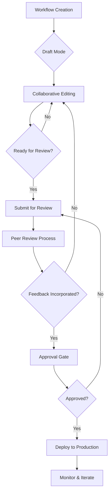

## Espaces de travail multi-utilisateurs

Créez des espaces de travail partagés où les membres de l'équipe peuvent collaborer sur des projets d'automatisation.

<Callout kind="info">
  Les fonctionnalités de collaboration en équipe sont disponibles avec les plans Pro et Entreprise.
</Callout>

## Gestion des espaces de travail

Configurez et gérez des environnements collaboratifs pour votre équipe.

<Steps>
  <Step title="Créer un espace de travail" icon="folder-plus">
    Configurez un nouvel espace de travail avec des paramètres et des permissions personnalisés.
  </Step>
  <Step title="Inviter des membres de l'équipe" icon="user-plus">
    Ajoutez des collègues avec des rôles et des niveaux d'accès appropriés.
  </Step>
  <Step title="Configurer les permissions" icon="shield">
    Définissez ce que chaque membre de l'équipe peut consulter, modifier et gérer.
  </Step>
  <Step title="Configurer les notifications" icon="bell">
    Configurez les alertes et les notifications de mise à jour à l'échelle de l'équipe.
  </Step>
</Steps>

## Contrôle d'accès basé sur les rôles

Des permissions granulaires garantissent un accès sécurisé et approprié aux workflows et aux données.

<Tabs>
  <Tab title="Rôles utilisateur" icon="users">
    | Rôle | Permissions | Description |
    |------|-------------|-------------|
    | **Propriétaire** | Accès complet à toutes les fonctionnalités | Peut gérer la facturation, les utilisateurs et les paramètres |
    | **Administrateur** | Gérer les utilisateurs et les workflows | Peut ajouter/supprimer des utilisateurs et modifier tous les workflows |
    | **Éditeur** | Créer et modifier les workflows | Peut créer et modifier des workflows mais pas gérer les utilisateurs |
    | **Lecteur** | Accès en lecture seule | Peut consulter les workflows et les analyses mais pas les modifier |
    | **Exécuteur** | Exécuter les workflows uniquement | Limité à l'exécution des workflows existants |
  </Tab>

  <Tab title="Permissions sur les workflows" icon="git-branch">
    Contrôlez l'accès au niveau du workflow individuel :
    - **Public** : Visible par tous les membres de l'équipe
    - **Équipe** : Restreint à des équipes spécifiques
    - **Privé** : Uniquement le créateur et les collaborateurs désignés
    - **Restreint** : Consultation uniquement avec approbation explicite requise pour les modifications
  </Tab>
</Tabs>

## Création collaborative de workflows

Créez des workflows ensemble grâce aux fonctionnalités de collaboration en temps réel.

<Columns cols={3}>
  <Card title="Édition en direct" icon="edit">
    Plusieurs utilisateurs peuvent modifier les workflows simultanément avec résolution des conflits.
  </Card>
  <Card title="Commentaires et retours" icon="message-circle">
    Ajoutez des commentaires et des suggestions directement sur les étapes du workflow.
  </Card>
  <Card title="Historique des versions" icon="history">
    Suivez les modifications et revenez aux versions précédentes si nécessaire.
  </Card>
</Columns>

<Expandable title="Processus de collaboration">
1. **Création de l'ébauche** : Un membre de l'équipe crée une ébauche initiale du workflow
2. **Revue par les pairs** : Les collègues examinent et fournissent des retours
3. **Amélioration itérative** : Intégration des suggestions et des améliorations
4. **Phase de test** : L'équipe valide la fonctionnalité du workflow
5. **Processus d'approbation** : Les relecteurs désignés approuvent pour la mise en production
6. **Déploiement** : Mise en production avec surveillance
</Expandable>

## Partage des connaissances

Partagez les bonnes pratiques, les modèles et la documentation au sein de votre équipe.

<ExpandableGroup>
  <Expandable title="Modèles de workflow">
    Créez des modèles de workflow réutilisables que les membres de l'équipe peuvent personnaliser.
  </Expandable>
  <Expandable title="Centre de documentation">
    Maintenez une documentation d'équipe pour les workflows et intégrations complexes.
  </Expandable>
  <Expandable title="Ressources de formation">
    Partagez des tutoriels et des bonnes pratiques pour une automatisation efficace.
  </Expandable>
</ExpandableGroup>

## Analyses et statistiques d'équipe

Surveillez les performances de l'équipe et les métriques de collaboration.

<Tabs>
  <Tab title="Performance individuelle" icon="user">
    Suivez la création de workflows, les taux de réussite et les contributions de chaque membre de l'équipe.
  </Tab>
  <Tab title="Productivité de l'équipe" icon="users">
    Surveillez l'impact global de l'automatisation et les améliorations d'efficacité de l'équipe.
  </Tab>
  <Tab title="Métriques de collaboration" icon="handshake">
    Analysez le partage de workflows, les révisions et la collaboration inter-équipes.
  </Tab>
</Tabs>

## Intégration des outils de communication

Connectez AetherFlow avec les outils de communication de votre équipe pour des mises à jour fluides.

<Columns cols={2}>
  <Card title="Intégration Slack" icon="message-circle">
    Recevez les notifications et mises à jour de workflows dans des canaux dédiés.
  </Card>
  <Card title="Microsoft Teams" icon="users">
    Notifications d'équipe et gestion interactive des workflows.
  </Card>
  <Card title="Notifications par e-mail" icon="mail">
    Alertes e-mail personnalisables pour les événements importants des workflows.
  </Card>
  <Card title="Webhooks" icon="webhook">
    Envoyez les données de workflow vers n'importe quel endpoint webhook pour des intégrations personnalisées.
  </Card>
</Columns>

## Processus de révision des workflows

Mettez en place des processus de révision structurés pour l'assurance qualité.

<Steps>
  <Step title="Soumettre pour révision" icon="send">
    Marquez le workflow comme prêt pour révision et assignez des relecteurs.
  </Step>
  <Step title="Retours de révision" icon="message-square">
    Les relecteurs fournissent des retours détaillés et des suggestions.
  </Step>
  <Step title="Traitement des commentaires" icon="check-circle">
    Effectuez les modifications demandées et soumettez à nouveau pour approbation.
  </Step>
  <Step title="Approbation finale" icon="thumbs-up">
    Les workflows approuvés peuvent être déployés en production.
  </Step>
</Steps>

<Expandable title="Liste de vérification pour la révision">
- [ ] Implications de sécurité examinées
- [ ] Gestion des erreurs implémentée
- [ ] Performance optimisée
- [ ] Documentation mise à jour
- [ ] Tests effectués
- [ ] Approbation des parties prenantes obtenue
</Expandable>

## Ressources et modèles partagés

Créez et maintenez une bibliothèque de composants réutilisables.

<ExpandableGroup>
  <Expandable title="Composants de workflow">
    Enregistrez les segments de workflow fréquemment utilisés comme composants réutilisables.
  </Expandable>
  <Expandable title="Modèles d'intégration">
    Configurations d'intégration préconfigurées pour les services courants.
  </Expandable>
  <Expandable title="Guides des bonnes pratiques">
    Patterns et standards documentés pour une création cohérente des workflows.
  </Expandable>
</ExpandableGroup>

## Collaboration inter-équipes

Activez la collaboration entre différents départements et équipes.

<Callout kind="tip">
  La collaboration inter-équipes brise les silos et permet une automatisation à l'échelle de l'entreprise.
</Callout>

<Columns cols={2}>
  <Card title="Espaces de travail partagés" icon="building">
    Créez des espaces de travail couvrant plusieurs équipes ou départements.
  </Card>
  <Card title="Partage de workflows" icon="share">
    Partagez des workflows entre équipes avec les permissions appropriées.
  </Card>
  <Card title="Gestion des dépendances" icon="link">
    Suivez comment les équipes dépendent des workflows des autres.
  </Card>
  <Card title="Politiques de gouvernance" icon="gavel">
    Implémentez des standards et des règles de conformité à l'échelle de l'entreprise.
  </Card>
</Columns>

## Formation et intégration

Aidez les nouveaux membres de l'équipe à maîtriser AetherFlow.

<Expandable title="Programme d'intégration">
- **Package de bienvenue** : Documentation de présentation et guides de démarrage rapide
- **Formation pratique** : Ateliers interactifs et tutoriels
- **Programme de mentorat** : Associez les nouveaux utilisateurs à des membres expérimentés de l'équipe
- **Certification** : Validez la maîtrise grâce à des évaluations structurées
</Expandable>

## Fonctionnalités entreprise

Capacités de collaboration avancées pour les grandes organisations.

<ExpandableGroup>
  <Expandable title="Authentification unique (SSO)">
    Intégrez des fournisseurs d'identité d'entreprise comme Okta, Azure AD et SAML.
  </Expandable>
  <Expandable title="Journalisation d'audit">
    Journalisation complète de toutes les actions des utilisateurs pour la conformité et la sécurité.
  </Expandable>
  <Expandable title="Permissions avancées">
    Permissions granulaires jusqu'aux actions individuelles des workflows et aux champs de données.
  </Expandable>
  <Expandable title="Support multi-espaces de travail">
    Gérez plusieurs espaces de travail isolés au sein d'un seul compte entreprise.
  </Expandable>
</ExpandableGroup>

## Résolution des conflits

Gérez les conflits d'édition collaborative avec élégance.

<Tabs>
  <Tab title="Conflits de fusion" icon="git-merge">
    Lorsque plusieurs utilisateurs modifient simultanément, AetherFlow fusionne intelligemment les modifications.
  </Tab>
  <Tab title="Contrôle des versions" icon="git-branch">
    Maintenez un historique des versions avec la possibilité de revenir en arrière et de comparer les versions.
  </Tab>
  <Tab title="Mécanisme de verrouillage" icon="lock">
    Évitez les conflits en permettant aux utilisateurs de verrouiller les workflows pendant les modifications critiques.
  </Tab>
</Tabs>

## Bonnes pratiques de communication

Établissez des modes de communication efficaces pour les équipes collaboratives.

<Expandable title="Directives de communication d'équipe">
- **Conventions de nommage claires** : Utilisez des noms descriptifs pour les workflows et les composants
- **Standards de documentation** : Maintenez une documentation à jour pour tous les workflows
- **Réunions de synchronisation régulières** : Révisions hebdomadaires des performances et améliorations des workflows
- **Partage des connaissances** : Sessions régulières pour partager de nouvelles techniques et bonnes pratiques
- **Culture du retour** : Encouragez les retours constructifs et l'amélioration continue
</Expandable>

La collaboration en équipe transforme les efforts d'automatisation individuels en solutions entreprise évolutives.
