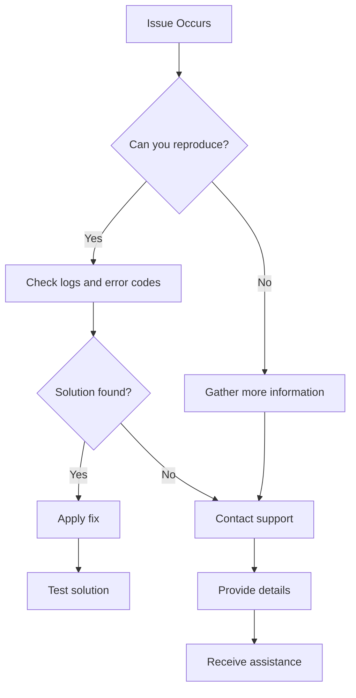

## Problèmes courants liés aux workflows

Résolvez les problèmes les plus fréquents rencontrés lors de la création et de l'exécution de workflows.

<Callout kind="tip">
  Commencez par consulter les journaux de votre workflow dans le tableau de bord pour obtenir des messages d'erreur détaillés.
</Callout>

## Problèmes de connexion aux intégrations

Lorsque des intégrations échouent à se connecter ou cessent de fonctionner, suivez ces étapes de diagnostic.

<Steps>
  <Step title="Vérifier les identifiants" icon="key">
    Vérifiez que les clés API ou les jetons OAuth n'ont pas expiré. Régénérez-les si nécessaire.
  </Step>
  <Step title="Tester la connexion" icon="wifi">
    Utilisez la fonctionnalité de test d'intégration dans le tableau de bord pour vérifier la connectivité.
  </Step>
  <Step title="Vérifier les permissions" icon="shield">
    Assurez-vous que vos comptes connectés disposent des permissions requises pour les opérations concernées.
  </Step>
</Steps>

<Tabs>
  <Tab title="Problèmes Slack" icon="message-circle">
    <Expandable title="Problèmes de jeton bot">
      - Vérifiez que les portées du bot incluent les permissions nécessaires
      - Vérifiez si le bot a été retiré du canal
      - Régénérez le jeton s'il a été compromis
    </Expandable>
    <Expandable title="Limitation de débit">
      Limites de l'API Slack : 1 message par seconde, 100 par minute
    </Expandable>
  </Tab>

  <Tab title="Google Workspace" icon="mail">
    <Expandable title="Portées OAuth">
      Assurez-vous que toutes les portées requises sont accordées lors de l'autorisation.
    </Expandable>
    <Expandable title="Restrictions de domaine">
      Vérifiez si votre domaine Google Workspace autorise l'accès aux applications tierces.
    </Expandable>
  </Tab>

  <Tab title="Notion" icon="file-text">
    <Expandable title="Accès à l'intégration">
      Vérifiez que l'intégration a accès aux pages et bases de données spécifiques.
    </Expandable>
  </Tab>
</Tabs>

## Échecs d'exécution des workflows

Déboguez les exécutions de workflows qui échouent ou produisent des résultats inattendus.

<Columns cols={2}>
  <Card title="Clarté des invites" icon="edit-3">
    Reformulez les invites ambiguës. Soyez précis sur les déclencheurs et les actions.
  </Card>
  <Card title="Dépendances entre étapes" icon="git-branch">
    Assurez-vous que les étapes prérequises se terminent avant que les actions dépendantes s'exécutent.
  </Card>
  <Card title="Problèmes de format de données" icon="database">
    Vérifiez que les formats de données correspondent aux exigences de l'intégration (JSON, XML, etc.).
  </Card>
  <Card title="Gestion des délais d'attente" icon="clock">
    Les workflows de longue durée peuvent expirer. Divisez-les en étapes plus petites.
  </Card>
</Columns>

## Codes d'erreur et solutions

| Code d'erreur | Description | Solution |
|---------------|-------------|----------|
| `AUTH_001` | Identifiants invalides | Vérifiez les clés API et régénérez-les si nécessaire |
| `INT_002` | Intégration hors ligne | Vérifiez l'état du service et réessayez ultérieurement |
| `WF_003` | Invite invalide | Reformulez la description du workflow de façon plus claire |
| `RATE_004` | Limite de débit dépassée | Implémentez un backoff exponentiel, envisagez une mise à niveau |
| `DATA_005` | Données malformées | Validez le format et la structure des données d'entrée |

## Problèmes de performance

Optimisez les workflows lents ou non réactifs.

<ExpandableGroup>
  <Expandable title="Optimisation des workflows">
    - Réduisez les étapes inutiles
    - Utilisez le traitement parallèle lorsque c'est possible
    - Mettez en cache les données fréquemment consultées
  </Expandable>
  <Expandable title="Performance des intégrations">
    - Regroupez les appels API pour réduire la surcharge
    - Utilisez des webhooks plutôt que l'interrogation
    - Optimisez la taille des transferts de données
  </Expandable>
</ExpandableGroup>

## Problèmes de compte et de facturation

Résolvez les problèmes de connexion, d'accès et de paiement.

<Steps>
  <Step title="Accès au compte" icon="user">
    Réinitialisez votre mot de passe si la connexion échoue. Vérifiez votre messagerie pour les liens de vérification.
  </Step>
  <Step title="Alertes de facturation" icon="credit-card">
    Mettez à jour les modes de paiement avant leur expiration. Surveillez l'utilisation par rapport aux limites.
  </Step>
  <Step title="Permissions d'équipe" icon="users">
    Vérifiez les rôles et permissions des utilisateurs pour les fonctionnalités restreintes.
  </Step>
</Steps>

## Outils de débogage et journalisation

Utilisez les capacités de débogage d'AetherFlow pour les problèmes complexes.

<Tabs>
  <Tab title="Journaux de workflow" icon="file-text">
    ```json
    {
      "workflow_id": "wf_123",
      "step": "slack_notification",
      "status": "error",
      "message": "Channel not found",
      "timestamp": "2024-01-15T10:30:00Z"
    }
    ```
  </Tab>

  <Tab title="Débogage API" icon="code">
    Utilisez des outils comme Postman ou curl avec une sortie détaillée :

    ```bash
    curl -v -X GET "https://api.aetherflow.com/v2/workflows" \
      -H "Authorization: Bearer YOUR_TOKEN"
    ```
  </Tab>
</Tabs>

## Obtenir de l'aide

Lorsque vous ne pouvez pas résoudre les problèmes de façon autonome, contactez l'assistance.

<Callout kind="success">
  Incluez l'identifiant du workflow, les messages d'erreur et les étapes pour reproduire le problème lorsque vous contactez l'assistance.
</Callout>

| Canal d'assistance | Temps de réponse | Idéal pour |
|-------------------|------------------|------------|
| Documentation | Immédiat | Solutions en libre-service |
| Forum communautaire | 24 heures | Aide entre pairs |
| Assistance par e-mail | 48 heures | Problèmes techniques complexes |
| Chat en direct | 30 minutes | Problèmes urgents en production |



Ce guide de dépannage vous aide à identifier et à résoudre rapidement les problèmes courants d'AetherFlow.
