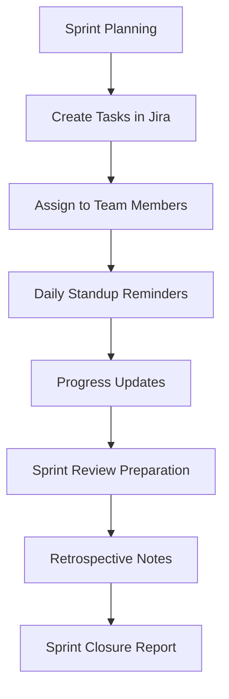

## Automatisation du support client

Rationalisez les opérations de support avec un routage intelligent des tickets et une automatisation des réponses.

<Callout kind="success">
  Les équipes de support utilisant AetherFlow signalent des temps de réponse 40 % plus rapides et une meilleure satisfaction client.
</Callout>

### Routage intelligent des tickets

Catégorisez et attribuez automatiquement les tickets de support en fonction de l'analyse du contenu.

<Expandable title="Exemple d'invite de flux de travail">
```
Lorsqu'un nouveau ticket est créé dans Zendesk :
- Analyser le sujet et la description du ticket pour repérer les mots-clés
- Catégoriser en : facturation, technique, compte ou général
- Vérifier la disponibilité et l'expertise des agents
- Attribuer à l'agent disponible le plus adapté
- Envoyer une notification Slack à l'agent assigné avec le niveau de priorité
- Si priorité élevée, notifier également le responsable du support
```
</Expandable>

### Réponses automatisées

Générez des réponses contextuelles pour les scénarios de support courants.

<Tabs>
  <Tab title="Réinitialisation de mot de passe" icon="key">
    ```prompt
    Lorsqu'un client demande une réinitialisation de mot de passe :
    - Générer un mot de passe temporaire sécurisé
    - Envoyer un e-mail de réinitialisation avec des instructions claires
    - Mettre à jour l'enregistrement client avec l'horodatage de la réinitialisation
    - Consigner l'action dans le journal d'audit de sécurité
    ```
  </Tab>

  <Tab title="Demande de statut de commande" icon="package">
    ```prompt
    Lorsqu'un client se renseigne sur le statut d'une commande :
    - Rechercher la commande dans le système à l'aide du numéro de commande fourni
    - Vérifier le statut d'expédition actuel et la livraison estimée
    - Envoyer une réponse personnalisée avec les informations de suivi
    - En cas de retard, proposer une réduction sur le prochain achat
    ```
  </Tab>
</Tabs>

## Gestion de contenu

Automatisez les flux de travail de création, publication et distribution de contenu.

<Columns cols={2}>
  <Card title="Publication de blog" icon="file-text">
    Générez des articles de blog à partir de plans, programmez la publication et distribuez sur plusieurs plateformes.
  </Card>
  <Card title="Gestion des réseaux sociaux" icon="share">
    Créez des calendriers de contenu, générez des publications et programmez la diffusion multiplateforme.
  </Card>
</Columns>

### Exemple de flux de travail de contenu

```prompt
Automatisation hebdomadaire de la publication de contenu :
- Générer 5 idées d'articles de blog sur les sujets tendance de notre secteur
- Créer des plans détaillés pour chaque idée
- Attribuer aux rédacteurs disponibles selon leur expertise
- Mettre en place un flux de révision avec approbation de l'éditeur
- Programmer la publication aux moments d'engagement optimal
- Republier sur LinkedIn, Twitter et la newsletter de l'entreprise
- Suivre les indicateurs d'engagement et générer un rapport de performance
```

## Automatisation des ventes et du marketing

Améliorez les processus de génération, de maturation et de conversion des prospects.

<ExpandableGroup>
  <Expandable title="Qualification des prospects">
    Scorez et routez automatiquement les prospects en fonction de leur comportement et de leurs données démographiques.
  </Expandable>
  <Expandable title="Campagnes e-mail">
    Personnalisez les séquences d'e-mails en fonction des caractéristiques et de l'engagement des prospects.
  </Expandable>
  <Expandable title="Planification de réunions">
    Coordonnez les réunions commerciales et les relances sur plusieurs fuseaux horaires.
  </Expandable>
</ExpandableGroup>

### Automatisation du pipeline de ventes

<Steps>
  <Step title="Capture des prospects" icon="user-plus">
    Capturez les prospects depuis les formulaires du site web, les réseaux sociaux et les cartes de visite.
  </Step>
  <Step title="Qualification" icon="filter">
    Scorez les prospects en fonction de la taille de l'entreprise, du budget, du calendrier et de l'engagement.
  </Step>
  <Step title="Maturation" icon="mail">
    Envoyez des séquences d'e-mails personnalisées et des recommandations de contenu.
  </Step>
  <Step title="Conversion" icon="target">
    Déclenchez des notifications à l'équipe commerciale lorsque les prospects atteignent le score cible.
  </Step>
</Steps>

## Automatisation des ressources humaines

Rationalisez les processus RH de l'intégration à la séparation.

<Callout kind="info">
  L'automatisation RH réduit le travail administratif jusqu'à 60 % et améliore l'expérience des employés.
</Callout>

### Intégration des nouveaux employés

```prompt
Flux de travail d'intégration d'un nouvel employé :
- Créer des comptes dans le système RH, la messagerie et Slack
- Envoyer un e-mail de bienvenue avec les informations du premier jour
- Planifier les réunions d'intégration avec le responsable et l'équipe
- Configurer la paie et l'inscription aux avantages sociaux
- Attribuer des modules de formation et suivre leur achèvement
- Envoyer un questionnaire de retour d'expérience après la première semaine
```

### Processus d'évaluation des performances

<Tabs>
  <Tab title="Collecte des auto-évaluations" icon="user">
    ```prompt
    Évaluations trimestrielles des performances :
    - Envoyer le formulaire d'auto-évaluation à tous les employés 2 semaines avant la période de révision
    - Rappeler aux employés s'il n'est pas rempli 3 jours avant la date limite
    - Collecter les formulaires de retour des responsables
    - Générer un document de révision consolidé
    - Planifier automatiquement les réunions d'évaluation
    ```
  </Tab>

  <Tab title="Définition des objectifs" icon="target">
    ```prompt
    Processus annuel de définition des objectifs :
    - Distribuer les modèles de définition d'objectifs à tous les employés
    - Planifier des sessions individuelles avec les responsables
    - Suivre l'avancement des objectifs tout au long de l'année
    - Envoyer des rappels de points trimestriels
    - Générer des rapports de réalisation des objectifs en fin d'année
    ```
  </Tab>
</Tabs>

## Gestion de projet

Automatisez les flux de travail de projet et la coordination des équipes.

<Columns cols={3}>
  <Card title="Attribution des tâches" icon="check-square">
    Distribuez les tâches en fonction de la disponibilité et des compétences des membres de l'équipe.
  </Card>
  <Card title="Suivi de l'avancement" icon="bar-chart">
    Surveillez les jalons du projet et envoyez des mises à jour de statut.
  </Card>
  <Card title="Allocation des ressources" icon="users">
    Optimisez l'utilisation de l'équipe et la répartition de la charge de travail.
  </Card>
</Columns>

### Gestion des sprints Agile



## Opérations financières

Automatisez les processus de facturation, de reporting et de conformité.

<Expandable title="Traitement des factures">
```
Flux de travail d'automatisation des factures :
- Extraire les données des factures reçues par OCR
- Valider par rapport aux bons de commande et aux contrats
- Router pour approbation selon les seuils de montant
- Traiter le paiement via le système comptable
- Envoyer la confirmation au fournisseur
- Archiver pour la piste d'audit
```
</Expandable>

## Opérations informatiques

Rationalisez la gestion des services informatiques et la surveillance de l'infrastructure.

<ExpandableGroup>
  <Expandable title="Réponse aux incidents">
    Triez automatiquement les alertes, créez des tickets et notifiez les ingénieurs d'astreinte.
  </Expandable>
  <Expandable title="Vérification des sauvegardes">
    Vérifiez l'achèvement des sauvegardes, testez les procédures de restauration et envoyez des rapports.
  </Expandable>
  <Expandable title="Gestion des licences">
    Suivez les licences logicielles, envoyez des rappels de renouvellement et optimisez l'utilisation.
  </Expandable>
</ExpandableGroup>

## Modèles par secteur d'activité

Modèles de flux de travail prêts à l'emploi pour les scénarios métier courants.

| Secteur | Cas d'utilisation populaires |
|---------|------------------------------|
| **Commerce en ligne** | Traitement des commandes, gestion des stocks, service client |
| **Santé** | Prise de rendez-vous, suivi des patients, reporting de conformité |
| **Éducation** | Inscription des étudiants, traitement des notes, suivi des présences |
| **Juridique** | Révision de documents, suivi des délais, communications clients |
| **Industrie** | Contrôle qualité, surveillance de la chaîne d'approvisionnement, planification de la maintenance |

<Callout kind="tip">
  Commencez par ces modèles et personnalisez-les pour l'adapter à vos processus métier spécifiques.
</Callout>

## Exemples d'intégrations personnalisées

Créez des flux de travail qui combinent plusieurs outils de manière créative.

```javascript
// Advanced API integration example
const workflow = {
  name: "Customer Onboarding",
  trigger: "webhook",
  steps: [
    {
      action: "create_customer",
      service: "stripe",
      data: "${webhook.customer_data}"
    },
    {
      action: "send_welcome_email",
      service: "sendgrid",
      template: "customer_welcome",
      data: {
        name: "${steps.create_customer.name}",
        account_link: "${steps.create_customer.account_url}"
      }
    },
    {
      action: "create_task",
      service: "asana",
      project: "Customer Success",
      assignee: "account_manager",
      due_date: "in 3 days"
    }
  ]
};
```

Ces exemples illustrent la polyvalence d'AetherFlow dans différentes fonctions métier et secteurs d'activité.
