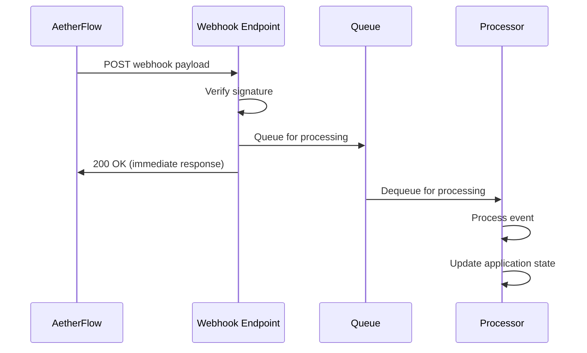

## Présentation des webhooks

Recevez des notifications en temps réel sur les événements de workflow et intégrez AetherFlow avec des systèmes externes.

<Callout kind="info">
  Les webhooks délivrent des notifications instantanées lorsque des événements de workflow se produisent, permettant des intégrations en temps réel.
</Callout>

## Créer des webhooks

Configurez des endpoints webhook pour recevoir les notifications d'événements AetherFlow.

<Steps>
  <Step title="Créer un endpoint" icon="server">
    Configurez un endpoint HTTPS dans votre application pour recevoir les charges utiles webhook.
  </Step>
  <Step title="Configurer le webhook" icon="settings">
    Enregistrez l'URL de votre endpoint dans le tableau de bord AetherFlow.
  </Step>
  <Step title="Ajouter un secret" icon="key">
    Générez et configurez un secret webhook pour la vérification des charges utiles.
  </Step>
  <Step title="Tester la connexion" icon="check-circle">
    Envoyez des événements de test pour vérifier que votre endpoint reçoit et traite bien les webhooks.
  </Step>
</Steps>

## Événements webhook

Abonnez-vous à des événements spécifiques qui déclenchent des notifications webhook.

<ExpandableGroup>
  <Expandable title="Événements de workflow">
    - `workflow.created` - Déclenché lors de la création d'un nouveau workflow
    - `workflow.updated` - Déclenché lors de la modification de la configuration d'un workflow
    - `workflow.deleted` - Déclenché lors de la suppression d'un workflow
    - `workflow.executed` - Déclenché au démarrage d'une exécution de workflow
    - `workflow.completed` - Déclenché lorsqu'un workflow se termine avec succès
    - `workflow.failed` - Déclenché lors de l'échec d'une exécution de workflow
  </Expandable>

  <Expandable title="Événements d'intégration">
    - `integration.connected` - Déclenché lors de la connexion réussie d'une intégration
    - `integration.disconnected` - Déclenché lors de la perte d'une connexion d'intégration
    - `integration.error` - Déclenché lorsqu'une intégration rencontre une erreur
  </Expandable>

  <Expandable title="Événements système">
    - `user.invited` - Déclenché lors de l'invitation d'un membre de l'équipe
    - `user.joined` - Déclenché lorsqu'un utilisateur rejoint l'espace de travail
    - `billing.updated` - Déclenché lors de la modification des informations de facturation
  </Expandable>
</ExpandableGroup>

## Structure des charges utiles webhook

Comprenez le format des charges utiles webhook et comment les traiter.

<Expandable title="Charge utile d'exécution de workflow">
```json
{
  "event": "workflow.completed",
  "id": "evt_1234567890",
  "timestamp": "2024-01-15T10:30:00Z",
  "data": {
    "workflow": {
      "id": "wf_abc123",
      "name": "Email Processor",
      "status": "completed",
      "execution_time": 2500,
      "executed_at": "2024-01-15T10:29:57Z"
    },
    "steps": [
      {
        "id": "step_1",
        "name": "Process Email",
        "status": "completed",
        "duration": 1200
      },
      {
        "id": "step_2",
        "name": "Send Slack Notification",
        "status": "completed",
        "duration": 1300
      }
    ],
    "custom_data": {
      "email_subject": "Important Update",
      "priority": "high"
    }
  }
}
```
</Expandable>

<Expandable title="Charge utile d'échec de workflow">
```json
{
  "event": "workflow.failed",
  "id": "evt_1234567891",
  "timestamp": "2024-01-15T10:35:00Z",
  "data": {
    "workflow": {
      "id": "wf_def456",
      "name": "Data Sync",
      "status": "failed",
      "error_message": "Integration timeout",
      "failed_at": "2024-01-15T10:34:45Z"
    },
    "error_details": {
      "step": "step_3",
      "integration": "salesforce",
      "error_code": "TIMEOUT",
      "retry_count": 3
    }
  }
}
```
</Expandable>

## Sécurité et vérification

Sécurisez vos endpoints webhook et vérifiez l'authenticité des charges utiles.

<Callout kind="warning">
  Vérifiez toujours les signatures webhook pour vous assurer que les charges utiles sont authentiques et n'ont pas été altérées.
</Callout>

### Vérification de la signature

<CodeGroup tabs="Node.js,Python,Go">
```javascript
const crypto = require('crypto');

function verifySignature(payload, signature, secret) {
  const expectedSignature = crypto
    .createHmac('sha256', secret)
    .update(payload, 'utf8')
    .digest('hex');

  return crypto.timingSafeEqual(
    Buffer.from(signature, 'hex'),
    Buffer.from(expectedSignature, 'hex')
  );
}

// Usage in Express.js
app.post('/webhook', express.raw({ type: 'application/json' }), (req, res) => {
  const signature = req.headers['x-aetherflow-signature'];
  const secret = process.env.WEBHOOK_SECRET;

  if (!verifySignature(req.body, signature, secret)) {
    return res.status(401).send('Invalid signature');
  }

  // Process webhook payload
  const payload = JSON.parse(req.body);
  // ... handle event
});
```

```python
import hmac
import hashlib
import json

def verify_signature(payload: bytes, signature: str, secret: str) -> bool:
    expected_signature = hmac.new(
        secret.encode('utf-8'),
        payload,
        hashlib.sha256
    ).hexdigest()

    return hmac.compare_digest(signature, expected_signature)

# Usage in Flask
@app.route('/webhook', methods=['POST'])
def webhook():
    signature = request.headers.get('X-AetherFlow-Signature')
    secret = os.environ.get('WEBHOOK_SECRET')

    if not verify_signature(request.data, signature, secret):
        return 'Invalid signature', 401

    payload = request.get_json()
    # ... handle event
    return 'OK', 200
```

```go
package main

import (
    "crypto/hmac"
    "crypto/sha256"
    "encoding/hex"
    "fmt"
    "io/ioutil"
    "net/http"
)

func verifySignature(payload []byte, signature string, secret string) bool {
    mac := hmac.New(sha256.New, []byte(secret))
    mac.Write(payload)
    expectedMAC := mac.Sum(nil)
    expectedSignature := hex.EncodeToString(expectedMAC)

    return hmac.Equal([]byte(signature), []byte(expectedSignature))
}

func webhookHandler(w http.ResponseWriter, r *http.Request) {
    signature := r.Header.Get("X-AetherFlow-Signature")
    secret := os.Getenv("WEBHOOK_SECRET")

    payload, err := ioutil.ReadAll(r.Body)
    if err != nil {
        http.Error(w, "Bad request", 400)
        return
    }

    if !verifySignature(payload, signature, secret) {
        http.Error(w, "Invalid signature", 401)
        return
    }

    // Process webhook payload
    // ... handle event
    fmt.Fprint(w, "OK")
}
```
</CodeGroup>

## Traitement des événements webhook

Traitez différents types d'événements webhook dans votre application.

<Expandable title="Exemple de traitement des événements">
```javascript
function processWebhookEvent(eventType, data) {
  switch (eventType) {
    case 'workflow.completed':
      // Update internal records
      updateWorkflowStatus(data.workflow.id, 'completed');
      // Send notifications
      notifyTeam(data.workflow.name + ' completed successfully');
      break;

    case 'workflow.failed':
      // Log error details
      logWorkflowError(data.workflow.id, data.error_details);
      // Trigger retry or alert
      if (data.error_details.retry_count < 3) {
        retryWorkflow(data.workflow.id);
      } else {
        alertDevopsTeam(data.workflow.name + ' failed permanently');
      }
      break;

    case 'integration.disconnected':
      // Handle integration issues
      disableWorkflowsUsingIntegration(data.integration.id);
      sendIntegrationAlert(data.integration.name);
      break;

    default:
      console.log('Unhandled event type:', eventType);
  }
}
```

```python
def process_webhook_event(event_type: str, data: dict):
    if event_type == 'workflow.completed':
        # Update internal records
        update_workflow_status(data['workflow']['id'], 'completed')
        # Send notifications
        notify_team(f"{data['workflow']['name']} completed successfully")

    elif event_type == 'workflow.failed':
        # Log error details
        log_workflow_error(data['workflow']['id'], data['error_details'])
        # Trigger retry or alert
        if data['error_details']['retry_count'] < 3:
            retry_workflow(data['workflow']['id'])
        else:
            alert_devops_team(f"{data['workflow']['name']} failed permanently")

    elif event_type == 'integration.disconnected':
        # Handle integration issues
        disable_workflows_using_integration(data['integration']['id'])
        send_integration_alert(data['integration']['name'])

    else:
        print(f'Unhandled event type: {event_type}')
```
</Expandable>

## Logique de nouvelle tentative et fiabilité

Gérez les échecs de livraison des webhooks et implémentez des mécanismes de nouvelle tentative.

<Callout kind="tip">
  Implémentez des gestionnaires de webhooks idempotents pour traiter en toute sécurité les livraisons en double.
</Callout>

<Columns cols={2}>
  <Card title="Idempotence" icon="repeat">
    Utilisez les identifiants d'événement pour éviter le traitement des livraisons webhook en double.
  </Card>
  <Card title="Gestion des nouvelles tentatives" icon="refresh-cw">
    AetherFlow réessaie automatiquement les livraisons de webhooks échouées jusqu'à 3 fois.
  </Card>
  <Card title="Gestion des délais d'attente" icon="clock">
    Répondez dans les 10 secondes pour éviter les nouvelles tentatives de livraison.
  </Card>
  <Card title="Réponses d'erreur" icon="alert-triangle">
    Renvoyez des codes de statut HTTP appropriés pour différentes conditions d'erreur.
  </Card>
</Columns>

<Expandable title="Exemple de gestionnaire idempotent">
```javascript
const processedEvents = new Set();

function handleWebhook(req, res) {
  const eventId = req.body.id;

  // Check if we've already processed this event
  if (processedEvents.has(eventId)) {
    return res.status(200).send('Already processed');
  }

  try {
    // Process the webhook
    processWebhookEvent(req.body.event, req.body.data);

    // Mark as processed
    processedEvents.add(eventId);

    // Clean up old events (keep last 1000)
    if (processedEvents.size > 1000) {
      const oldestEvent = processedEvents.values().next().value;
      processedEvents.delete(oldestEvent);
    }

    res.status(200).send('Processed');
  } catch (error) {
    console.error('Webhook processing error:', error);
    res.status(500).send('Processing failed');
  }
}
```

```python
processed_events = set()

def handle_webhook():
    event_id = request.json['id']

    # Check if we've already processed this event
    if event_id in processed_events:
        return 'Already processed', 200

    try:
        # Process the webhook
        process_webhook_event(request.json['event'], request.json['data'])

        # Mark as processed
        processed_events.add(event_id)

        # Clean up old events (keep last 1000)
        if len(processed_events) > 1000:
            oldest_event = next(iter(processed_events))
            processed_events.remove(oldest_event)

        return 'Processed', 200
    except Exception as e:
        print(f'Webhook processing error: {e}')
        return 'Processing failed', 500
```
</Expandable>

## Tester les webhooks

Testez vos intégrations webhook avant de passer en production.

<Tabs>
  <Tab title="Tests via le tableau de bord" icon="monitor">
    Utilisez le tableau de bord AetherFlow pour envoyer des événements webhook de test à votre endpoint.
  </Tab>

  <Tab title="Développement local" icon="code">
    Utilisez des outils comme ngrok ou localtunnel pour exposer les serveurs de développement locaux.
  </Tab>

  <Tab title="Tests automatisés" icon="robot">
    Créez des tests unitaires pour les gestionnaires de webhooks et le traitement des charges utiles.
  </Tab>
</Tabs>

<Expandable title="Exemple de charge utile de test">
```bash
curl -X POST http://your-endpoint.com/webhook \
  -H "Content-Type: application/json" \
  -H "X-AetherFlow-Signature: test_signature" \
  -d '{
    "event": "workflow.completed",
    "id": "test_event_123",
    "timestamp": "2024-01-15T10:30:00Z",
    "data": {
      "workflow": {
        "id": "test_workflow",
        "name": "Test Workflow",
        "status": "completed"
      }
    }
  }'
```
</Expandable>

## Gestion des webhooks

Gérez et surveillez vos configurations webhook.

<ExpandableGroup>
  <Expandable title="Paramètres des webhooks">
    Configurez les politiques de nouvelle tentative, les paramètres de délai d'attente et les filtres d'événements.
  </Expandable>

  <Expandable title="Surveillance des livraisons">
    Suivez les taux de succès de livraison des webhooks et les temps de réponse.
  </Expandable>

  <Expandable title="Journalisation de débogage">
    Activez la journalisation détaillée pour résoudre les problèmes de webhooks.
  </Expandable>
</ExpandableGroup>

## Bonnes pratiques

Optimisez votre implémentation webhook pour la fiabilité et la performance.

<Columns cols={3}>
  <Card title="Réponses rapides" icon="zap">
    Traitez les webhooks de façon asynchrone et répondez rapidement.
  </Card>
  <Card title="Gestion des erreurs" icon="shield">
    Implémentez une gestion des erreurs et une journalisation complètes.
  </Card>
  <Card title="Sécurité" icon="lock">
    Vérifiez toujours les signatures et utilisez des endpoints HTTPS.
  </Card>
  <Card title="Surveillance" icon="eye">
    Surveillez les métriques de livraison et de traitement des webhooks.
  </Card>
  <Card title="Gestion des versions" icon="tag">
    Gérez le versionnage des charges utiles webhook avec élégance.
  </Card>
  <Card title="Limitation de débit" icon="gauge">
    Implémentez la limitation de débit pour gérer les événements à fort volume.
  </Card>
</Columns>

<Expandable title="Pattern d'architecture webhook">

</Expandable>

Les webhooks fournissent des capacités d'intégration en temps réel, permettant à vos applications de répondre instantanément aux événements AetherFlow.
