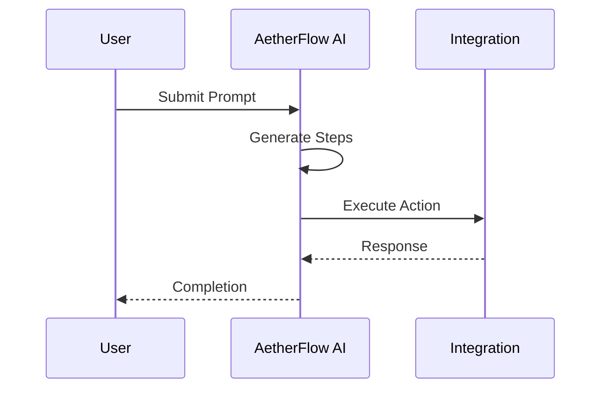

## Créer des flux de travail

Vous créez des flux de travail en décrivant les résultats souhaités en langage naturel. L'IA analyse votre invite, suggère des étapes et s'intègre aux applications connectées. Cette approche sans code rend l'automatisation accessible à tous les membres de l'équipe.

<Callout kind="info">
  Les invites doivent être claires et précises pour une interprétation optimale par l'IA.
</Callout>

## Interface du créateur de flux de travail

Accédez au créateur depuis le tableau de bord. Saisissez votre invite et affinez le flux généré.

<Steps>
  <Step title="Saisir l'invite" icon="edit-3">
    Tapez une description telle que « Attribuer les tickets aux agents disponibles en fonction de leurs compétences. »
  </Step>
  <Step title="Vérifier les étapes" icon="eye">
    Modifiez les actions individuelles, par exemple en ajoutant des conditions ou des boucles.
    ```javascript
    // API to update workflow
    await fetch(`/workflows/${id}`, {
      method: 'PATCH',
      body: JSON.stringify({
        steps: [{ action: 'assign', app: 'zendesk' }]
      })
    });
    ```
  </Step>
  <Step title="Déployer" icon="rocket">
    Activez le flux de travail et définissez les déclencheurs.
  </Step>
</Steps>

## Gérer les flux de travail actifs

Surveillez et modifiez les flux de travail en cours d'exécution depuis l'onglet Flux de travail.

<Tabs>
  <Tab title="Déclencheurs" icon="zap">
    Définissez des conditions telles que des déclencheurs temporels ou événementiels.
    <CodeGroup tabs="JSON, YAML">
      ```json
      {
        "trigger": {
          "type": "event",
          "source": "email"
        }
      }
      ```
      ```yaml
      trigger:
        type: event
        source: email
      ```
    </CodeGroup>
  </Tab>
  <Tab title="Actions" icon="play">
    Définissez les sorties comme les notifications ou les mises à jour de données.
    <Columns cols={2}>
      <Card title="Logique conditionnelle" icon="git-branch">
        Utilisez des règles si-alors dans les invites.
      </Card>
      <Card title="Gestion des erreurs" icon="alert-circle">
        Définissez des solutions de repli pour les étapes échouées.
      </Card>
    </Columns>
  </Tab>
</Tabs>

## Optimisation et analyse

Examinez les indicateurs de performance pour améliorer les flux de travail.

<ExpandableGroup>
  <Expandable title="Explication des indicateurs">
    Le taux de réussite, le temps d'exécution moyen et les journaux d'erreurs aident à identifier les problèmes.
  </Expandable>
  <Expandable title="Suggestions de l'IA">
    Obtenez des suggestions d'affinement d'invites basées sur les données d'utilisation.
  </Expandable>
</ExpandableGroup>

| Indicateur | Description | Cible |
|------------|-------------|-------|
| Taux de réussite | Pourcentage d'exécutions complétées | `>95%` |
| Temps d'exécution | Durée moyenne d'exécution | `<30` sec |
| Erreurs | Points d'échec courants | Consulter les journaux |



<Callout kind="tip">
  Itérez sur les flux de travail à l'aide de l'analyse pour améliorer l'efficacité.
</Callout>

Les utilisateurs avancés peuvent exporter les flux de travail au format JSON pour la gestion des versions.

```javascript
// Export example
const workflowData = {
  id: 'wf_123',
  prompt: 'Automate reports',
  integrations: ['slack', 'google']
};
```

Ce guide détaillé vous permet de maîtriser la création et la gestion des flux de travail.
