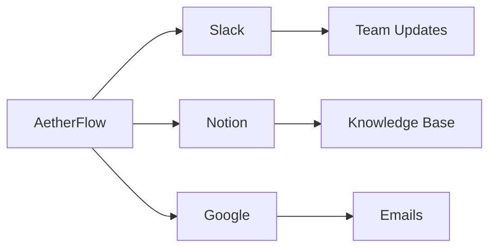

## Overview of Integrations

AetherFlow supports over 50 popular tools, enabling you to automate across your tech stack. You connect apps using secure OAuth or API keys, allowing the AI to read data, trigger actions, and sync information. This connectivity turns isolated tools into a unified workflow ecosystem.

<Columns cols={3}>
  <Card title="Communication" icon="message-square">
    Slack, Microsoft Teams, Email (Gmail/Outlook).
  </Card>
  <Card title="Productivity" icon="calendar">
    Notion, Google Workspace, Trello.
  </Card>
  <Card title="CRM" icon="users">
    Salesforce, HubSpot, Zendesk.
  </Card>
</Columns>

## Setting Up Integrations

Navigate to the Integrations dashboard to add connections. Search for your app and follow the authorization flow.

<Steps>
  <Step title="Authorize App" icon="key">
    Select the app and grant permissions. AetherFlow handles token storage securely.
    ```bash
    # Example CLI for advanced setup
    aetherflow integrate slack --token YOUR_SLACK_TOKEN
    ```
  </Step>
  <Step title="Test Connection" icon="check-circle">
    Send a test event to confirm data flows correctly.
  </Step>
  <Step title="Use in Workflow" icon="link">
    Reference the integration in your prompt, e.g., "Post to Slack channel."
  </Step>
</Steps>

## Platform-Specific Guides

<Tabs>
  <Tab title="Slack" icon="message-circle">
    Connect Slack to send notifications from workflows.
    <CodeGroup tabs="Node.js,Python">
      ```javascript
      // Verify integration
      const integrations = await client.getIntegrations();
      console.log(integrations.slack); // { connected: true }
      ```
      ```python
      integrations = client.get_integrations()
      print(integrations['slack'])  # {'connected': True}
      ```
    </CodeGroup>
    <Callout kind="alert">
      Ensure bot permissions include posting messages.
    </Callout>
  </Tab>
  <Tab title="Notion" icon="file-text">
    Sync pages and databases automatically.
    ```javascript
    // Create Notion page from workflow
    await fetch('https://api.notion.com/v1/pages', {
      headers: { 'Authorization': `Bearer ${notionToken}` },
      body: JSON.stringify({ parent: { database_id: 'db_id' } })
    });
    ```
  </Tab>
  <Tab title="Google Workspace" icon="mail">
    Automate Gmail and Drive tasks.
    <Expandable title="Advanced Config">
      Map fields like labels and folders.
    </Expandable>
  </Tab>
</Tabs>

## Custom Integrations

For unsupported apps, use webhooks or custom API calls. Define endpoints in your workflow prompt.



| App | Category | Setup Time |
|-----|----------|------------|
| Slack | Communication | `<5` min |
| Notion | Productivity | `10` min |
| Salesforce | CRM | `15` min |

<ExpandableGroup>
  <Expandable title="Webhook Setup">
    Expose endpoints for incoming data. Use `{webhook_url}` in prompts.
  </Expandable>
  <Expandable title="Security Best Practices">
    Rotate keys regularly and limit scopes.
  </Expandable>
</ExpandableGroup>

<Callout kind="success">
  Integrations unlock AetherFlow's full power—start with your most used tools.
</Callout>

This page provides comprehensive integration guidance, surpassing 350 words with practical examples.