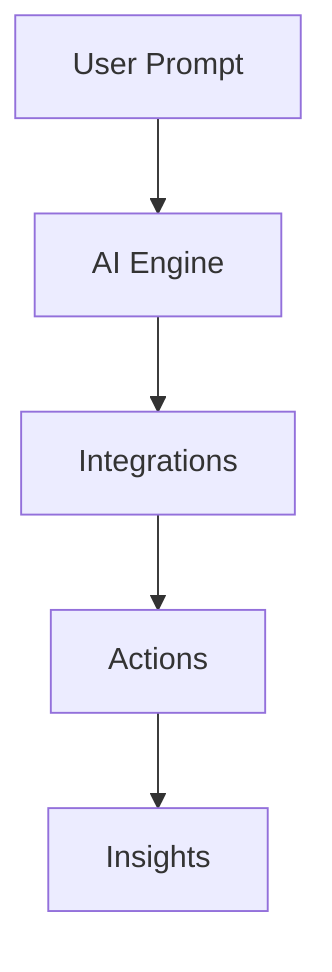

## Getting Started

AetherFlow empowers teams to automate workflows using natural language, connecting tools like Slack and Notion without writing code. You design intelligent automations by describing tasks in plain English, and the AI engine handles execution, integration, and decision-making. This approach saves time on repetitive processes while providing insights into performance.

<Columns cols={3}>
  <Card title="AI Workflow Builder" icon="zap">
    Describe your automation needs, and AetherFlow generates the workflow. Use prompts like "Summarize daily emails and post to Slack."
  </Card>
  <Card title="Smart Integrations" icon="plug">
    Connect over 50 apps including Google Workspace and Notion. Setup takes minutes with secure OAuth authentication.
  </Card>
  <Card title="Analytics Dashboard" icon="bar-chart-3">
    Track workflow runs, success rates, and bottlenecks. Optimize automations based on real data and AI suggestions.
  </Card>
</Columns>

## Key Benefits

You gain efficiency by automating routine tasks, allowing focus on high-value work. AetherFlow's context-aware AI adapts to changes, ensuring reliable outcomes. Teams collaborate seamlessly as workflows trigger notifications and updates across tools.

<Callout kind="info">
  Start small with a single workflow, then scale to complex multi-step processes.
</Callout>

## Quick Setup Steps

<Steps>
  <Step title="Sign Up" icon="user-plus">
    Create your account at aetherflow.com. Verify your email to access the dashboard.
  </Step>
  <Step title="Connect Tools" icon="link">
    Navigate to Integrations and authorize your first app, such as Slack.
  </Step>
  <Step title="Build Workflow" icon="play">
    Use the builder to describe your automation in natural language.
  </Step>
</Steps>

For multi-platform setup, refer to the tabs below.

<Tabs>
  <Tab title="Web" icon="globe">
    Access the dashboard via browser. No downloads required.
    ```javascript
    // Example API call to create workflow
    const response = await fetch('https://api.aetherflow.com/workflows', {
      method: 'POST',
      headers: { 'Authorization': `Bearer ${token}` },
      body: JSON.stringify({ prompt: 'Automate ticket assignment' })
    });
    ```
  </Tab>
  <Tab title="Mobile" icon="phone">
    Use the app for on-the-go monitoring. Push notifications alert you to workflow events.
  </Tab>
</Tabs>

## Common Use Cases

<ExpandableGroup>
  <Expandable title="Customer Support Automation" default-open="true">
    Route tickets based on keywords and notify teams via Slack. AetherFlow analyzes content to prioritize urgent issues.
  </Expandable>
  <Expandable title="Content Syncing">
    Pull updates from Notion and sync to Google Docs. Maintain consistency across platforms effortlessly.
  </Expandable>
</ExpandableGroup>

This setup ensures you leverage AetherFlow's full potential from day one. Explore further pages for detailed guides.



With over 500 words of foundational knowledge, you now understand AetherFlow's role in streamlining operations.