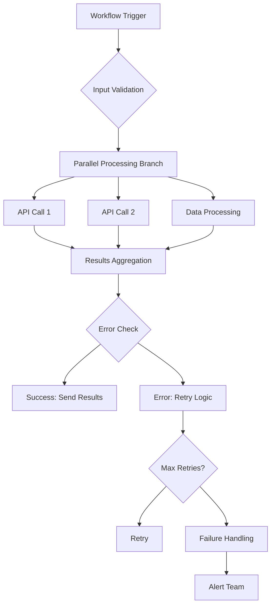

## Performance Fundamentals

Understand the key factors that affect AetherFlow performance and how to optimize them.

<Callout kind="info">
  Well-optimized workflows run faster, cost less, and provide more reliable automation.
</Callout>

## Workflow Execution Time

Factors that influence how quickly your workflows complete.

<Columns cols={3}>
  <Card title="Integration Latency" icon="wifi">
    Time spent communicating with external APIs and services.
  </Card>
  <Card title="Data Processing" icon="database">
    Time required to transform and process data within workflows.
  </Card>
  <Card title="AI Processing" icon="brain">
    Time for AetherFlow's AI to interpret prompts and generate actions.
  </Card>
</Columns>

## Optimization Strategies

Techniques to improve workflow performance across different dimensions.

### Prompt Optimization

<ExpandableGroup>
  <Expandable title="Clarity and Specificity">
    Write clear, specific prompts that leave less room for AI interpretation:

    **Poor:** "Handle customer emails"
    **Better:** "When receiving customer emails, categorize them as billing, support, or sales, then route to the appropriate team channel in Slack"
  </Expandable>

  <Expandable title="Context Provision">
    Provide necessary context upfront rather than making AI infer it:

    **Poor:** "Process orders"
    **Better:** "When a new order comes in from Shopify, check inventory levels in our warehouse system, update the order status, and send confirmation email to customer@example.com"
  </Expandable>

  <Expandable title="Action Sequencing">
    Structure prompts to minimize back-and-forth:

    **Poor:** "Email summary, then Slack post"
    **Better:** "Generate a weekly sales summary from Salesforce data and post it to the #sales Slack channel every Monday at 9 AM"
  </Expandable>
</ExpandableGroup>

### Integration Optimization

<Steps>
  <Step title="Batch Operations" icon="package">
    Group multiple API calls into single requests when possible.
  </Step>
  <Step title="Caching Strategy" icon="database">
    Cache frequently accessed data to reduce API calls.
  </Step>
  <Step title="Connection Pooling" icon="server">
    Reuse connections instead of creating new ones for each request.
  </Step>
  <Step title="Rate Limiting Awareness" icon="gauge">
    Respect API limits and implement intelligent retry logic.
  </Step>
</Steps>

### Data Processing Optimization

<Expandable title="Efficient Data Handling">
- **Filter Early**: Reduce data volume as early as possible in the workflow
- **Stream Processing**: Process large datasets in chunks rather than loading everything
- **Index Optimization**: Use appropriate data structures for lookups
- **Memory Management**: Be mindful of memory usage with large datasets
</Expandable>

## Monitoring Performance

Track and analyze workflow performance metrics.

<Tabs>
  <Tab title="Execution Metrics" icon="bar-chart">
    Monitor average execution time, success rates, and failure patterns.
  </Tab>
  <Tab title="Resource Usage" icon="cpu">
    Track CPU, memory, and API call consumption.
  </Tab>
  <Tab title="Bottleneck Analysis" icon="search">
    Identify which steps or integrations slow down workflows.
  </Tab>
</Tabs>

<Expandable title="Performance Dashboard">
```javascript
// Example: Custom performance monitoring
const performanceData = await client.analytics.getWorkflowMetrics(workflowId, {
  metrics: ['avg_execution_time', 'success_rate', 'step_timings'],
  timeframe: 'last_7_days'
});

// Identify bottlenecks
const slowSteps = performanceData.step_timings
  .filter(step => step.duration > 5000) // Steps taking >5 seconds
  .sort((a, b) => b.duration - a.duration);

console.log('Performance bottlenecks:', slowSteps);
```
</Expandable>

## Cost Optimization

Reduce operational costs while maintaining performance.

<Columns cols={2}>
  <Card title="Execution Efficiency" icon="zap">
    Minimize unnecessary workflow executions through better triggers.
  </Card>
  <Card title="Resource Utilization" icon="cpu">
    Optimize for cost-effective resource usage within performance bounds.
  </Card>
  <Card title="Plan Selection" icon="credit-card">
    Choose appropriate plans based on actual usage patterns.
  </Card>
  <Card title="Caching Benefits" icon="database">
    Reduce API calls through intelligent caching strategies.
  </Card>
</Columns>

## Advanced Optimization Techniques

Sophisticated methods for high-performance workflows.

### Parallel Processing

<Expandable title="Workflow Parallelization">
Execute independent steps simultaneously:

```prompt
When processing monthly reports:
1. [Parallel] Generate sales report from Salesforce
2. [Parallel] Generate marketing report from Google Analytics
3. [Parallel] Generate financial report from QuickBooks
4. Combine all reports and send consolidated email
```

**Performance Impact:** Reduces total execution time from sequential sum to longest individual step.
</Expandable>

### Conditional Execution

<Expandable title="Smart Branching">
Avoid unnecessary processing with intelligent conditions:

```prompt
When receiving a customer ticket:
- If priority is "urgent", immediately notify on-call engineer via SMS
- If priority is "high", create task in Jira and notify team via Slack
- If priority is "normal", add to support queue and send automated response
- Only for billing-related tickets, also update accounting system
```

**Performance Impact:** Reduces average execution time by skipping irrelevant steps.
</Expandable>

### Caching and Memoization

<Expandable title="Intelligent Caching">
Cache expensive operations and reuse results:

```javascript
// Example caching strategy
const CACHE_TTL = 3600000; // 1 hour

async function getCachedUserData(userId) {
  const cacheKey = `user_${userId}`;
  let userData = await cache.get(cacheKey);

  if (!userData) {
    userData = await fetchUserFromAPI(userId);
    await cache.set(cacheKey, userData, CACHE_TTL);
  }

  return userData;
}
```
</Expandable>

## Scalability Considerations

Design workflows that scale with your business growth.

<ExpandableGroup>
  <Expandable title="Horizontal Scaling">
    Design workflows that can handle increased load through parallel processing.
  </Expandable>
  <Expandable title="Resource Management">
    Implement proper resource allocation and cleanup in long-running workflows.
  </Expandable>
  <Expandable title="Load Balancing">
    Distribute work across multiple instances when volume exceeds thresholds.
  </Expandable>
</ExpandableGroup>

## Error Handling Optimization

Efficient error handling that doesn't impact performance.

<Expandable title="Graceful Degradation">
Design workflows to continue operating when non-critical components fail:

```prompt
When generating weekly reports:
- Try to fetch data from primary database
- If primary fails, use backup data source
- Always generate report, even with partial data
- Send report with data quality indicators
```
</Expandable>

<Expandable title="Circuit Breakers">
Prevent cascade failures by temporarily disabling problematic integrations:

```javascript
class CircuitBreaker {
  constructor(failureThreshold = 5, recoveryTimeout = 60000) {
    this.failureCount = 0;
    this.failureThreshold = failureThreshold;
    this.recoveryTimeout = recoveryTimeout;
    this.state = 'CLOSED'; // CLOSED, OPEN, HALF_OPEN
  }

  async execute(operation) {
    if (this.state === 'OPEN') {
      if (Date.now() - this.lastFailureTime > this.recoveryTimeout) {
        this.state = 'HALF_OPEN';
      } else {
        throw new Error('Circuit breaker is OPEN');
      }
    }

    try {
      const result = await operation();
      this.onSuccess();
      return result;
    } catch (error) {
      this.onFailure();
      throw error;
    }
  }

  onSuccess() {
    this.failureCount = 0;
    this.state = 'CLOSED';
  }

  onFailure() {
    this.failureCount++;
    if (this.failureCount >= this.failureThreshold) {
      this.state = 'OPEN';
      this.lastFailureTime = Date.now();
    }
  }
}
```
</Expandable>

## Performance Testing

Systematically test and validate workflow performance.

<Steps>
  <Step title="Load Testing" icon="activity">
    Test workflows under various load conditions to identify limits.
  </Step>
  <Step title="Stress Testing" icon="zap">
    Push workflows beyond normal limits to find breaking points.
  </Step>
  <Step title="Endurance Testing" icon="clock">
    Test long-running workflows for memory leaks and degradation.
  </Step>
  <Step title="Spike Testing" icon="trending-up">
    Test sudden increases in load to validate scalability.
  </Step>
</Steps>

## Monitoring and Alerting

Set up comprehensive monitoring for performance issues.

<Expandable title="Performance Alerts">
- **Execution Time**: Alert when workflows exceed time thresholds
- **Error Rates**: Notify when error rates rise above acceptable levels
- **Resource Usage**: Monitor for unusual spikes in CPU or memory usage
- **Integration Latency**: Alert on slow API responses from integrations
</Expandable>

## Best Practices Summary

Key principles for optimal AetherFlow performance.

<Columns cols={4}>
  <Card title="Design for Parallelism" icon="split">
    Structure workflows to maximize concurrent execution.
  </Card>
  <Card title="Minimize API Calls" icon="minus">
    Batch operations and use caching to reduce external requests.
  </Card>
  <Card title="Fail Fast" icon="x">
    Detect and handle errors early to prevent wasted processing.
  </Card>
  <Card title="Monitor Continuously" icon="eye">
    Track performance metrics and set up automated alerts.
  </Card>
</Columns>

<Expandable title="Performance Checklist">
- [ ] Prompts are clear and specific
- [ ] Independent steps run in parallel
- [ ] Expensive operations are cached
- [ ] Error handling doesn't impact performance
- [ ] Monitoring and alerting are configured
- [ ] Regular performance reviews conducted
- [ ] Scalability considerations included
- [ ] Cost optimization balanced with performance
</Expandable>



Implementing these optimization strategies will significantly improve your workflow performance, reliability, and cost efficiency.
