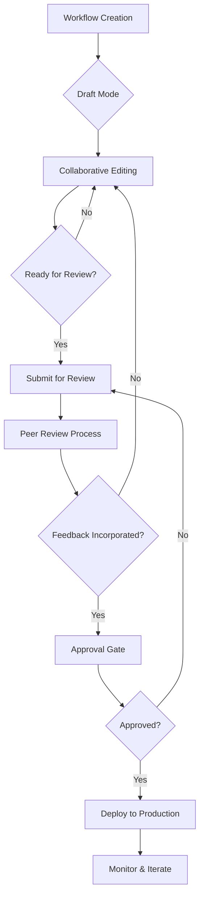

## Multi-User Workspaces

Create shared workspaces where team members can collaborate on automation projects.

<Callout kind="info">
  Team collaboration features are available on Pro and Enterprise plans.
</Callout>

## Workspace Management

Set up and manage collaborative environments for your team.

<Steps>
  <Step title="Create Workspace" icon="folder-plus">
    Set up a new workspace with custom settings and permissions.
  </Step>
  <Step title="Invite Team Members" icon="user-plus">
    Add colleagues with appropriate roles and access levels.
  </Step>
  <Step title="Configure Permissions" icon="shield">
    Define what each team member can view, edit, and manage.
  </Step>
  <Step title="Set Up Notifications" icon="bell">
    Configure team-wide alerts and update notifications.
  </Step>
</Steps>

## Role-Based Access Control

Granular permissions ensure secure and appropriate access to workflows and data.

<Tabs>
  <Tab title="User Roles" icon="users">
    | Role | Permissions | Description |
    |------|-------------|-------------|
    | **Owner** | Full access to all features | Can manage billing, users, and settings |
    | **Admin** | Manage users and workflows | Can add/remove users and modify all workflows |
    | **Editor** | Create and edit workflows | Can build and modify workflows but not manage users |
    | **Viewer** | Read-only access | Can view workflows and analytics but not modify |
    | **Runner** | Execute workflows only | Limited to running existing workflows |
  </Tab>

  <Tab title="Workflow Permissions" icon="git-branch">
    Control access at the individual workflow level:
    - **Public**: Visible to all team members
    - **Team**: Restricted to specific teams
    - **Private**: Only creator and designated collaborators
    - **Restricted**: View-only with explicit approval required for edits
  </Tab>
</Tabs>

## Collaborative Workflow Building

Build workflows together with real-time collaboration features.

<Columns cols={3}>
  <Card title="Live Editing" icon="edit">
    Multiple users can edit workflows simultaneously with conflict resolution.
  </Card>
  <Card title="Comments & Feedback" icon="message-circle">
    Add comments and suggestions directly on workflow steps.
  </Card>
  <Card title="Version History" icon="history">
    Track changes and revert to previous versions when needed.
  </Card>
</Columns>

<Expandable title="Collaboration Workflow">
1. **Draft Creation**: Team member creates initial workflow draft
2. **Peer Review**: Colleagues review and provide feedback
3. **Iterative Refinement**: Incorporate suggestions and improvements
4. **Testing Phase**: Team validates workflow functionality
5. **Approval Process**: Designated reviewers approve for production
6. **Deployment**: Roll out to production with monitoring
</Expandable>

## Knowledge Sharing

Share best practices, templates, and documentation within your team.

<ExpandableGroup>
  <Expandable title="Workflow Templates">
    Create reusable workflow templates that team members can customize.
  </Expandable>
  <Expandable title="Documentation Hub">
    Maintain team documentation for complex workflows and integrations.
  </Expandable>
  <Expandable title="Training Resources">
    Share tutorials and best practices for effective automation.
  </Expandable>
</ExpandableGroup>

## Team Analytics and Insights

Monitor team performance and collaboration metrics.

<Tabs>
  <Tab title="Individual Performance" icon="user">
    Track each team member's workflow creation, success rates, and contributions.
  </Tab>
  <Tab title="Team Productivity" icon="users">
    Monitor overall team automation impact and efficiency improvements.
  </Tab>
  <Tab title="Collaboration Metrics" icon="handshake">
    Analyze workflow sharing, reviews, and cross-team collaboration.
  </Tab>
</Tabs>

## Communication Integration

Connect AetherFlow with team communication tools for seamless updates.

<Columns cols={2}>
  <Card title="Slack Integration" icon="message-circle">
    Receive workflow notifications and updates in dedicated channels.
  </Card>
  <Card title="Microsoft Teams" icon="users">
    Team notifications and interactive workflow management.
  </Card>
  <Card title="Email Notifications" icon="mail">
    Customizable email alerts for important workflow events.
  </Card>
  <Card title="Webhooks" icon="webhook">
    Send workflow data to any webhook endpoint for custom integrations.
  </Card>
</Columns>

## Workflow Review Process

Implement structured review processes for quality assurance.

<Steps>
  <Step title="Submit for Review" icon="send">
    Mark workflow as ready for review and assign reviewers.
  </Step>
  <Step title="Review Feedback" icon="message-square">
    Reviewers provide detailed feedback and suggestions.
  </Step>
  <Step title="Address Comments" icon="check-circle">
    Make requested changes and resubmit for approval.
  </Step>
  <Step title="Final Approval" icon="thumbs-up">
    Approved workflows can be deployed to production.
  </Step>
</Steps>

<Expandable title="Review Checklist">
- [ ] Security implications reviewed
- [ ] Error handling implemented
- [ ] Performance optimized
- [ ] Documentation updated
- [ ] Testing completed
- [ ] Stakeholder approval obtained
</Expandable>

## Shared Resources and Templates

Create and maintain a library of reusable components.

<ExpandableGroup>
  <Expandable title="Workflow Components">
    Save frequently used workflow segments as reusable components.
  </Expandable>
  <Expandable title="Integration Templates">
    Pre-configured integration setups for common services.
  </Expandable>
  <Expandable title="Best Practice Guides">
    Documented patterns and standards for consistent workflow creation.
  </Expandable>
</ExpandableGroup>

## Cross-Team Collaboration

Enable collaboration between different departments and teams.

<Callout kind="tip">
  Cross-team collaboration breaks down silos and enables enterprise-wide automation.
</Callout>

<Columns cols={2}>
  <Card title="Shared Workspaces" icon="building">
    Create workspaces that span multiple teams or departments.
  </Card>
  <Card title="Workflow Sharing" icon="share">
    Share workflows between teams with appropriate permissions.
  </Card>
  <Card title="Dependency Management" icon="link">
    Track how teams depend on each other's workflows.
  </Card>
  <Card title="Governance Policies" icon="gavel">
    Implement enterprise-wide standards and compliance rules.
  </Card>
</Columns>

## Training and Onboarding

Help new team members get up to speed with AetherFlow.

<Expandable title="Onboarding Program">
- **Welcome Package**: Overview documentation and quick start guides
- **Hands-on Training**: Interactive workshops and tutorials
- **Mentorship Program**: Pair new users with experienced team members
- **Certification**: Validate proficiency with structured assessments
</Expandable>

## Enterprise Features

Advanced collaboration capabilities for large organizations.

<ExpandableGroup>
  <Expandable title="Single Sign-On (SSO)">
    Integrate with enterprise identity providers like Okta, Azure AD, and SAML.
  </Expandable>
  <Expandable title="Audit Logging">
    Comprehensive logging of all user actions for compliance and security.
  </Expandable>
  <Expandable title="Advanced Permissions">
    Granular permissions down to individual workflow actions and data fields.
  </Expandable>
  <Expandable title="Multi-Workspace Support">
    Manage multiple isolated workspaces within a single enterprise account.
  </Expandable>
</ExpandableGroup>

## Conflict Resolution

Handle collaborative editing conflicts gracefully.

<Tabs>
  <Tab title="Merge Conflicts" icon="git-merge">
    When multiple users edit simultaneously, AetherFlow intelligently merges changes.
  </Tab>
  <Tab title="Version Control" icon="git-branch">
    Maintain version history with the ability to revert changes and compare versions.
  </Tab>
  <Tab title="Locking Mechanism" icon="lock">
    Prevent conflicts by allowing users to lock workflows during critical edits.
  </Tab>
</Tabs>

## Communication Best Practices

Establish effective communication patterns for collaborative teams.

<Expandable title="Team Communication Guidelines">
- **Clear Naming Conventions**: Use descriptive names for workflows and components
- **Documentation Standards**: Maintain up-to-date documentation for all workflows
- **Regular Sync Meetings**: Weekly reviews of workflow performance and improvements
- **Knowledge Sharing**: Regular sessions to share new techniques and best practices
- **Feedback Culture**: Encourage constructive feedback and continuous improvement
</Expandable>

Team collaboration transforms individual automation efforts into scalable enterprise solutions.
