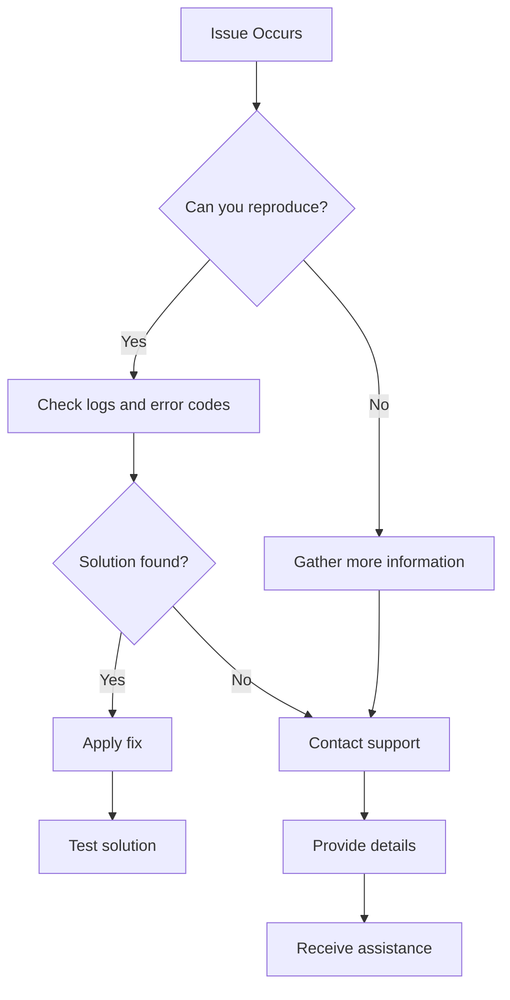

## Common Workflow Issues

Resolve the most frequent problems encountered when building and running workflows.

<Callout kind="tip">
  Start by checking your workflow logs in the dashboard for detailed error messages.
</Callout>

## Integration Connection Problems

When integrations fail to connect or stop working, follow these diagnostic steps.

<Steps>
  <Step title="Verify Credentials" icon="key">
    Check that API keys or OAuth tokens haven't expired. Regenerate if necessary.
  </Step>
  <Step title="Test Connection" icon="wifi">
    Use the integration test feature in the dashboard to verify connectivity.
  </Step>
  <Step title="Check Permissions" icon="shield">
    Ensure your connected accounts have the required permissions for the operations.
  </Step>
</Steps>

<Tabs>
  <Tab title="Slack Issues" icon="message-circle">
    <Expandable title="Bot Token Problems">
      - Verify bot scope includes necessary permissions
      - Check if bot was removed from channel
      - Regenerate token if compromised
    </Expandable>
    <Expandable title="Rate Limiting">
      Slack API limits: 1 message per second, 100 per minute
    </Expandable>
  </Tab>

  <Tab title="Google Workspace" icon="mail">
    <Expandable title="OAuth Scopes">
      Ensure all required scopes are granted during authorization.
    </Expandable>
    <Expandable title="Domain Restrictions">
      Check if your Google Workspace domain allows third-party app access.
    </Expandable>
  </Tab>

  <Tab title="Notion" icon="file-text">
    <Expandable title="Integration Access">
      Verify integration has access to the specific pages/databases.
    </Expandable>
  </Tab>
</Tabs>

## Workflow Execution Failures

Debug workflow runs that fail or produce unexpected results.

<Columns cols={2}>
  <Card title="Prompt Clarity" icon="edit-3">
    Rephrase ambiguous prompts. Be specific about triggers and actions.
  </Card>
  <Card title="Step Dependencies" icon="git-branch">
    Ensure prerequisite steps complete before dependent actions run.
  </Card>
  <Card title="Data Format Issues" icon="database">
    Verify data formats match integration requirements (JSON, XML, etc.).
  </Card>
  <Card title="Timeout Handling" icon="clock">
    Long-running workflows may timeout. Break into smaller steps.
  </Card>
</Columns>

## Error Codes and Solutions

| Error Code | Description | Solution |
|------------|-------------|----------|
| `AUTH_001` | Invalid credentials | Check API keys and regenerate if needed |
| `INT_002` | Integration offline | Verify service status and retry later |
| `WF_003` | Invalid prompt | Rephrase workflow description more clearly |
| `RATE_004` | Rate limit exceeded | Implement exponential backoff, upgrade plan |
| `DATA_005` | Malformed data | Validate input data format and structure |

## Performance Issues

Optimize slow or unresponsive workflows.

<ExpandableGroup>
  <Expandable title="Workflow Optimization">
    - Reduce unnecessary steps
    - Use parallel processing where possible
    - Cache frequently accessed data
  </Expandable>
  <Expandable title="Integration Performance">
    - Batch API calls to reduce overhead
    - Use webhooks instead of polling
    - Optimize data transfer sizes
  </Expandable>
</ExpandableGroup>

## Account and Billing Issues

Resolve login, access, and payment problems.

<Steps>
  <Step title="Account Access" icon="user">
    Reset password if login fails. Check email for verification links.
  </Step>
  <Step title="Billing Alerts" icon="credit-card">
    Update payment methods before expiration. Monitor usage against limits.
  </Step>
  <Step title="Team Permissions" icon="users">
    Verify user roles and permissions for restricted features.
  </Step>
</Steps>

## Debug Tools and Logging

Utilize AetherFlow's debugging capabilities for complex issues.

<Tabs>
  <Tab title="Workflow Logs" icon="file-text">
    ```json
    {
      "workflow_id": "wf_123",
      "step": "slack_notification",
      "status": "error",
      "message": "Channel not found",
      "timestamp": "2024-01-15T10:30:00Z"
    }
    ```
  </Tab>

  <Tab title="API Debugging" icon="code">
    Use tools like Postman or curl with verbose output:

    ```bash
    curl -v -X GET "https://api.aetherflow.com/v2/workflows" \
      -H "Authorization: Bearer YOUR_TOKEN"
    ```
  </Tab>
</Tabs>

## Getting Help

When you can't resolve issues independently, reach out for support.

<Callout kind="success">
  Include workflow ID, error messages, and steps to reproduce when contacting support.
</Callout>

| Support Channel | Response Time | Best For |
|----------------|----------------|----------|
| Documentation | Immediate | Self-service solutions |
| Community Forum | 24 hours | Peer assistance |
| Email Support | 48 hours | Complex technical issues |
| Live Chat | 30 minutes | Urgent production problems |



This troubleshooting guide helps you quickly identify and resolve common AetherFlow issues.
