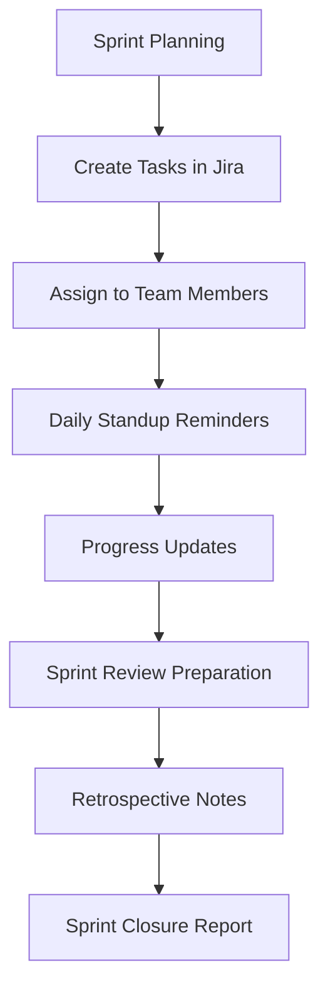

## Customer Support Automation

Streamline support operations with intelligent ticket routing and response automation.

<Callout kind="success">
  Support teams using AetherFlow report 40% faster response times and improved customer satisfaction.
</Callout>

### Intelligent Ticket Routing

Automatically categorize and assign support tickets based on content analysis.

<Expandable title="Sample Workflow Prompt">
```
When a new ticket is created in Zendesk:
- Analyze the ticket subject and description for keywords
- Categorize as: billing, technical, account, or general
- Check agent availability and expertise
- Assign to the most suitable available agent
- Send Slack notification to the assigned agent with priority level
- If high priority, also notify the support manager
```
</Expandable>

### Automated Responses

Generate contextual responses for common support scenarios.

<Tabs>
  <Tab title="Password Reset" icon="key">
    ```prompt
    When a customer requests password reset:
    - Generate secure temporary password
    - Send reset email with clear instructions
    - Update customer record with reset timestamp
    - Log the action in the security audit trail
    ```
  </Tab>

  <Tab title="Order Status Inquiry" icon="package">
    ```prompt
    When customer asks about order status:
    - Look up order in the system using provided order number
    - Check current shipping status and estimated delivery
    - Send personalized response with tracking information
    - If delayed, offer discount on next purchase
    ```
  </Tab>
</Tabs>

## Content Management

Automate content creation, publishing, and distribution workflows.

<Columns cols={2}>
  <Card title="Blog Publishing" icon="file-text">
    Generate blog posts from outlines, schedule publishing, and distribute to multiple platforms.
  </Card>
  <Card title="Social Media Management" icon="share">
    Create content calendars, generate posts, and schedule cross-platform publishing.
  </Card>
</Columns>

### Content Workflow Example

```prompt
Weekly content publishing automation:
- Generate 5 blog post ideas based on trending topics in our industry
- Create detailed outlines for each idea
- Assign to available writers based on their expertise
- Set up review workflow with editor approval
- Schedule publishing for optimal engagement times
- Cross-post to LinkedIn, Twitter, and company newsletter
- Track engagement metrics and generate performance report
```

## Sales and Marketing Automation

Enhance lead generation, nurturing, and conversion processes.

<ExpandableGroup>
  <Expandable title="Lead Qualification">
    Automatically score and route leads based on behavior and demographics.
  </Expandable>
  <Expandable title="Email Campaigns">
    Personalize email sequences based on lead characteristics and engagement.
  </Expandable>
  <Expandable title="Meeting Scheduling">
    Coordinate sales meetings and follow-ups across multiple time zones.
  </Expandable>
</ExpandableGroup>

### Sales Pipeline Automation

<Steps>
  <Step title="Lead Capture" icon="user-plus">
    Capture leads from website forms, social media, and business cards.
  </Step>
  <Step title="Qualification" icon="filter">
    Score leads based on company size, budget, timeline, and engagement.
  </Step>
  <Step title="Nurturing" icon="mail">
    Send personalized email sequences and content recommendations.
  </Step>
  <Step title="Conversion" icon="target">
    Trigger sales team notifications when leads reach target score.
  </Step>
</Steps>

## Human Resources Automation

Streamline HR processes from onboarding to offboarding.

<Callout kind="info">
  HR automation reduces administrative work by up to 60% and improves employee experience.
</Callout>

### Employee Onboarding

```prompt
New employee onboarding workflow:
- Create accounts in HR system, email, and Slack
- Send welcome email with first-day information
- Schedule onboarding meetings with manager and team
- Set up payroll and benefits enrollment
- Assign training modules and track completion
- Send feedback survey after first week
```

### Performance Review Process

<Tabs>
  <Tab title="Self-Review Collection" icon="user">
    ```prompt
    Quarterly performance reviews:
    - Send self-review form to all employees 2 weeks before review period
    - Remind employees if not completed 3 days before deadline
    - Collect manager feedback forms
    - Generate consolidated review document
    - Schedule review meetings automatically
    ```
  </Tab>

  <Tab title="Goal Setting" icon="target">
    ```prompt
    Annual goal setting process:
    - Distribute goal-setting templates to all employees
    - Schedule one-on-one sessions with managers
    - Track goal progress throughout the year
    - Send quarterly check-in reminders
    - Generate year-end goal achievement reports
    ```
  </Tab>
</Tabs>

## Project Management

Automate project workflows and team coordination.

<Columns cols={3}>
  <Card title="Task Assignment" icon="check-square">
    Distribute tasks based on team member availability and skills.
  </Card>
  <Card title="Progress Tracking" icon="bar-chart">
    Monitor project milestones and send status updates.
  </Card>
  <Card title="Resource Allocation" icon="users">
    Optimize team utilization and workload distribution.
  </Card>
</Columns>

### Agile Sprint Management



## Financial Operations

Automate invoicing, reporting, and compliance processes.

<Expandable title="Invoice Processing">
```
Invoice automation workflow:
- Extract data from received invoices using OCR
- Validate against purchase orders and contracts
- Route for approval based on amount thresholds
- Process payment through accounting system
- Send confirmation to vendor
- File for audit trail
```
</Expandable>

## IT Operations

Streamline IT service management and infrastructure monitoring.

<ExpandableGroup>
  <Expandable title="Incident Response">
    Automatically triage alerts, create tickets, and notify on-call engineers.
  </Expandable>
  <Expandable title="Backup Verification">
    Verify backup completion, test restore procedures, and send reports.
  </Expandable>
  <Expandable title="License Management">
    Track software licenses, send renewal reminders, and optimize usage.
  </Expandable>
</ExpandableGroup>

## Industry-Specific Templates

Pre-built workflow templates for common business scenarios.

| Industry | Popular Use Cases |
|----------|-------------------|
| **E-commerce** | Order fulfillment, inventory management, customer service |
| **Healthcare** | Appointment scheduling, patient follow-ups, compliance reporting |
| **Education** | Student enrollment, grade processing, attendance tracking |
| **Legal** | Document review, deadline tracking, client communications |
| **Manufacturing** | Quality control, supply chain monitoring, maintenance scheduling |

<Callout kind="tip">
  Start with these templates and customize them to fit your specific business processes.
</Callout>

## Custom Integration Examples

Build workflows that combine multiple tools creatively.

```javascript
// Advanced API integration example
const workflow = {
  name: "Customer Onboarding",
  trigger: "webhook",
  steps: [
    {
      action: "create_customer",
      service: "stripe",
      data: "${webhook.customer_data}"
    },
    {
      action: "send_welcome_email",
      service: "sendgrid",
      template: "customer_welcome",
      data: {
        name: "${steps.create_customer.name}",
        account_link: "${steps.create_customer.account_url}"
      }
    },
    {
      action: "create_task",
      service: "asana",
      project: "Customer Success",
      assignee: "account_manager",
      due_date: "in 3 days"
    }
  ]
};
```

These examples demonstrate the versatility of AetherFlow across different business functions and industries.
