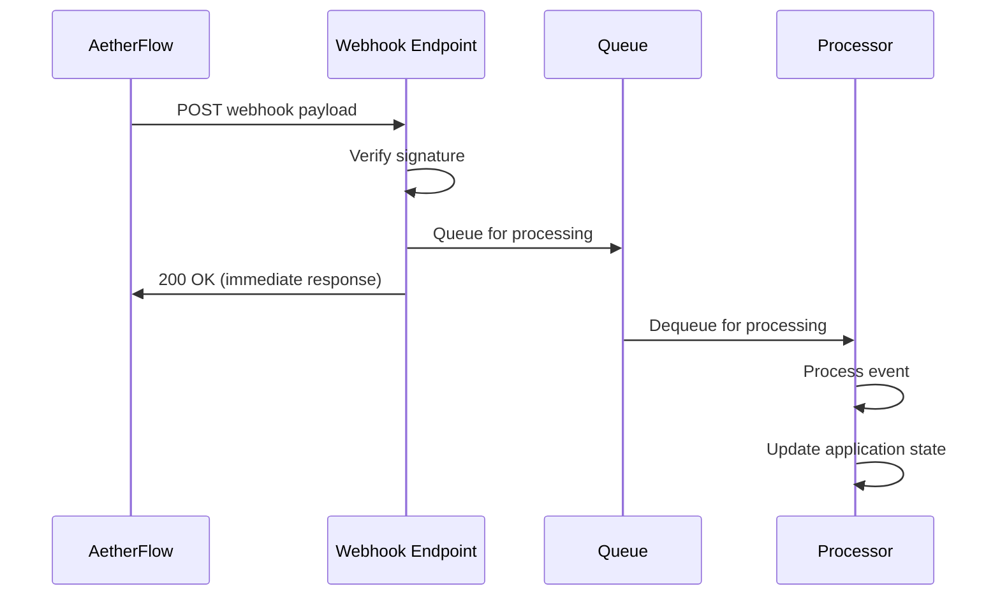

## Webhook Overview

Receive real-time notifications about workflow events and integrate AetherFlow with external systems.

<Callout kind="info">
  Webhooks deliver instant notifications when workflow events occur, enabling real-time integrations.
</Callout>

## Creating Webhooks

Set up webhook endpoints to receive AetherFlow event notifications.

<Steps>
  <Step title="Create Endpoint" icon="server">
    Set up an HTTPS endpoint in your application to receive webhook payloads.
  </Step>
  <Step title="Configure Webhook" icon="settings">
    Register your endpoint URL in the AetherFlow dashboard.
  </Step>
  <Step title="Add Secret" icon="key">
    Generate and configure a webhook secret for payload verification.
  </Step>
  <Step title="Test Connection" icon="check-circle">
    Send test events to verify your endpoint receives and processes webhooks.
  </Step>
</Steps>

## Webhook Events

Subscribe to specific events that trigger webhook notifications.

<ExpandableGroup>
  <Expandable title="Workflow Events">
    - `workflow.created` - Fired when a new workflow is created
    - `workflow.updated` - Fired when workflow configuration changes
    - `workflow.deleted` - Fired when a workflow is deleted
    - `workflow.executed` - Fired when a workflow execution starts
    - `workflow.completed` - Fired when a workflow completes successfully
    - `workflow.failed` - Fired when a workflow execution fails
  </Expandable>

  <Expandable title="Integration Events">
    - `integration.connected` - Fired when an integration is successfully connected
    - `integration.disconnected` - Fired when an integration connection is lost
    - `integration.error` - Fired when an integration encounters an error
  </Expandable>

  <Expandable title="System Events">
    - `user.invited` - Fired when a team member is invited
    - `user.joined` - Fired when a user joins the workspace
    - `billing.updated` - Fired when billing information changes
  </Expandable>
</ExpandableGroup>

## Webhook Payload Structure

Understand the format of webhook payloads and how to process them.

<Expandable title="Workflow Execution Payload">
```json
{
  "event": "workflow.completed",
  "id": "evt_1234567890",
  "timestamp": "2024-01-15T10:30:00Z",
  "data": {
    "workflow": {
      "id": "wf_abc123",
      "name": "Email Processor",
      "status": "completed",
      "execution_time": 2500,
      "executed_at": "2024-01-15T10:29:57Z"
    },
    "steps": [
      {
        "id": "step_1",
        "name": "Process Email",
        "status": "completed",
        "duration": 1200
      },
      {
        "id": "step_2",
        "name": "Send Slack Notification",
        "status": "completed",
        "duration": 1300
      }
    ],
    "custom_data": {
      "email_subject": "Important Update",
      "priority": "high"
    }
  }
}
```
</Expandable>

<Expandable title="Workflow Failure Payload">
```json
{
  "event": "workflow.failed",
  "id": "evt_1234567891",
  "timestamp": "2024-01-15T10:35:00Z",
  "data": {
    "workflow": {
      "id": "wf_def456",
      "name": "Data Sync",
      "status": "failed",
      "error_message": "Integration timeout",
      "failed_at": "2024-01-15T10:34:45Z"
    },
    "error_details": {
      "step": "step_3",
      "integration": "salesforce",
      "error_code": "TIMEOUT",
      "retry_count": 3
    }
  }
}
```
</Expandable>

## Security and Verification

Secure your webhook endpoints and verify payload authenticity.

<Callout kind="warning">
  Always verify webhook signatures to ensure payloads are genuine and haven't been tampered with.
</Callout>

### Signature Verification

<CodeGroup tabs="Node.js,Python,Go">
```javascript
const crypto = require('crypto');

function verifySignature(payload, signature, secret) {
  const expectedSignature = crypto
    .createHmac('sha256', secret)
    .update(payload, 'utf8')
    .digest('hex');

  return crypto.timingSafeEqual(
    Buffer.from(signature, 'hex'),
    Buffer.from(expectedSignature, 'hex')
  );
}

// Usage in Express.js
app.post('/webhook', express.raw({ type: 'application/json' }), (req, res) => {
  const signature = req.headers['x-aetherflow-signature'];
  const secret = process.env.WEBHOOK_SECRET;

  if (!verifySignature(req.body, signature, secret)) {
    return res.status(401).send('Invalid signature');
  }

  // Process webhook payload
  const payload = JSON.parse(req.body);
  // ... handle event
});
```

```python
import hmac
import hashlib
import json

def verify_signature(payload: bytes, signature: str, secret: str) -> bool:
    expected_signature = hmac.new(
        secret.encode('utf-8'),
        payload,
        hashlib.sha256
    ).hexdigest()

    return hmac.compare_digest(signature, expected_signature)

# Usage in Flask
@app.route('/webhook', methods=['POST'])
def webhook():
    signature = request.headers.get('X-AetherFlow-Signature')
    secret = os.environ.get('WEBHOOK_SECRET')

    if not verify_signature(request.data, signature, secret):
        return 'Invalid signature', 401

    payload = request.get_json()
    # ... handle event
    return 'OK', 200
```

```go
package main

import (
    "crypto/hmac"
    "crypto/sha256"
    "encoding/hex"
    "fmt"
    "io/ioutil"
    "net/http"
)

func verifySignature(payload []byte, signature string, secret string) bool {
    mac := hmac.New(sha256.New, []byte(secret))
    mac.Write(payload)
    expectedMAC := mac.Sum(nil)
    expectedSignature := hex.EncodeToString(expectedMAC)

    return hmac.Equal([]byte(signature), []byte(expectedSignature))
}

func webhookHandler(w http.ResponseWriter, r *http.Request) {
    signature := r.Header.Get("X-AetherFlow-Signature")
    secret := os.Getenv("WEBHOOK_SECRET")

    payload, err := ioutil.ReadAll(r.Body)
    if err != nil {
        http.Error(w, "Bad request", 400)
        return
    }

    if !verifySignature(payload, signature, secret) {
        http.Error(w, "Invalid signature", 401)
        return
    }

    // Process webhook payload
    // ... handle event
    fmt.Fprint(w, "OK")
}
```
</CodeGroup>

## Handling Webhook Events

Process different types of webhook events in your application.

<Expandable title="Event Processing Example">
```javascript
function processWebhookEvent(eventType, data) {
  switch (eventType) {
    case 'workflow.completed':
      // Update internal records
      updateWorkflowStatus(data.workflow.id, 'completed');
      // Send notifications
      notifyTeam(data.workflow.name + ' completed successfully');
      break;

    case 'workflow.failed':
      // Log error details
      logWorkflowError(data.workflow.id, data.error_details);
      // Trigger retry or alert
      if (data.error_details.retry_count < 3) {
        retryWorkflow(data.workflow.id);
      } else {
        alertDevopsTeam(data.workflow.name + ' failed permanently');
      }
      break;

    case 'integration.disconnected':
      // Handle integration issues
      disableWorkflowsUsingIntegration(data.integration.id);
      sendIntegrationAlert(data.integration.name);
      break;

    default:
      console.log('Unhandled event type:', eventType);
  }
}
```

```python
def process_webhook_event(event_type: str, data: dict):
    if event_type == 'workflow.completed':
        # Update internal records
        update_workflow_status(data['workflow']['id'], 'completed')
        # Send notifications
        notify_team(f"{data['workflow']['name']} completed successfully")

    elif event_type == 'workflow.failed':
        # Log error details
        log_workflow_error(data['workflow']['id'], data['error_details'])
        # Trigger retry or alert
        if data['error_details']['retry_count'] < 3:
            retry_workflow(data['workflow']['id'])
        else:
            alert_devops_team(f"{data['workflow']['name']} failed permanently")

    elif event_type == 'integration.disconnected':
        # Handle integration issues
        disable_workflows_using_integration(data['integration']['id'])
        send_integration_alert(data['integration']['name'])

    else:
        print(f'Unhandled event type: {event_type}')
```
</Expandable>

## Retry Logic and Reliability

Handle webhook delivery failures and implement retry mechanisms.

<Callout kind="tip">
  Implement idempotent webhook handlers to safely process duplicate deliveries.
</Callout>

<Columns cols={2}>
  <Card title="Idempotency" icon="repeat">
    Use event IDs to prevent processing duplicate webhook deliveries.
  </Card>
  <Card title="Retry Handling" icon="refresh-cw">
    AetherFlow automatically retries failed webhook deliveries up to 3 times.
  </Card>
  <Card title="Timeout Handling" icon="clock">
    Respond within 10 seconds to avoid delivery retries.
  </Card>
  <Card title="Error Responses" icon="alert-triangle">
    Return appropriate HTTP status codes for different error conditions.
  </Card>
</Columns>

<Expandable title="Idempotent Handler Example">
```javascript
const processedEvents = new Set();

function handleWebhook(req, res) {
  const eventId = req.body.id;

  // Check if we've already processed this event
  if (processedEvents.has(eventId)) {
    return res.status(200).send('Already processed');
  }

  try {
    // Process the webhook
    processWebhookEvent(req.body.event, req.body.data);

    // Mark as processed
    processedEvents.add(eventId);

    // Clean up old events (keep last 1000)
    if (processedEvents.size > 1000) {
      const oldestEvent = processedEvents.values().next().value;
      processedEvents.delete(oldestEvent);
    }

    res.status(200).send('Processed');
  } catch (error) {
    console.error('Webhook processing error:', error);
    res.status(500).send('Processing failed');
  }
}
```

```python
processed_events = set()

def handle_webhook():
    event_id = request.json['id']

    # Check if we've already processed this event
    if event_id in processed_events:
        return 'Already processed', 200

    try:
        # Process the webhook
        process_webhook_event(request.json['event'], request.json['data'])

        # Mark as processed
        processed_events.add(event_id)

        # Clean up old events (keep last 1000)
        if len(processed_events) > 1000:
            oldest_event = next(iter(processed_events))
            processed_events.remove(oldest_event)

        return 'Processed', 200
    except Exception as e:
        print(f'Webhook processing error: {e}')
        return 'Processing failed', 500
```
</Expandable>

## Testing Webhooks

Test your webhook integrations before going live.

<Tabs>
  <Tab title="Dashboard Testing" icon="monitor">
    Use the AetherFlow dashboard to send test webhook events to your endpoint.
  </Tab>

  <Tab title="Local Development" icon="code">
    Use tools like ngrok or localtunnel to expose local development servers.
  </Tab>

  <Tab title="Automated Testing" icon="robot">
    Create unit tests for webhook handlers and payload processing.
  </Tab>
</Tabs>

<Expandable title="Test Payload Example">
```bash
curl -X POST http://your-endpoint.com/webhook \
  -H "Content-Type: application/json" \
  -H "X-AetherFlow-Signature: test_signature" \
  -d '{
    "event": "workflow.completed",
    "id": "test_event_123",
    "timestamp": "2024-01-15T10:30:00Z",
    "data": {
      "workflow": {
        "id": "test_workflow",
        "name": "Test Workflow",
        "status": "completed"
      }
    }
  }'
```
</Expandable>

## Webhook Management

Manage and monitor your webhook configurations.

<ExpandableGroup>
  <Expandable title="Webhook Settings">
    Configure retry policies, timeout settings, and event filters.
  </Expandable>

  <Expandable title="Delivery Monitoring">
    Track webhook delivery success rates and response times.
  </Expandable>

  <Expandable title="Debug Logging">
    Enable detailed logging for troubleshooting webhook issues.
  </Expandable>
</ExpandableGroup>

## Best Practices

Optimize your webhook implementation for reliability and performance.

<Columns cols={3}>
  <Card title="Fast Responses" icon="zap">
    Process webhooks asynchronously and respond quickly.
  </Card>
  <Card title="Error Handling" icon="shield">
    Implement comprehensive error handling and logging.
  </Card>
  <Card title="Security" icon="lock">
    Always verify signatures and use HTTPS endpoints.
  </Card>
  <Card title="Monitoring" icon="eye">
    Monitor webhook delivery and processing metrics.
  </Card>
  <Card title="Versioning" icon="tag">
    Handle webhook payload versioning gracefully.
  </Card>
  <Card title="Rate Limiting" icon="gauge">
    Implement rate limiting to handle high-volume events.
  </Card>
</Columns>

<Expandable title="Webhook Architecture Pattern">

</Expandable>

Webhooks provide real-time integration capabilities, enabling your applications to respond instantly to AetherFlow events.
