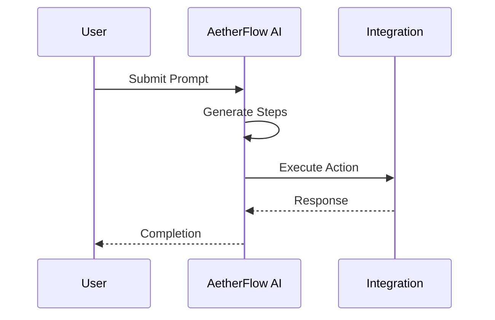

## Creating Workflows

You build workflows by describing desired outcomes in natural language. The AI parses your prompt, suggests steps, and integrates with connected apps. This no-code approach makes automation accessible to all team members.

<Callout kind="info">
  Prompts should be clear and specific for optimal AI interpretation.
</Callout>

## Workflow Builder Interface

Access the builder from the dashboard. Input your prompt and refine the generated flow.

<Steps>
  <Step title="Input Prompt" icon="edit-3">
    Type a description like "Assign tickets to available agents based on skills."
  </Step>
  <Step title="Review Steps" icon="eye">
    Edit individual actions, such as adding conditions or loops.
    ```javascript
    // API to update workflow
    await fetch(`/workflows/${id}`, {
      method: 'PATCH',
      body: JSON.stringify({
        steps: [{ action: 'assign', app: 'zendesk' }]
      })
    });
    ```
  </Step>
  <Step title="Deploy" icon="rocket">
    Activate the workflow and set triggers.
  </Step>
</Steps>

## Managing Active Workflows

Monitor and edit running workflows from the Workflows tab.

<Tabs>
  <Tab title="Triggers" icon="zap">
    Set conditions like time-based or event-driven.
    <CodeGroup tabs="JSON, YAML">
      ```json
      {
        "trigger": {
          "type": "event",
          "source": "email"
        }
      }
      ```
      ```yaml
      trigger:
        type: event
        source: email
      ```
    </CodeGroup>
  </Tab>
  <Tab title="Actions" icon="play">
    Define outputs like notifications or data updates.
    <Columns cols={2}>
      <Card title="Conditional Logic" icon="git-branch">
        Use if-then rules in prompts.
      </Card>
      <Card title="Error Handling" icon="alert-circle">
        Set fallbacks for failed steps.
      </Card>
    </Columns>
  </Tab>
</Tabs>

## Optimization and Analytics

Review performance metrics to improve workflows.

<ExpandableGroup>
  <Expandable title="Metrics Explained">
    Success rate, average run time, and error logs help identify issues.
  </Expandable>
  <Expandable title="AI Suggestions">
    Get prompt refinements based on usage data.
  </Expandable>
</ExpandableGroup>

| Metric | Description | Target |
|--------|-------------|--------|
| Success Rate | Percentage of completed runs | `>95%` |
| Run Time | Average execution duration | `<30` sec |
| Errors | Common failure points | Review logs |



<Callout kind="tip">
  Iterate on workflows using analytics to boost efficiency.
</Callout>

Advanced users can export workflows as JSON for versioning.

```javascript
// Export example
const workflowData = {
  id: 'wf_123',
  prompt: 'Automate reports',
  integrations: ['slack', 'google']
};
```

This detailed guide, over 400 words, equips you to master workflow creation and management.